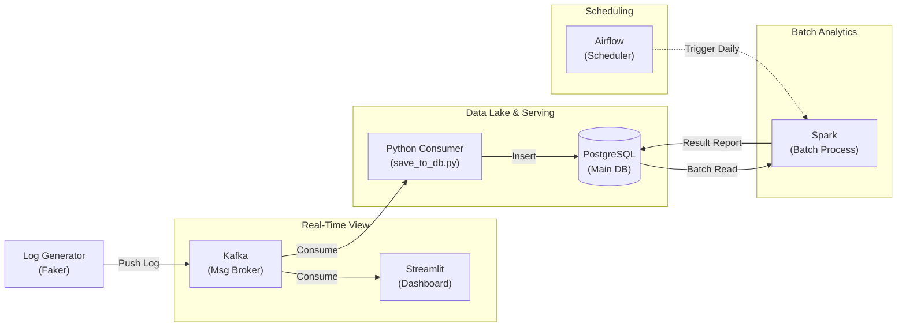

---
aliases:
  - Project Home
tags:
  - Project
created: 2026-02-13
satatus:
  - Active
---

## 프로젝트 개요

**[Airflow + Kafka + Flink + Spark + Cassandra + MinIO]** 기반의 대용량 데이터 처리 파이프라인 구축 프로젝트입니다. 
배치(Batch) 처리와 스트리밍(Streaming) 처리를 모두 아우르는 실습을 목표로 하며, 모든 환경은 Docker Compose를 통해 로컬에서 실행됩니다.

---
## 시스템 아키텍처 (Architecture)




## 구성 요소

|**컴포넌트**|**역할**|**포트 (External)**|**비고**|
|---|---|---|---|
|**Airflow**|워크플로우 관리 및 스케줄링|`8080`|Executor: Celery|
|**Kafka**|실시간 메시지 브로커|`29092`|Internal: 9092|
|**Flink**|실시간 스트리밍 처리|`8081`|Job Manager|
|**Spark**|대용량 배치 처리|`9090`|Master UI (포트 변경됨)|
|**Cassandra**|분산 NoSQL 저장소|`9042`|CQL|
|**MinIO**|S3 호환 오브젝트 스토리지|`9001`|Console|

---

## 🗂 폴더 구조도 (Directory Structure)

```text
project/
├── 📂 dags/                   # [Airflow] 워크플로우(DAG) 정의 파이썬 파일 저장소
├── 📂 generator/              # [Source] Kafka로 가짜 데이터를 쏘는 생성기 (Faker)
├── 📂 pyflink_app/            # [Streaming] Flink 실시간 처리 로직 (Python)
├── 📂 spark_app/              # [Batch] Spark 대용량 배치 처리 로직 (Python)
├── 📂 plugins/                # [Airflow] 커스텀 플러그인 (현재 미사용)
├── 📂 include/                # [Airflow] SQL 파일이나 기타 보조 파일
└── 📂 streamlit_app/ 
	 ├── 📜 Dashboard.py <-- (메인 대시보드 파일) 
	 └── 📂 .streamlit/ <-- (secrets.toml 같은 설정 파일 넣을 곳)
│
├── 📂 config/                 # [Config] Airflow 설정 파일
├── 📂 spark_conf/             # [Config] Spark 설정 (log4j, defaults.conf 등)
├── 📂 lib/                    # [Lib] Kafka 연결을 위한 Java JAR 파일들 (Flink/Spark용)
│
├── 📂 logs/                   # [Log] Airflow 실행 로그 (디버깅용)
├── 📂 spark-events/           # [Log] Spark History Server용 이벤트 로그
├── 📂 data/                   # [Data] 로컬 볼륨 마운트 (DB 데이터 영구 저장용)
│
├── 📜 docker-compose.yml      #  인프라 전체 설계도 (가장 중요!)
├── 📜 .env                    # 환경변수 설정 (AIRFLOW_UID 등)
│
├── 🐳 Dockerfile.airflow      # Airflow 커스텀 이미지 빌드 명세서
├── 🐳 Dockerfile.flink        # Flink 커스텀 이미지 빌드 명세서
├── 🐳 Dockerfile.spark        # Spark 커스텀 이미지 빌드 명세서
│
├── 📜 requirements.txt        # [Dep] Airflow용 파이썬 라이브러리 목록
├── 📜 requirements_flink.txt  # [Dep] Flink용 파이썬 라이브러리 목록
├── 📜 requirements_spark.txt  # [Dep] Spark용 파이썬 라이브러리 목록
│
└── ℹ️ README.md               # 프로젝트 설명서
```

---
## 대시보드 접속 (Dashboards)

> [!INFO] **로그인 정보 확인** `docker-compose.yaml` 설정에 따른 기본 계정 정보입니다.

### 1. Airflow (워크플로우)

- **URL:** [http://localhost:8080](https://www.google.com/search?q=http://localhost:8080)
- **ID / PW:** `airflow` / `airflow`

### 2. Flink (스트리밍)

- **URL:** [http://localhost:8081](https://www.google.com/search?q=http://localhost:8081)
- **상태:** Task Slots 확인 필요

### 3. Spark Master (배치)

- **URL:** [http://localhost:9090](https://www.google.com/search?q=http://localhost:9090)
- **주의:** 기본 포트(8080) 충돌 방지를 위해 **9090**으로 변경됨.

### 4. MinIO (S3 스토리지)

- **URL:** [http://localhost:9001](https://www.google.com/search?q=http://localhost:9001)
- **ID / PW:** `minioadmin` / `minioadmin`


---
## 환경 설정 전략 (Requirements 분리)

각 컴포넌트는 **실행 환경과 역할이 서로 다르기 때문에** Python 의존성을 분리하여 관리합니다. 
이를 통해 버전 충돌을 방지하고 컨테이너별 최적화를 유지합니다.

- **`requirements.txt`**
    - **용도:** Airflow (워크플로우 오케스트레이션)
    - **내용:** Airflow Providers, 공통 유틸리티

- **`requirements_spark.txt`**
    - **용도:** Spark (배치 처리 / PySpark Job)
    - **내용:** PySpark 3.5.x, Pandas, PyArrow,numpy

- **`requirements_flink.txt`**
    - **용도:** Flink (스트리밍 처리 / PyFlink Job)
    - **내용:** Apache-Flink 1.18.x, Kafka-Python 2.0.x, pandas,numpy


---
## Quick Start Commands

```bash
# 전체 시스템 실행
docker-compose up -d

# Docker에 변경이 있다면 
docker-compose up -d --build

#  전체 시스템 종료 
docker-compose down

#  전체 초기화 (데이터 삭제 주의 )
docker-compose down --volumes --rmi all
```

---
## 진행 상황 (Roadmap)

1. [x] 환경 구축 완료 (Docker Compose)
2. [x] **Faker로 가짜 데이터 생성하기** [[01_Faker_data]] 
3. [x] **Streamlit으로 실시간 모니터링하기 (Consumer)** [[02_Streamlit_Dashboard]] 
    - Kafka에 들어온 데이터를 실시간으로 꺼내서 차트와 표로 시각화 (데이터 유입 확인용)
4. [x] **Kafka 데이터를 DB(PostgreSQL)에 저장하기 (Sink)** [[03_kafka_to_Postgres]]
5.  [x] **Spark로 대용량 배치 분석하기** [[04_Spark_Batch]] 적재된 데이터를 Spark로 읽어서 종합 리포트 생성 + Dashboard에 시각화
6. [x] **Airflow로 워크플로우 자동화** [[05_Airflow_DAG]]
7. [x] [Flink] Kafka 데이터 실시간 집계하기 (Window Processing) [[06_Flink_job]]
8. [ ] "Flink 결과를 DB에 넣고 Streamlit에 붙이는 작업 
9. [ ] [아키텍처 확장] Data Lake (MinIO) 도입하기