---
aliases:
  - SQL 사고 흐름도
  - 쿼리 작성 로드맵
  - SQL 실행 순서
tags:
  - SQL_Guide
related: []
---
## SQL 문법 선택 표 (치트시트)

| 문제에서 보이는 표현          | 핵심 의미     | 가장 적합한 문법           | 한 줄 힌트            |
| -------------------- | --------- | ------------------- | ----------------- |
| 전체 평균 / 전체 기준 / 전체 중 | 하나의 값과 비교 | **서브쿼리**            | “평균이 1개면 JOIN 금지” |
| ~보다 높은(낮은) 데이터       | 값 비교만 필요  | **서브쿼리**            | 결과에 평균 안 나옴       |
| 최대값 / 최소값            | 단일 값 비교   | **서브쿼리**            | `MAX / MIN`       |
| 값만 필터링               | 조건만 중요    | **서브쿼리**            | SELECT에 집계 없음     |
| ~별 / 유형별             | 그룹 나눔     | **GROUP BY**        | ‘별’ 보이면 GROUP     |
| 각 ~마다                | 그룹 단위 처리  | **GROUP BY**        | 행이 줄어든다           |
| 그룹 평균이 ~ 이상          | 그룹 조건     | **HAVING**          | WHERE 아님          |
| 평균도 함께 출력            | 집계 + 행    | **JOIN / CTE**      | 결과에 평균 컬럼         |
| ~정보와 함께 출력           | 테이블 결합    | **JOIN**            | 컬럼 수 증가           |
| 순위 / 랭킹              | 행 내부 비교   | **WINDOW FUNCTION** | `RANK()`          |
| 상위 N개                | 순서 기준     | **WINDOW FUNCTION** | `ROW_NUMBER()`    |
| 그룹 내에서 비교            | 그룹 유지     | **WINDOW FUNCTION** | `PARTITION BY`    |
| 누적 / 이동 평균           | 흐름 분석     | **WINDOW FUNCTION** | OVER 절            |

## 시험장에서 쓰는 압축 판단법

|키워드|바로 선택|
|---|---|
|전체|서브쿼리|
|~별|GROUP BY|
|그룹 조건|HAVING|
|같이 출력|JOIN|
|순위|WINDOW|

## TIP

**"출력 결과의 형태"를 상상하면 쉬워요.**
- 결과가 **숫자 딱 하나**다? -> `서브쿼리`
- 결과가 **그룹 개수만큼** 줄어든다? -> `GROUP BY`
- 결과 행 개수는 그대로인데 **옆에 뭐가 붙는다**? -> `JOIN` or `Window Function`

---

## 🗺️ SQL 사고 로드맵 (Flowchart)

```mermaid
flowchart TD
    Start((🚀 쿼리 설계 시작)) --> Q_Complex

    %% 0. 설계 단계 (Architect) - [업데이트됨!]
    subgraph Step0_Architect ["Step 0: 큰 그림 그리기 (Strategy)"]
        direction TB
        Q_Complex{"계산된 결과(평균 등)가<br>필요한가?"}
        
        %% --- [NEW] 여기가 핵심 변경 포인트! ---
        Q_Complex -- Yes --> Q_ResultType{"필요한 결과가<br>딱 숫자 하나인가?<br>(예: 전체 평균)"}
        
        Q_ResultType -- "Yes: 단순 비교" --> Op_ScalarSub[":::newNode 💡 스칼라 서브쿼리<br>(WHERE 절에 바로 사용)"]
        Q_ResultType -- "No: 집합/재사용" --> Op_CTE["WITH 절(CTE)<br>논리 블록 분리"]
        %% -------------------------------------

        Q_SetOp{"결과물을 위아래로<br>합쳐야 하는가?"}
        
        Q_Complex -- No --> Q_SetOp
        Op_CTE --> Q_SetOp
        
        %% 스칼라 서브쿼리는 바로 데이터 소스로 넘어감 (CTE 불필요)
        Op_ScalarSub -.-> Q_Sources 

        Q_SetOp -- Yes: 합치기 --> Op_Union["UNION / UNION ALL<br>(설계 후 마지막에 결합)"]
        
        %% Step 0 -> Step 1 연결
        Q_SetOp -- No: 단일 쿼리 --> Q_Sources
        Op_Union --> Q_Sources
    end

    %% 1. 데이터 준비 (Data & Join)
    subgraph Step1_Data ["Step 1: 데이터 판 깔기 & 조인 전략"]
        direction TB
        Q_Sources{"데이터 소스가<br>여러 개인가?"}
        Q_Sources -- No --> Op_From["FROM 테이블"]
        Q_Sources -- Yes --> Q_Fanout{"1:N 조인으로<br>행 뻥튀기 위험?"}
        
        Q_Fanout -- Yes: 위험 --> Op_PreAgg["Pre-Aggregation<br>(먼저 GROUP BY 후 조인)"]
        Q_Fanout -- No: 안전 --> Q_JoinType{"모든 행이<br>다 필요한가?"}
        
        Q_JoinType -- "교집합만 (필수)" --> Op_Inner["INNER JOIN"]
        Q_JoinType -- "원본 유지 (옵션)" --> Op_Left["LEFT JOIN"]
        
        Op_From --> Q_Where
        Op_Inner --> Q_Where
        Op_Left --> Q_Where
        Op_PreAgg --> Q_Where
    end

    %% 2. 필터링 (Filter)
    subgraph Step2_Filter ["Step 2: 재료 손질 (WHERE)"]
        direction TB
        Q_Where{"미리 걸러낼 조건?<br>(날짜, 상태코드)"}
        Q_Where -- Yes --> Op_Where["WHERE 절 작성"]
        
        %% 스칼라 서브쿼리 연결 강조
        Op_ScalarSub -.-> Op_Where 

        Q_Where -- No --> Q_Granularity
        Op_Where --> Q_Granularity
    end

    %% 3. 핵심 로직 (Core Logic)
    subgraph Step3_Core ["Step 3: 행(Row)의 운명 결정"]
        direction TB
        Q_Granularity{"🎯 결과 집합의<br>행 수를 줄일 것인가?"}

        %% === 왼쪽: 집계 (Aggregation) ===
        Q_Granularity -- Yes: 압축 --> Op_Group["GROUP BY"]
        Op_Group --> Q_AggType{"집계 목적"}
        Q_AggType -- 건수/합계 --> Op_BasicAgg["COUNT / SUM / AVG"]
        Q_AggType -- 조건부 집계 --> Op_FilterAgg["COUNT() FILTER<br>(CASE WHEN 대용)"]
        
        %% === 오른쪽: 윈도우 (Window) ===
        Q_Granularity -- No: 유지 --> Q_WindowNeed{"이전/다음 행 참조?<br>(LAG, LEAD)"}
        
        Q_WindowNeed -- Yes: 시계열 비교 --> Q_Partition{"누구끼리 경쟁/합산?"}
        Q_WindowNeed -- No: 순위/번호 --> Q_RankFunc{"순위 매기기?<br>(RANK, ROW_NUMBER)"}
        
        Q_RankFunc --> Q_Partition
        
        Q_Partition -- 그룹별 --> Op_Win_Part["OVER (PARTITION BY..)"]
        Q_Partition -- 전체 --> Op_Win_All["OVER ()"]
        
        Op_Win_Part --> Q_WinOrder{"순서 중요?"}
        Op_Win_All --> Q_WinOrder
        Q_WinOrder -- Yes: 필수 --> Op_Win_Ord["ORDER BY 추가"]
        
        %% 경로 합류
        Q_AggType --> Q_Having
        Op_BasicAgg --> Q_Having
        Op_FilterAgg --> Q_Having
        
        Q_WindowNeed -- No --> Q_Logic
        Q_WinOrder -- No --> Q_Logic
        Op_Win_Ord --> Q_Logic
    end

    %% 4. 후처리 (Post-Filter)
    subgraph Step4_PostFilter ["Step 4: 결과 솎아내기"]
        direction TB
        Q_Having{"집계 후 필터링?<br>(예: 매출 100이상)"}
        Q_Having -- Yes --> Op_Having["HAVING"]
        Q_Having -- No --> Q_Logic
        Op_Having --> Q_Logic
    end

    %% 5. 최종 가공 (Final Polish)
    subgraph Step5_Final ["Step 5: 마무리 데코레이션"]
        direction TB
        Q_Logic{"조건부 값/변환 필요?"}
        Q_Logic -- Yes --> Op_CaseCast["CASE WHEN (조건문)<br>::Type (형변환)"]
        Q_Logic -- No --> Op_SelCol["SELECT 컬럼 확정"]
        Op_CaseCast --> Op_Null
        
        Op_SelCol --> Q_Null
        Q_Null{"NULL 처리?"}
        Q_Null -- Yes --> Op_Null["COALESCE"]
        Q_Null -- No --> Q_Order
        Op_Null --> Q_Order
        
        Q_Order{"최종 정렬?"}
        Q_Order -- Yes --> Op_FinalOrder["ORDER BY"]
        Q_Order -- No --> End((🏁 완성))
        Op_FinalOrder --> End
    end

    %% 스타일링
    linkStyle default stroke:#555,stroke-width:2px
    classDef startend fill:#2c3e50,stroke:#34495e,color:white
    class Start,End startend
    classDef decision fill:#fff9c4,stroke:#fbc02d,stroke-width:2px
    class Q_Complex,Q_SetOp,Q_Sources,Q_Fanout,Q_JoinType,Q_Where,Q_Granularity,Q_AggType,Q_WindowNeed,Q_Partition,Q_WinOrder,Q_Having,Q_Logic,Q_Null,Q_Order,Q_ResultType decision
    classDef critical fill:#ffe0b2,stroke:#e65100,stroke-width:3px
    class Q_Complex,Q_Fanout,Q_Granularity critical
    classDef action fill:#e3f2fd,stroke:#1e88e5,stroke-width:2px
    class Op_CTE,Op_Union,Op_From,Op_PreAgg,Op_Inner,Op_Left,Op_Where,Op_Group,Op_BasicAgg,Op_FilterAgg,Op_Win_Part,Op_Win_All,Op_Win_Ord,Op_Having,Op_CaseCast,Op_SelCol,Op_Null,Op_FinalOrder action
    
    %% 새로 추가된 노드 스타일 (붉은색 강조)
    classDef newNode fill:#ffcdd2,stroke:#d32f2f,stroke-width:4px,color:black
    class Op_ScalarSub newNode
```

---
