---
aliases:
  - SQL 사고 흐름도
  - 쿼리 작성 로드맵
  - SQL 실행 순서
tags:
  - SQL_Guide
related: []
---
## SQL 문법 선택 표 (치트시트)

### 기준값이 하나냐? 여러 개냐?

| 문제 표현                | 핵심 의미          | 추천 문법                | 한 줄 힌트                   |
| -------------------- | -------------- | -------------------- | ------------------------ |
| 전체 평균 / 전체 기준 / 전체 중 | **단일 기준값**과 비교 | **서브쿼리**             | 기준은 1줄                   |
| ~보다 높은(낮은) 데이터       | 값 비교           | **서브쿼리**             | 결과에 기준값 안 나옴             |
| 최대값 / 최소값            | 단일 값           | **서브쿼리**             | `{text}= (SELECT MAX())` |
| 최대값인 **행 자체**        | 값이 아닌 행        | **서브쿼리 / WINDOW**    | MAX는 행을 안 줌              |
| 1등만 필요               | 결과 1개          | **ORDER BY + LIMIT** | RANK 불필요                 |

### 그룹이 보이면 바로 떠올릴 것

|문제 표현|핵심 의미|추천 문법|한 줄 힌트|
|---|---|---|---|
|~별 / 유형별|그룹 분리|**GROUP BY**|‘별’ 보이면 GROUP|
|각 ~마다|그룹 단위 처리|**GROUP BY**|행 수 줄어듦|
|그룹 평균 / 그룹 합계|그룹 집계|**GROUP BY + 집계**|SELECT에 집계|
|그룹 평균이 ~ 이상|**그룹 조건**|**HAVING**|WHERE 아님|

### 평균·집계를 “같이” 보고 싶을 때

| 문제 표현      | 핵심 의미     | 추천 문법          | 한 줄 힌트        |
| ---------- | --------- | -------------- | ------------- |
| 평균도 함께 출력  | 집계 + 원본 행 | **JOIN / CTE** | 결과에 평균 컬럼     |
| ~정보와 함께 출력 | 테이블 결합    | **JOIN**       | 컬럼 수 증가       |
| 값만 필터링     | 조건만 중요    | **서브쿼리**       | SELECT에 집계 없음 |
### 순위·비교·흐름이 보이면 (WINDOW FUNCTION)

| 문제 표현         | 핵심 의미   | 추천 문법                | 한 줄 힌트              |
| ------------- | ------- | -------------------- | ------------------- |
| 순위 / 랭킹       | 행 간 비교  | **WINDOW FUNCTION**  | `RANK()`            |
| 순위표가 필요       | 전체 순위   | **WINDOW FUNCTION**  | LIMIT 쓰지 말 것        |
| 상위 N개         | 정렬 + 제한 | **ORDER BY + LIMIT** | N개면 LIMIT           |
| 상위 N개 (동률 포함) | 공동 순위   | **WINDOW FUNCTION**  | `RANK / DENSE_RANK` |
| 그룹 내에서 비교     | 그룹 유지   | **WINDOW FUNCTION**  | `PARTITION BY`      |
| 누적 / 이동 평균    | 흐름 분석   | **WINDOW FUNCTION**  | `OVER + ORDER BY`   |
| 이전/다음 값 비교    | 행 참조    | **WINDOW FUNCTION**  | `LAG / LEAD`        |
| 비율 / 점유율      | 전체 대비   | **WINDOW FUNCTION**  | `SUM() OVER()`      |

##  압축 판단법

>“순위표가 필요하면 RANK,  
>최고값 하나면 ORDER BY + LIMIT”

---

## 🗺️ SQL 사고 로드맵 (Flowchart)

### 로드맵 보는 법

1. **Start**에서 시작해서 질문(`?`)에 답하며 화살표를 따라가세요.
2. **빨간색 박스**는 "행의 개수"가 바뀌는 중요한 결정 포인트입니다.
3. **파란색 박스**는 실제 작성해야 할 문법입니다.

```mermaid
flowchart TD
    %% === 시작점 ===
    Start((🚀 SQL 문제 시작)) --> Step1_Analyze

    %% ==========================================
    %% Step 1: 데이터 재료 준비
    %% ==========================================
    subgraph Step1_Analyze ["Step 1: 데이터 재료 & 출처 결정"]
        direction TB
        
        Q_Complex{"집계된 결과나 가상 테이블이<br>먼저 필요한가?"}
        
        Q_Complex -- "Yes (CTE 생성)" --> Op_CTE[":::point 🍳 CTE / SubQuery<br>(가상 테이블 생성)"]
        Q_Complex -- "No (원본 사용)" --> Q_ColCheck
        
        Op_CTE --> Q_ColCheck{"🎯 필요한 모든 컬럼이<br>현재 테이블(또는 CTE) 하나에<br>전부 다 들어있는가?"}
        
        Q_ColCheck -- "Yes (JOIN 금지 🚫)" --> Op_OneTable[":::point 💡 FROM 테이블 1개만 사용<br>(가장 깔끔한 정답)"]
        Q_ColCheck -- "No (어쩔 수 없음)" --> Op_Join["JOIN (정보 합치기)"]
    end

    Op_OneTable --> Q_Where
    Op_Join --> Q_Where

    %% ==========================================
    %% Step 2: 행 걸러내기
    %% ==========================================
    subgraph Step2_Filter ["Step 2: 원본 데이터 청소 (WHERE)"]
        direction TB
        Q_Where{"'특정 조건'인 행만<br>필요한가?"}
        
        Q_Where -- "Yes (날짜, 카테고리 등)" --> Op_Where["WHERE 절 사용"]
        Q_Where -- "No (전체 데이터)" --> Q_Group
        Op_Where --> Q_Group
    end

    %% ==========================================
    %% Step 3: 뭉칠까 펼칠까 (핵심 분기점)
    %% "Window Function 추가됨!"
    %% ==========================================
    subgraph Step3_Agg ["Step 3: 집계 및 계산 방식 결정"]
        direction TB
        Q_Group{"'~별'로 묶어서<br>행 개수를 줄일 것인가?"}
        
        %% [Path A] Group By (행 압축)
        Q_Group -- "Yes (통계/요약)" --> Op_GroupBy["GROUP BY"]
        Op_GroupBy --> Op_Calc["SUM / COUNT / AVG"]
        Op_Calc --> Q_Having{"집계된 결과를<br>필터링해야 하는가?"}
        Q_Having -- "Yes (HAVING)" --> Op_Having["HAVING"]
        
        %% [Path B] Window Function (행 유지) ⭐️ NEW!
        Q_Group -- "No (행 유지)" --> Q_Window{"순위, 누적합, 이동평균,<br>이전 행 비교가 필요한가?"}
        
        Q_Window -- "Yes (고급 계산)" --> Op_Window[":::point 🪟 WINDOW FUNCTION<br>(RANK, LEAD, SUM OVER...)"]
        
        %% [Path C] 단순 조회
        Q_Window -- "No (단순 조회)" --> Q_Distinct{"중복을 제거해야 하는가?<br>(Distinct)"}
        Q_Distinct -- Yes --> Op_Distinct["SELECT DISTINCT"]
    end

    %% Step 3 -> Step 4 연결 (모든 길이 Step 4로 모임)
    Q_Having -- No --> Q_Order
    Op_Having --> Q_Order
    Op_Window --> Q_Order
    Q_Distinct -- No --> Q_Order
    Op_Distinct --> Q_Order

    %% ==========================================
    %% Step 4: 순서 및 제한
    %% ==========================================
    subgraph Step4_Final ["Step 4: 결과 다듬기"]
        direction TB
        Q_Order{"순위나 정렬이<br>필요한가?"}
        
        Q_Order -- Yes --> Op_Order["ORDER BY"]
        Q_Order -- No --> Q_Limit
        Op_Order --> Q_Limit{"상위 N개만 필요한가?"}
        
        Q_Limit -- Yes --> Op_Limit["LIMIT"]
        Q_Limit -- No --> End((🏁 쿼리 완성))
        Op_Limit --> End
    end

    %% === 스타일 정의 ===
    classDef default fill:#fff,stroke:#333,stroke-width:1px;
    classDef startend fill:#2c3e50,stroke:#34495e,color:white,stroke-width:2px;
    classDef decision fill:#fff9c4,stroke:#fbc02d,stroke-width:2px;
    classDef action fill:#e3f2fd,stroke:#1e88e5,stroke-width:2px;
    classDef point fill:#ffcdd2,stroke:#d32f2f,stroke-width:4px,color:black;

    class Start,End startend;
    class Q_Complex,Q_ColCheck,Q_Where,Q_Group,Q_Window,Q_Distinct,Q_Having,Q_Order,Q_Limit decision;
    class Op_CTE,Op_Join,Op_OneTable,Op_Where,Op_GroupBy,Op_Calc,Op_Having,Op_Window,Op_Distinct,Op_Order,Op_Limit action;
    class Op_OneTable,Op_CTE,Op_Window point;
```

---
###  설명 스크립트 (최종본)

**오프닝:** "SQL 쿼리를 짤 때 매번 막막하다면, 이 **5단계 지도**만 따라오세요. 복잡한 문제도 순서대로 풀립니다."

## 🗣️ [멘탈 모델 가이드] SQL 문제 해결 4단계 사고법

이 로드맵은 **"무작정 코드부터 치다가 길을 잃는 것"**을 막기 위해 존재합니다. 문제를 딱 보자마자, **Step 1부터 순서대로** 자문자답하며 내려가세요.

### Step 1. 재료 찾기 (Analyze) 🧐

**"가장 먼저, 무조건 `JOIN`부터 하려는 습관을 버리세요!"**

- 질문에서 요구하는 컬럼들을 보세요.
- 만약 `customer_id` 하나만 필요한데, 굳이 `Customer` 테이블을 조인하고 있진 않나요?
- **핵심:** **"테이블 하나로 해결된다면, 그게 가장 정답에 가깝습니다."** (`FROM` 하나만 쓰세요.)
- 테이블이 찢어져 있어서 어쩔 수 없을 때만 `JOIN`을 꺼내 드세요.

### Step 2. 재료 손질 (Pre-Filter) 🥦

**"요리하기 전에 흙 묻은 재료부터 씻어내세요."**

- 전체 데이터를 다 들고 갈 필요가 있나요?
- "2024년 데이터만", "서울 지역만" 같은 조건이 있다면, **`WHERE` 절로 미리 쳐내야 합니다.**
- 데이터가 가벼워져야 쿼리 속도도 빨라지고, 계산 실수도 줄어듭니다.

### Step 3. 요리 방식 결정 (Aggregation) 🍳

**"여기가 가장 중요한 갈림길입니다. 뭉칠 것인가, 펼칠 것인가?"**

- **단순 조회:** 그냥 명단만 필요하다면 `GROUP BY`는 필요 없습니다. (혹시 중복이 거슬리면 `DISTINCT`만 살짝 쓰세요.)
- **집계(통계):** "~별 합계", "팀별 평균" 같은 단어가 보이면 무조건 **`GROUP BY`**입니다.
    
    - 🚨 **주의:** 집계(SUM, AVG)를 한 **결과값**을 거르고 싶나요? (예: 매출 1000만 원 이상)
    - 그건 `WHERE`가 아니라 **`HAVING`**의 영역입니다. (이거 헷갈리면 에러 납니다!)
        

### Step 4. 예쁘게 담기 (Formatting) 🍽️

**"이제 요리는 끝났습니다. 서빙 준비만 하세요."**

- **순서:** "가장 많이 판 순서대로" -> `ORDER BY`
- **개수:** "상위 3명만" -> `LIMIT`
- **마무리:** 컬럼 이름이 지저분하면 `AS`로 예쁘게 별명을 붙여주면 끝입니다.

