---
aliases:
  - SQL 사고 흐름도
  - 쿼리 작성 로드맵
  - SQL 실행 순서
tags:
  - SQL_Guide
related: []
---
## SQL 문법 선택 표 (치트시트)

| 문제에서 보이는 표현          | 핵심 의미              | 가장 적합한 문법                             | 한 줄 힌트                   |
| -------------------- | ------------------ | ------------------------------------- | ------------------------ |
| 전체 평균 / 전체 기준 / 전체 중 | 하나의 **단일 기준값**과 비교 | **서브쿼리**                              | “기준은 1줄, 결과는 여러 줄”       |
| ~보다 높은(낮은) 데이터       | 값 비교만 필요           | **서브쿼리**                              | 결과에 기준값 안 나옴             |
| 최대값 / 최소값            | 단일 값 비교            | **서브쿼리**                              | `{text}= (SELECT MAX())` |
| 값만 필터링               | 조건만 중요             | **서브쿼리**                              | SELECT에 집계 없음            |
| ~별 / 유형별             | 그룹 나눔              | **GROUP BY**                          | ‘별’ 보이면 GROUP            |
| 각 ~마다                | 그룹 단위 처리           | **GROUP BY**                          | 행 수 줄어든다                 |
| 그룹 평균이 ~ 이상          | 그룹 조건              | **HAVING**                            | WHERE 아님                 |
| 평균도 함께 출력            | 집계 + 원본 행          | **JOIN / CTE**                        | 결과에 평균 컬럼                |
| ~정보와 함께 출력           | 테이블 결합             | **JOIN**                              | 컬럼 수 증가                  |
| 순위 / 랭킹              | 행 간 비교             | **WINDOW FUNCTION**                   | `RANK()`                 |
| 상위 N개                | 정렬 + 제한            | **ORDER BY + LIMIT**or `ROW_NUMBER()` | “N개면 LIMIT부터 의심”         |
| 상위 N개 (동률 포함)        | 공동 순위 유지           | **WINDOW FUNCTION**                   | `RANK / DENSE_RANK`      |
| 그룹 내에서 비교            | 그룹 유지한 채 계산        | **WINDOW FUNCTION**                   | `PARTITION BY`           |
| 누적 / 이동 평균           | 흐름·시간 분석           | **WINDOW FUNCTION**                   | `OVER + ORDER BY`        |
| 이전/다음 값 비교           | 행 간 참조             | **WINDOW FUNCTION**                   | `LAG / LEAD`             |
| 비율 / 점유율             | 전체 대비 계산           | **WINDOW FUNCTION**                   | `SUM() OVER()`           |
| 최대값인 행 자체            | 값이 아니라 **행**       | **서브쿼리 or WINDOW**                    | MAX는 행을 안 줌              |
| 1등만 필요               | 결과 1개              | **ORDER BY + LIMIT**                  | RANK 필요 없음               |
| 순위표가 필요              | 순위 전부              | **WINDOW FUNCTION**                   | LIMIT 쓰지 말 것             |

##  압축 판단법

>“순위표가 필요하면 RANK,  
>최고값 하나면 ORDER BY + LIMIT”

---

## 🗺️ SQL 사고 로드맵 (Flowchart)

### 로드맵 보는 법

1. **Start**에서 시작해서 질문(`?`)에 답하며 화살표를 따라가세요.
2. **빨간색 박스**는 "행의 개수"가 바뀌는 중요한 결정 포인트입니다.
3. **파란색 박스**는 실제 작성해야 할 문법입니다.

```mermaid
flowchart TD
    Start((🚀 SQL 문제 시작)) --> Step0

    %% ==========================================
    %% Step 0: 전략 수립 (Strategy)
    %% "내가 필요한 재료가 무엇인가?"
    %% ==========================================
    subgraph Step0_Strategy ["Step 0: 큰 그림 그리기 (비교 대상 확인)"]
        direction TB
        Q_NeedCalc{"평균/합계 등을 기준으로<br>크거나 작은 걸 찾는가?"}
        
        Q_NeedCalc -- Yes --> Q_CalcScope{"그 숫자가<br>전체 기준인가?"}
        
        Q_CalcScope -- "Yes (전체 평균 등)" --> Op_Scalar[":::point 💡 스칼라 서브쿼리<br>(WHERE절에 바로 사용)"]
        Q_CalcScope -- "No (그룹별 평균 등)" --> Op_CTE["CTE (WITH절)<br>임시 테이블 만들기"]
        
        Q_NeedCalc -- No --> Q_Source
    end

    %% 스칼라 서브쿼리와 CTE는 데이터 준비 단계로 합류
    Op_Scalar -.-> Q_Source
    Op_CTE --> Q_Source

    %% ==========================================
    %% Step 1: 데이터 준비 (Data Source)
    %% "어디서 가져올 것인가?"
    %% ==========================================
    subgraph Step1_Source ["Step 1: 데이터 판 깔기"]
        direction TB
        Q_Source{"테이블이<br>여러 개인가?"}
        Q_Source -- No --> Op_From["FROM 테이블"]
        Q_Source -- Yes --> Q_JoinType{"모든 행이<br>다 필요한가?"}
        
        Q_JoinType -- "교집합만 (필수)" --> Op_Inner["INNER JOIN"]
        Q_JoinType -- "원본 유지 (옵션)" --> Op_Left["LEFT JOIN"]
        
        Op_From --> Q_Where
        Op_Inner --> Q_Where
        Op_Left --> Q_Where
    end

    %% ==========================================
    %% Step 2: 사전 필터링 (Pre-Filter)
    %% "쓸모없는 데이터 버리기"
    %% ==========================================
    subgraph Step2_Filter ["Step 2: 재료 손질 (Filtering)"]
        direction TB
        Q_Where{"미리 걸러낼<br>조건이 있는가?"}
        Q_Where -- "Yes (날짜, 상태 등)" --> Op_Where["WHERE 절"]
        Q_Where -- No --> Q_Granularity
        Op_Where --> Q_Granularity
    end

    %% ==========================================
    %% Step 3: 핵심 로직 (Aggregation vs Window)
    %% "데이터를 뭉칠까, 펼칠까?"
    %% ==========================================
    subgraph Step3_Core ["Step 3: 행(Row)의 운명 결정"]
        direction TB
        Q_Granularity{"🎯 결과 행 수를<br>줄일(압축) 것인가?"}

        %% === [Path A] 집계 (Grouping) ===
        Q_Granularity -- "Yes (그룹별 통계)" --> Op_Group["GROUP BY"]
        Op_Group --> Op_Agg["SUM / AVG / COUNT"]
        Op_Agg --> Q_Having{"집계 후<br>필터링 필요?"}
        Q_Having -- Yes --> Op_Having["HAVING"]
        Q_Having -- No --> Q_FinalCheck
        Op_Having --> Q_FinalCheck

        %% === [Path B] 윈도우/순위 (Window) ===
        Q_Granularity -- "No (행 유지)" --> Q_RankNeed{"순위나<br>누적 계산 필요?"}
        
        Q_RankNeed -- "Yes (순위/이동평균)" --> Op_Window["WINDOW FUNCTION<br>OVER (PARTITION BY...)"]
        Q_RankNeed -- "No (단순 조회)" --> Q_FinalCheck
        
        Op_Window --> Q_RankOnly{"1등만 뽑아야<br>하는가?"}
        Q_RankOnly -- Yes --> Op_SubRank["서브쿼리로 감싸서<br>WHERE rank = 1"]
        Q_RankOnly -- No --> Q_FinalCheck
    end

    %% ==========================================
    %% Step 4: 최종 가공 (Final Polish)
    %% "예쁘게 포장하기"
    %% ==========================================
    subgraph Step4_Final ["Step 4: 마무리 (Formatting)"]
        direction TB
        Q_FinalCheck{"상위 N개만<br>필요한가?"}
        
        Q_FinalCheck -- "Yes (Top N)" --> Op_Limit["ORDER BY + LIMIT"]
        Q_FinalCheck -- No --> Op_Select
        
        Op_Limit --> Op_Select["SELECT 컬럼 확정"]
        Op_Select --> Q_Null{"NULL 처리?"}
        
        Q_Null -- Yes --> Op_Coalesce["COALESCE / IFNULL"]
        Q_Null -- No --> End((🏁 쿼리 완성))
        Op_Coalesce --> End
    end

    %% === 스타일링 (가독성 UP) ===
    classDef default fill:#fff,stroke:#333,stroke-width:1px;
    classDef startend fill:#2c3e50,stroke:#34495e,color:white,stroke-width:2px;
    classDef decision fill:#fff9c4,stroke:#fbc02d,stroke-width:2px;
    classDef action fill:#e3f2fd,stroke:#1e88e5,stroke-width:2px;
    classDef point fill:#ffcdd2,stroke:#d32f2f,stroke-width:4px,color:black;

    class Start,End startend;
    class Q_NeedCalc,Q_CalcScope,Q_Source,Q_JoinType,Q_Where,Q_Granularity,Q_Having,Q_RankNeed,Q_RankOnly,Q_FinalCheck,Q_Null decision;
    class Op_CTE,Op_From,Op_Inner,Op_Left,Op_Where,Op_Group,Op_Agg,Op_Having,Op_Window,Op_SubRank,Op_Limit,Op_Select,Op_Coalesce action;
    class Op_Scalar point;
```

---
###  설명 스크립트 (최종본)

**오프닝:** "SQL 쿼리를 짤 때 매번 막막하다면, 이 **5단계 지도**만 따라오세요. 복잡한 문제도 순서대로 풀립니다."

---

#### **0️⃣ Step 0: 전략 수립 (비교 대상 확인) ⭐**

계산된 숫자가 '넘어야 할 허들(조건)'인가요, 아니면 단순히 '1등을 뽑는(순위)' 건가요?"

- **설명:** "`SUM`이나 `AVG` 같은 계산값이 필요한 건 똑같지만, 용도가 다릅니다."

- **핵심 구분:**
    
    - **허들(Filter)일 때 (Yes):** "전체 평균**보다 높은**, 전체 매출의 50% **이상인**..." 처럼 **비교해서 살아남는 놈만 뽑아야 한다면?**
        - → **Step 0 Yes** (서브쿼리나 CTE로 '평균'이라는 허들을 먼저 만들어야 합니다.)
            
    - **순위/결과(Result)일 때 (No):** "가장 팁이 **많은**, 합계가 가장 **높은**..." 처럼 **그냥 줄 세워서 1등을 뽑는 거라면?**
        - → **Step 0 No** (굳이 미리 비교할 필요 없습니다. 다 계산해서(`GROUP BY`) 줄 세우고(`ORDER BY`) 맨 위(`LIMIT 1`)만 가져오면 되니까요!)

- **아까 푼 문제:** "팁이 **가장 많은** 요일" -> **순위(No)** -> `ORDER BY + LIMIT`
- **다른 문제:** "팁이 **평균보다 많은** 요일" -> **허들(Yes)** -> `WHERE tip > (SELECT AVG...)`

#### **1️⃣ Step 1: 데이터 판 깔기 (JOIN 전략)**

> **"전략이 섰으면, 데이터를 어디서 가져올지 정합니다."**
> 
> 
> 

- **설명:** "테이블이 여러 개라면 JOIN을 해야 하는데, 여기서 질문을 던집니다."
    
- **핵심:**
    
    - "두 테이블의 **공통된 데이터(교집합)** 만 필요한가? → **INNER JOIN**"
    - "아니면, 왼쪽 테이블의 **원본 데이터는 다 살려야** 하는가? → **LEFT JOIN**"

#### **2️⃣ Step 2: 재료 손질 (사전 필터링)**

> **"데이터를 합쳤다면, 요리하기 전에 상한 재료부터 버립니다."**

- **설명:** "무거운 집계 작업을 하기 전에, `WHERE` 절로 불필요한 행을 미리 쳐내야 쿼리 속도가 빨라집니다."
- **예시:** "2024년 데이터만 남긴다거나, 취소된 주문은 제외하는 작업이 여기에 해당합니다."

#### **3️⃣ Step 3: 행의 운명 결정 (핵심 갈림길) 🔥**

> **"여기가 가장 중요합니다. 데이터의 행(Row) 개수를 줄일 건가요, 유지할 건가요?"**

- **갈림길 A: 압축하기 (GROUP BY)**
    - "데이터를 반별, 요일별로 뭉쳐서 **통계**를 낼 거라면 `GROUP BY`를 씁니다."
    - "이때, 뭉쳐진 결과에 대해 필터링하려면(예: 평균 80점 이상) `HAVING`을 씁니다."
- **갈림길 B: 유지하기 (WINDOW)**
    - "데이터 행은 **그대로 둔 채**, 옆에 **등수**나 **누적 합계**만 붙이고 싶다면 `WINDOW 함수`를 씁니다."
    - "그룹별로 순위를 매긴다면 `PARTITION BY`, 전체 순위라면 `OVER()`를 씁니다."        

#### **4️⃣ Step 4: 순위 및 1등 뽑기**

> **"순위를 구했다면, 1등만 필요한지 전체 순위표가 필요한지 결정합니다."**

- **설명:**
    - "단순히 **가장 높은 1명**만 필요하다? → `ORDER BY`로 정렬하고 `LIMIT 1`로 자릅니다."
    - "각 **그룹별 1등**을 뽑아야 한다? → `RANK()` 함수로 순위를 매긴 뒤, 서브쿼리로 감싸서 `WHERE rank = 1` 조건을 겁니다."

#### **5️⃣ Step 5: 마무리 (출력 및 포장)**

> **"마지막으로 결과를 예쁘게 포장해서 내보냅니다."**

- **설명:**
    
    - "필요한 컬럼만 `SELECT`에 적고,"
    - "`NULL` 값이 있다면 `COALESCE`로 0이나 다른 값으로 채워줍니다."
    - "최종적으로 보기에 좋게 `ORDER BY`로 정렬하면 쿼리 완성입니다."