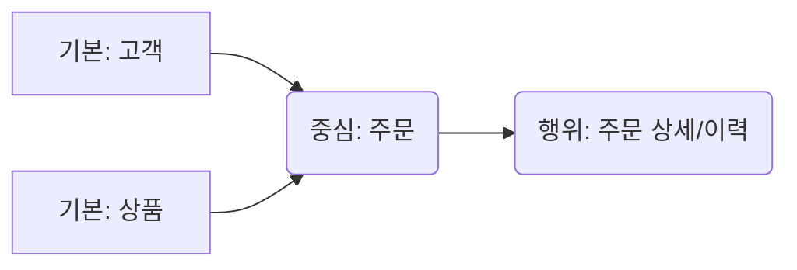
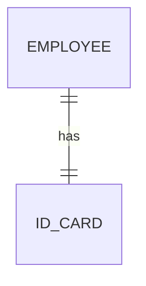
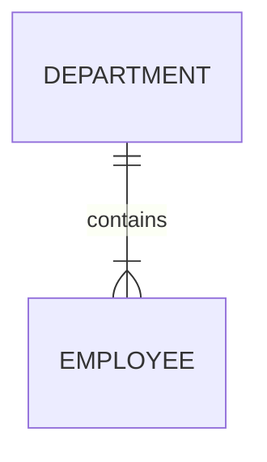
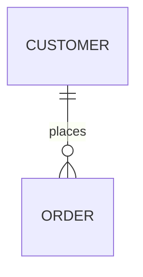
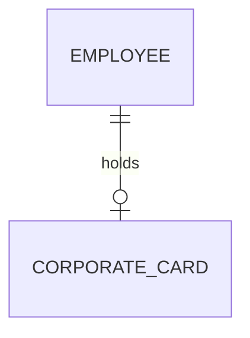
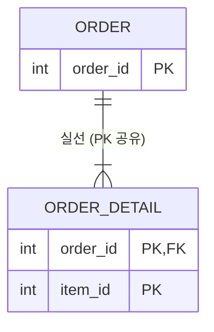
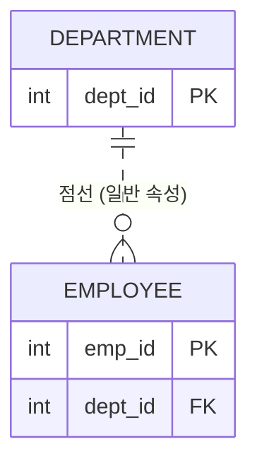

---
aliases:
  - ERD 구성요서
  - 엔터티
  - 속성
  - 관계
  - ERD 작성순서
tags:
  - SQL
related:
  - "[[Data_Modeling_Overview]]"
  - "[[SQL_Keys_and_Identifiers]]"
  - "[[00_SQL_HomePage]]"
---
#  ERD의 3대 요소: 엔터티, 속성, 관계

##  한줄요약

**"데이터 모델링의 3대 재료(Entity, Attribute, Relationship)와 이를 그리는 설계도(ERD)."**

----
## Why: 왜 필요한가?

* **문제:** "고객 정보를 저장하자"라고 말만 하면, 누구는 엑셀에 적고 누구는 노트에 적습니다. 구조가 제각각이죠.
* **해결:** **"데이터(Entity)", "세부 정보(Attribute)", "연관성(Relationship)"** 으로 명확히 구분해서 정의하면, 누구나 똑같이 이해할 수 있는 **표준 설계도**가 됩니다.

---
## Practical Context (실무 활용)

* **엔터티(Entity):** 엑셀의 '시트(Sheet)' 이름이나 DB의 **'테이블(Table)'** 이 됩니다. (예: 학생, 과목)
* **속성(Attribute):** 엑셀의 '헤더(Header)'나 DB의 **'컬럼(Column)'** 이 됩니다. (예: 학번, 이름)
* **관계(Relationship):** 테이블 간의 **'조인(Join)'** 조건(FK)이 됩니다. (예: 학생은 수강을 신청한다.)

---
## Detailed Analysis (ERD 작성법)

### ERD 작성 순서 (Workflow) ⭐

시험에 순서 맞추기 문제가 자주 나옵니다.

> **💡 암기 팁: "도.배.설.명.차.선"** 

1.  **도**출 (Derive): 엔터티를 찾아내서 그린다.
2.  **배**치 (Arrange): 중요한 엔터티를 **왼쪽 상단**에 둔다. 
3.  **설**정 (Set Relationship): 엔터티 간의 관계를 연결한다.
4.  **명**기술 (Name): 관계의 이름을 적는다. (예: 수강한다)
5.  **차**수 (Cardinality): 1:1인지 1:N인지 표시한다.
6.  **선**택사양 (Optionality): 필수인지 선택(점선)인지 표시한다.

#### **Peter Chen vs Barker 표기법 비교**

| **구분**                | **Peter Chen 표기법**           | **Barker 표기법**                 |
| --------------------- | ---------------------------- | ------------------------------ |
| **활용 단계**             | 주로 **개념적 모델링** 단계에서 사용       | **논리적 모델링** 및 실무 ERD 작성 시 사용   |
| **관계 (Relationship)** | **마름모** 도형으로 연결              | **선(Line)**으로 직접 연결 (도형 없음)    |
| **식별자 표기**            | 속성(타원) 이름에 **밑줄**을 긋거나 별도 표시 | 속성 앞에 **`#`** (UID) 기호를 붙임     |
| **선택(Optional) 표현**   | 끝에 **동그라미 (`o`)**가 있음        | 선 자체가 **점선 (`----`)**임         |
| **속성(Attribute) 표현**  | 박스 안에 **목록**으로 나열            | 속성 앞에 **`#`, `*`, `o`** 기호가 붙음 |
| **엔터티 모양**            | **직각** 사각형                   | **둥근** 사각형 (Soft Box)          |

---
## A. 엔터티 (Entity) - "데이터를 담는 그릇" (Table)

현실 세계에서 독립적으로 식별 가능한 객체입니다. 
엔터티는 명확한 조건이 기준이 되어야한다.

* **특징:**
	1. **업무에서 필요로 하는 정보**여야 함. (안 쓰는 건 저장 안 함)
    2.  **유일한 식별자**가 있어야 함. (ID 없으면 안 됨) 
    3.  **2개 이상의 인스턴스(행)** 를 가져야 함. (데이터 딱 1개 넣을 거면 테이블 안 만듦) 
    4.  **반드시 2개 이상의 속성(Attribute)** 이 있어야 함. (주식별자만 있고 다른 정보가 없으면 안 됨)
    5.  다른 엔터티와 **1개 이상의 관계(Relationship)** 가 있어야 함. (고립된 섬은 안 됨)

>"시험에서 **'엔터티는 반드시 1개의 속성만 있어도 된다'** 라고 하면 오답입니다! 
>엔터티 성립 조건은 **속성이 최소 2개**여야 합니다. (ID 하나랑, 적어도 이름 하나는 있어야 하니까요!)"


### 엔터티의 분류 (Classification)

#### **유무형에 따른 분류 - "유.개.사"**

눈에 보이느냐, 개념적이냐로 나눕니다.

1.  **유형 (Tangible):** 눈에 보이는 물리적 실체. (사원, 물품, 강사) 
2. **개념 (Conceptual):** 눈에 안 보이지만 개념적으로 존재. (조직, 보험상품,학과,부서) 
3.  **사건 (Event):** 업무 수행 중 발생. 데이터량이 가장 많음. (주문, 청구, 미납,이벤트응모) 

#### 발생 시점에 따른 분류 - "기.중.행" 

데이터가 **"언제, 어떻게 태어났느냐"** 로 나눕니다.

1. **기본 엔터티 (Basic/Key Entity):** "부모"
	- 다른 엔터티의 영향 없이 **독립적으로 생성**되는 엔터티
	- 타 엔터티의 부모 역할
	- 업무에 원래 존재하는 정보
	- 예: 고객, 상품, 사원, 부서

2. **중심 엔터티 (Main Entity):** "중심 사건"
	- 기본 엔터티와 행위 엔터티를 연결하는 **업무의 중심**이 되는 엔터티
	- 데이터 양이 많이 발생, 업무의 핵심입니다.
	- 예: 주문, 계약, 접수, 수강신청

3. **행위 엔터티 (Active Entity):** "상세 내역"
	- 두 개 이상의 엔터티가 상호작용하여 발생합니다.
	- 데이터가 자주 변경되거나 증가할 수 있음
	- 예: 주문내역, 계약이력, 접속로그, 수강이력



### 엔터티 명명 규칙 (Naming Convention)

1. **현업 용어 사용:** 업무에서 실제로 쓰이는 용어를 사용합니다. (가능하면 약어를 쓰지 않습니다) .
2. **단수 명사 사용:** `학생들(Students)`이 아니라 **`학생(Student)`** 처럼 단수형을 씁니다.
3. **유일성:** 전체 모델 내에서 엔터티 이름은 **유일**해야 합니다. (동일한 이름이 두 번 등장하면 안 됨)
4. 표기법 (Formatting):
	- **한글:** 약어를 사용하지 않고 풀어서 씁니다. (명확성) 
	- **영문:** **대문자(Uppercase)** 로 표기합니다.
	- **공백:** **띄어쓰기는 하지 않습니다.** (붙여 쓰거나 언더바`_` 사용)

---
## B. 속성 (Attribute) - "그릇 안의 내용물" (Column)

**"더 이상 쪼개지지 않는 데이터의 최소 단위"** 입니다. (예: '홍길동'을 '홍', '길동'으로 쪼개면 의미가 사라지죠?)
한 개의 속성은 **반드시 한 개의 값(Atomic Value)** 만 가집니다. (이름 칸에 '홍길동, 김철수' 둘 다 적으면 안 됨) 

### 용어 정리

- **엔터티 (Entity):** 표 전체 (예: 학생 표)
- **인스턴스 (Instance):** 가로 한 줄, **행(Row)** (예: 101번 홍길동 데이터 한 줄)
- **속성 (Attribute):** 세로 제목, **열(Column)** (예: 학번, 이름, 학점)
- **속성값 (Attribute Value):** 실제 칸에 들어가는 **값** (예: "홍길동", "A+")

```text
[ 엔터티 (Entity) = 테이블 전체 : "학생" ]
       +-------------------------------------------------------+
       |                                                       |
       v                                                       v
+-------------+------------------+------------------+------------------+
|   (구분)    |  학번 (Attribute)|  이름 (Attribute)|  학점 (Attribute)| <--- 속성 (Column)
+-------------+------------------+------------------+------------------+      (세로 제목)
| 인스턴스 1  |       101        |      홍길동      |        A+        | <--- 인스턴스 (Row)
+-------------+------------------+------------------+------------------+      (가로 한 줄)
| 인스턴스 2  |       102        |      이순신      |        B         |
+-------------+------------------+------------------+------------------+
                       ^                  ^
                       |                  |
                 속성값 (Value)     속성값 (Value)
               (실제 들어있는 값)  (실제 들어있는 값)
```

**💡 [공식] 관계의 법칙 (암기!)**
1. **한 개의 엔터티**는 **2개 이상의 인스턴스(행)** 를 가집니다. 
2. **한 개의 엔터티**는 **2개 이상의 속성(열)** 을 가집니다. (ID만 있고 내용이 없으면 안 되니까요) 
3. **한 개의 속성**은 **한 개의 속성값**만 가집니다. (이름 칸에 '홍길동, 이순신' 두 명을 적으면 안 됨)

### 속성의 분류 (Classification)

#### **① 특성에 따른 분류 (기.설.파)**

데이터가 **"원래 있었냐, 새로 만들었냐"** 로 구분합니다

1. **기본 속성 (Basic):** 업무에서 원래 존재하는 정보. 가장 많음. (이름, 입사일, 원가,주민등록번호,상품가격)
2. **설계 속성 (Designed):** 데이터를 관리하기 위해 시스템이 **새로 만든** 정보. (상품코드, 일련번호, 지점코드,학번)
3. **파생 속성 (Derived):** 다른 속성을 계산하거나 변형해서 만든 정보. (합계, 평균, 이자,이벤트응모건수)
	- 주의: 데이터 정합성(일치)을 위해 꼭 필요한 경우에만 만듭니다.

#### **② 구성 방식(역할)에 따른 분류 (PK.FK.일반)** 

이 속성이 **"식별자 역할을 하느냐"** 로 구분합니다.

1. **기본키 속성 (PK Attribute):** 인스턴스를 유일하게 구분하는 식별자. (학번, 사번)
2. **외래키 속성 (FK Attribute):** 다른 엔터티와 연결되는 연결 고리, 다른 엔터티의 PK값과 일치하거나 NULL값을 가질수도 있다. (학과코드, 부서번호)
3. **일반 속성 (General Attribute):** PK도 FK도 아닌 나머지 일반 정보. (이름, 전화번호,생년월일,상품명)

#### **③ 분해 가능 여부에 따른 분류**

1. **단일 속성:** 더 이상 못 쪼갬. (나이, 학번)
2. **복합 속성:** 여러 세부 속성으로 쪼갤 수 있음. (주소 → 시, 구, 동)
3. **다중값 속성:** 값이 여러 개일 수 있음. 별도 엔터티로 분리해야 함. (취미, 전화번호 목록)

### 도메인 (Domain) - "값의 범위"

속성이 가질 수 있는 **값의 범위와 타입(Type)을 제한**하는 것입니다.
데이터의 무결성(Integrity)을 지키기 위해 필수적입니다.

**정의:** 속성에 들어갈 수 있는 데이터 타입, 크기, 제약조건

**예시:**
- **성별:** '남' 또는 '여'만 가능. (Physically: `CHAR(1)` check `M, F`)
- **학점:** 0.0 ~ 4.5 사이의 실수.
- **나이:** 0 ~ 120 사이의 정수.

### [심화] 도메인 관리 시스템

도메인을 그냥 머릿속으로만 생각하면 안 되겠죠? 
실무와 DB 내부에서는 이렇게 관리합니다.

#### **① 용어 사전 (Data Dictionary) - "설계자의 약속 노트"**

- **개념:** 데이터 모델링 과정에서 사용하는 모든 용어(속성명, 도메인 등)를 정리한 문서입니다.
- **목적:** "누구는 `학생이름`, 누구는 `성명`이라고 쓰면 안 되니까 통일하자!" (표준화), 명확한 의미의 이름을 부여하고 다른 엔터티와의 혼란을 예방하기 위해 사용
- **구성:**
    - **표준 단어:** 업무에서 사용하는 최소 단위의 단어 (예: 학생, 이름, 일자)
    - **표준 도메인:** 문자형 10자리, 숫자형 8자리 등 타입의 표준.
    - **표준 용어:** 단어 + 도메인 (예: `학생이름` = `학생` + `이름`)

#### **② 시스템 카탈로그 (System Catalog) - "DB의 신분증" ⭐️**

- **개념:** 데이터베이스가 생성되면 **DBMS가 알아서 자동으로 만드는** 데이터 사전입니다.
- **별명:** **데이터 사전(Data Dictionary)** 또는 **메타 데이터(Meta-Data)** 라고도 부릅니다.
- **특징 (시험 필출!):**
    1. **사용자 조회 가능 (`SELECT`):** 우리는 `SELECT * FROM ALL_TABLES` 처럼 내용을 볼 수 있습니다.
    2. **사용자 수정 불가 (`INSERT/UPDATE/DELETE` X):** **절대 안 됩니다.** 오직 DBMS만 건드릴 수 있습니다.
    3. **내용:** 테이블 정보, 인덱스 정보, 뷰 정보, **도메인 정보**, 권한 정보 등이 들어있습니다.

---
## C. 관계 (Relationship) - "그릇 간의 연결 고리"

엔터티와 엔터티 사이의 **논리적인 연관성**을 의미합니다.
(예: 학생이 수강신청을 한다, 사원이 부서에 소속된다)

### 관계의 3대 요소 (The 3 Components) 

관계를 정의할 때는 반드시 이 3가지를 체크해야 합니다.

> **💡 암기 팁: "관.차.선" (관계명, 차수, 선택사양)**

1. **관계명 (Membership):** "무슨 사이야?"
    - 엔터티 간의 행동이나 소속을 나타내는 동사. (예: 소속된다, 주문한다, 관리한다)
    -  **작성 원칙:**
	    1. 반드시 **명확한 문장**으로 표현해야 합니다. (애매모호함 금지)
	    2. 반드시 **현재형**이어야 합니다. ('주문했다' (X) → '주문한다' (O))
	- **방향성:** 각 방향별로 이름이 다를 수 있습니다.
	    - _예: 부서 → 사원: '포함한다', 사원 → 부서: '소속된다'_

[바람직한 관계명 vs 바람직하지 않은 관계명]

| **바람직하지 않은 예 (Avoid)**             | **바람직한 예 (Recommended)** | **이유 (Why)**                             |
| ---------------------------------- | ------------------------ | ---------------------------------------- |
| **관계된다, 관련있다**<br>(Vague)          | **소속된다, 포함한다, 관리한다**     | 너무 포괄적이라 구체적인 업무 내용을 알 수 없음.             |
| **주문했다, 신청했다**<br><br>(Past Tense) | **주문한다, 신청한다**           | 관계는 현재 상태나 지속적인 규칙을 나타내야 하므로 **현재형**을 씀. |
| **학생-수강**<br><br>(Noun Phrase)     | **수강신청한다**               | 명사형 연결이 아니라, **동사(행위)**로 서술해야 문장이 됨.     |
| **A에 의한 B**<br>(Passive)           | **생성한다, 소유한다**           | 능동형(Active) 동사를 사용하는 것이 의미 파악에 더 명확함.    |

2. **차수 (Cardinality):** "몇 명이랑 사겨?"
    - 1:1, 1:M, M:N 처럼 관계에 참여하는 **수(Number)** 를 의미합니다.
        
3. **선택사양 (Optionality):** "필수야, 선택이야?"
    - 관계가 **필수(Mandatory)** 인지 **선택(Optional)** 인지 나타냅니다.

### 관계의 종류 (Classification)

어떤 성격의 연결이냐에 따라 두 가지로 나뉩니다.

| **구분**                          | **설명**                            | **예시**                                | **비유**                               |
| ------------------------------- | --------------------------------- | ------------------------------------- | ------------------------------------ |
| **1. 존재 관계**<br><br>(Existence) | "소속"의 개념.<br><br>상대방이 있어서 내가 존재함. | **부서 - 사원**<br><br>(부서가 있어서 사원이 소속됨)  | **[엄마 - 아들]**<br>엄마 뱃속에서 나옴. (상태)    |
| **2. 행위 관계**<br><br>(Action)    | "행동"의 개념.<br><br>어떤 이벤트(사건)로 연결됨. | **고객 - 주문**<br><br>(고객이 주문 버튼을 '클릭'함) | **[친구 - 친구]**<br><br>같이 놀아서(행위) 친해짐. |

>_참고: ERD에서는 존재/행위 관계를 기호로 구분하지 않지만, UML에서는 구분합니다._


----
##  Common Beginner Misconceptions (주의사항)

* **오해:** "속성이 많을수록 좋다?"
    * 👉 **아닙니다.** 속성은 반드시 **'원자성(Atomic)'**을 지켜야 합니다. '주소'라는 속성에 '서울시 강남구 역삼동'을 통째로 넣는 것보다, '시', '구', '동'으로 쪼개는 것이 검색에 유리할 수 있습니다. (상황에 따라 다름)
* **오해:** "ERD는 한 번 그리면 끝이다?"
    * 👉 **아닙니다.** 데이터 모델링은 계속 변합니다. 특히 **M:N 관계**는 물리 모델링 단계에서 그대로 구현할 수 없어서, 중간에 **'교차 엔터티(Mapping Table)'**를 만들어 1:N, N:1로 풀어줘야 합니다. 

----
### [심화] 관계선 해독기 (IE 표기법)

ERD의 관계선은 그냥 선이 아니라 **"문장"** 입니다.
선 끝에 달린 **기호 2개**만 보면 해석할 수 있습니다.

#### 기호의 위치와 의미 ⭐️

선 끝부분을 자세히 보면 기호가 **두 개** 겹쳐 있습니다.

```scss
(1) 안쪽     (2) 바깥쪽
                       ↓            ↓
[엔터티 A]  -------------|------------{   [엔터티 B]
                     필수/선택       몇 개?
                    (Optionality)  (Cardinality)
```

- **안쪽 기호 (Optionality):** "상대방이 없어도 돼(0)? 무조건 있어야 돼(1)?"
    - `|` : 필수 (무조건 있어야 함)
    - `o` : 선택 (없을 수도 있음)

- **바깥쪽 기호 (Cardinality):** "한 개야(1)? 여러 개야(N)?"
    - `|` : 한 개 (단수)
    - `{` : 여러 개 (까마귀 발, 복수)

#### 기호 모양 완벽 정리 (Cheat Sheet)

|**모양**|**이름**|**의미**|**비유 (암기팁)**|
|---|---|---|---|
|**`|`**|**실선 (Bar)**|**1 (One) / 필수**|
|**`O`**|**동그라미 (Ring)**|**0 (Zero) / 선택**|"없을 수도 있어 (빵 개)"|
|**`{`**|**까마귀 발 (Crow's Foot)**|**N (Many) / 여러 개**|"발가락이 여러 개니까 N개"|

### 실전 조합 예제 (Mermaid)

#### ① 1:1 필수 관계 (One-to-One)

**상황:** "사원"은 반드시 하나의 "사원증"을 발급받는다.
**해석:** 양쪽 다 작대기 두 개(`||`) = **"무조건 하나씩!"**



#### ② 1:N 필수 관계 (One-to-Many)

- **상황:** "부서"는 반드시 여러 명의 "직원"을 데리고 있다. (직원 없는 부서는 폐지됨)
- **해석:**
- 부서 쪽(`||`): 직원은 무조건 부서 하나에 소속됨.
- 직원 쪽(`|{`): 부서 하나엔 직원이 여러 명(N) 있음. (작대기+까마귀발)


#### ③ 1:N 선택 관계 (Zero-or-Many) ⭐️ **(가장 흔함)**

- **상황:** "고객"은 주문을 "안 할 수도 있고(0), 많이 할 수도 있다(N)".
    
- **해석:**
    - 고객 쪽(`||`): 주문서는 반드시 고객 정보가 있어야 함.
    - 주문 쪽(`o{`): 고객은 주문을 0번~N번 할 수 있음. (**동그라미+까마귀발**)


#### ④ 1:1 선택 관계 (Zero-or-One)

- **상황:** "사원"은 "법인카드"를 가질 수도 있고, 없을 수도 있다.
    
- **해석:**
    - 사원 쪽(`||`): 카드는 반드시 주인(사원)이 있어야 함.
    - 카드 쪽(`o|`): 사원은 카드가 0개거나 1개임. (**동그라미+작대기**)



### 선의 모양: 실선 vs 점선 (식별자 관계) ⭐️

선 끝의 기호가 아니라, **"선 자체가 끊어져 있는지(점선)"** 아니면 **"이어져 있는지(실선)"** 를 봅니다. 
이것은 **"부모의 주민번호(PK)를 자식이 어떻게 물려받느냐"** 의 문제입니다.

| **구분** | **실선 (Identifying)**                   | **점선 (Non-Identifying)**                   |
| ------ | -------------------------------------- | ------------------------------------------ |
| **이름** | **식별자 관계** (강한 연결)                     | **비식별자 관계** (약한 연결)                        |
| **비유** | **"부모 없이는 자식도 없다."** (생명공동체)           | **"부모 없어도 자식은 산다."** (독립적)                 |
| **핵심** | 부모의 PK가 자식의 **PK(주식별자)**로 들어감          | 부모의 PK가 자식의 **일반 속성(FK)**으로 들어감            |
| **예시** | **주문 - 주문상세**<br>(주문이 없으면 상세내역은 존재 불가) | **부서 - 사원**<br>(부서가 없어져도 사원은 대기발령으로 존재 가능) |


#### 실선 (식별자 관계) - "한 몸"

자식이 부모의 ID를 **자신의 신분증(PK)** 으로 사용하는 경우입니다. 
부모가 사라지면 자식도 존재 가치를 잃습니다


#### 점선 (비식별자 관계) - "남남"

자식이 부모의 ID를 그냥 **참고용(FK)** 으로만 가지고 있는 경우입니다. 
부모와 자식은 서로 독립적인 생명주기를 가집니다


