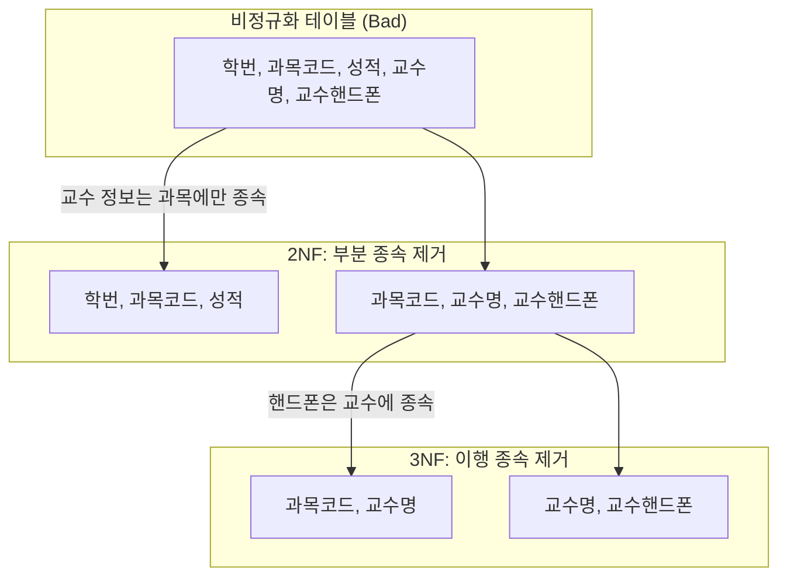

---
aliases:
  - DB 정규화
  - Normalization
  - 1NF 2NF 3NF
  - 정규형
  - 반정규화
tags:
  - SQL
related:
  - "[[Keys_and_Identifiers]]"
  - "[[ERD_Components]]"
  - "[[Data_Modeling_Overview]]"
---
#  Normalization Theory: 테이블 쪼개기의 미학

> [!QUOTE] 핵심 요약
> **"정규화(Normalization)"**란 뚱뚱하고 중복된 테이블을 잘게 쪼개서 **"데이터의 중복을 제거"**하고 **"무결성(Integrity)을 유지"**하는 과정입니다.
> *목표: 이상 현상(Anomaly) 방지*

---
## Why? 왜 쪼개야 하나요? (이상 현상) 

테이블을 하나에 몰아넣으면(비정규화 상태), 다음과 같은 **3대 이상 현상(Anomaly)** 이 발생합니다.

| 현상 | 설명 | 예시 상황 |
| :--- | :--- | :--- |
| **삽입 이상** (Insertion) | 불필요한 데이터를 넣지 않으면 새 데이터를 넣을 수 없음. | 신입생이 들어왔는데, 수강 신청을 안 했다고 학생 등록 자체가 불가능함. (PK가 `학번+과목`이라서) |
| **갱신 이상** (Update) | 중복된 데이터 중 일부만 수정되어 데이터 불일치 발생. | '홍길동'이 개명했는데, 100개의 수강 내역 중 99개만 바뀌고 1개는 옛날 이름으로 남음. |
| **삭제 이상** (Deletion) | 필요한 데이터까지 덩달아 삭제됨. | 학생이 수강을 취소했는데, 학생의 주소/전화번호 정보까지 같이 날아감. |

---
##  정규화 단계별 정리 (Step-by-Step) 

실무에서는 보통 **3정규형(3NF)** 까지만 진행합니다.

### ① 제1정규형 (1NF): "원자값(Atomic Value)을 가져라" ⚛️

* **Rule:** 하나의 칸(Cell)에는 **오직 하나의 값**만 들어가야 한다.
* **핵심:** **"가로(Column)로 늘어놓거나, 쉼표(,)로 뭉치지 말고, 세로(Row)로 쌓아라!"**

#### ❌ 흔한 위반 사례 (Bad Patterns)

**Type A. 쉼표로 우겨넣기 (Stuffing)**

> *"귀찮으니까 한 칸에 다 넣자."*
* **상황:** `취미` 컬럼에 **"축구,농구,야구"** 라고 텍스트로 저장.
* **문제점:**
    1.  **검색 불가:** "축구" 좋아하는 사람 찾을 때 `WHERE 취미 = '축구'`로 검색 안 됨.
    2.  **성능 저하:** `LIKE '%축구%'`를 써야 하는데, 이건 인덱스(Index)를 못 타서 **Full Scan** 발생.
    3.  **코드 지옥:** 데이터 꺼낼 때마다 앱에서 **`SPLIT(',')`** 하고 루프 돌려야 함.

**Type B. 컬럼으로 늘어놓기 (Spreading)**

> *"엑셀처럼 옆으로 늘리면 되잖아?"* (반복 그룹)
* **상황:** `가족1`, `가족2`, `가족3` 처럼 컬럼을 계속 만듦.
* **문제점:**
    1.  **확장성 꽝:** 가족이 4명이 되면? -> **테이블 구조 변경(ALTER TABLE)** 필요. (서버 점검각)
    2.  **공간 낭비:** 가족 없으면 `Null`만 잔뜩 들어감.
    3.  **쿼리 지옥:** "철수가 가족인 사람?" -> `WHERE 가족1='철수' OR 가족2='철수' OR ...` (최악)

#### ✅ 정규화 수행 (Solution: 1:N Table)

위의 두 가지 문제(쉼표, 반복컬럼)의 해결책은 똑같습니다.
**자식 테이블을 만들어서 세로(Row)로 데이터를 쌓는 것**입니다.

**[Before: 위반 상태]**

| 회원번호 | 이름 | 취미(Type A) | 가족1(Type B) | 가족2 |
| :--- | :--- | :--- | :--- | :--- |
| 101 | 김철수 | **축구,농구** | 영희 | 민수 |

**[After: 정규화 완료]**

**1. 회원 테이블 (부모)**

| 회원번호(PK) | 이름 |
| :--- | :--- |
| 101 | 김철수 |

**2. 취미/가족 테이블 (자식)** -> **행(Row)으로 데이터가 쌓임!**

| 회원번호(FK) | 구분 | 값 |
| :--- | :--- | :--- |
| **101** | 취미 | 축구 |
| **101** | 취미 | 농구 |
| **101** | 가족 | 영희 |
| **101** | 가족 | 민수 |

> **결론:** 이제 취미가 100개든, 가족이 10명이든 **테이블 수정 없이 `INSERT`만 하면 해결**됩니다. 이것이 정규화의 힘입니다!

### ② 제2정규형 (2NF): "부분 함수 종속 제거" 

* **조건:** 테이블의 PK가 **복합키(두 개 이상의 컬럼)** 일 때 발생합니다.
* **Rule:** PK 전체가 아닌, **PK의 일부(부분)** 에만 의존하는 컬럼을 떼어내라.
* **상황:**
    * PK: `학번` + `과목코드`
    * 일반 컬럼: `성적`, `교수명`
* **Bad:** `교수명`은 `과목코드`만 알면 결정됨. (`학번`과는 상관없음). → **부분 종속!**
* **Good:** `과목` 테이블(`과목코드`, `교수명`)을 따로 만듦.

### ③ 제3정규형 (3NF): "이행 함수 종속 제거" 

* **Rule:** PK가 아닌 일반 컬럼끼리 의존하는 관계(한다리 건너는 관계)를 끊어라.
* **상황:** `학번(PK)` -> `소속학과` -> `학과사무실위치`
* **Bad:** `학과사무실위치`는 사실 `학번`이 아니라 `소속학과`에 따라 결정됨. (A->B->C 구조)
* **Good:** `학과` 테이블(`학과명`, `위치`)을 따로 만듦.

---

## 3. 정규화 시각화 (Before & After)

가장 흔한 **수강신청 테이블** 예시로 3NF까지 가는 과정입니다.

`

---
## Performance Trade-off (정규화와 성능의 관계) 

정규화는 데이터의 무결성을 지키지만, 성능 면에서는 **"쓰기(Write)는 빨라지고, 읽기(Read)는 느려질 수 있다"** 는 양면성을 가집니다.

###  성능 향상 (Input / Update / Delete)

**"가벼워지니까 빠르다."**
* **이유:** 중복된 데이터가 없으니, 데이터를 수정할 때 **한 군데만 고치면** 됩니다.
* **효과:** 불필요한 I/O가 줄어들고, 데이터 잠금(Lock) 범위가 최소화되어 **입력, 수정, 삭제** 속도가 매우 빨라집니다.

###  성능 저하 (Select)

**"조립해야 하니까 느리다."**
* **이유:** 테이블이 잘게 쪼개져 있어서, 원하는 데이터를 보려면 **JOIN** 연산을 많이 해야 합니다.
* **효과:** 조인이 많아질수록 CPU 사용량이 늘어나고, **조회(SELECT)** 성능이 저하될 수 있습니다.

> [!WARNING] 실무의 딜레마
> 대부분의 서비스는 **"쓰기"보다 "읽기(조회)"가 8:2 정도로 압도적으로 많습니다.**
> 그래서 정규화를 원칙(3NF)대로 하되, **조회 성능이 너무 안 나올 때만 전략적으로 반정규화**를 수행합니다.

---
## 정규화 vs 반정규화 (De-Normalization) 비교

| 구분 | **정규화 (Normalization)** | **반정규화 (De-Normalization)** |
| :--- | :--- | :--- |
| **목표** | 데이터 중복 제거, 무결성 확보 | **조회 성능(Read Performance) 향상** |
| **장점** | 이상 현상 없음, 저장 공간 절약, **쓰기 성능 향상** | **JOIN 감소**로 인한 조회 속도 개선 |
| **단점** | **JOIN 증가**로 인한 **조회 성능 저하** 가능성 | 데이터 중복 발생, 데이터 불일치 위험(갱신 이상) |
