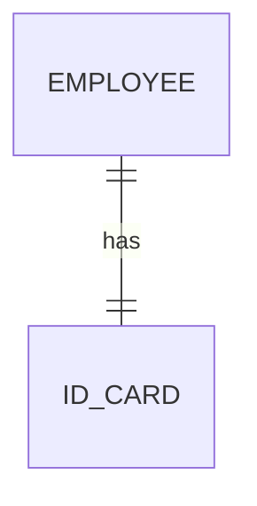
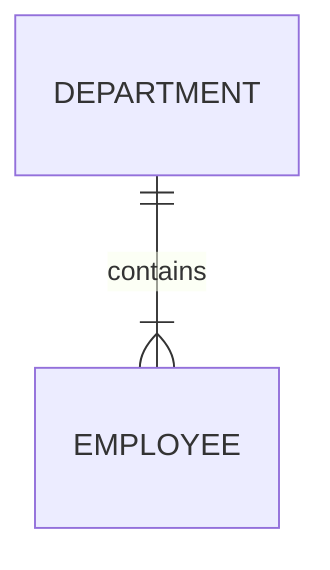
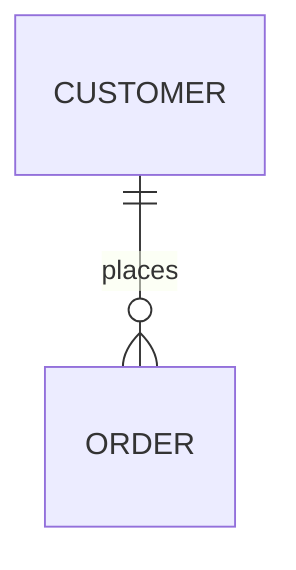
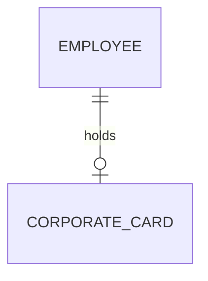
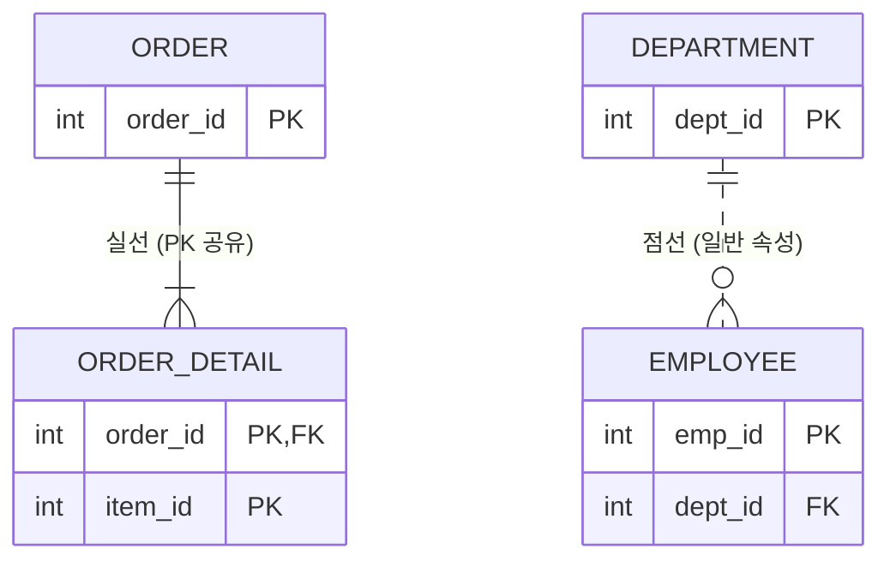
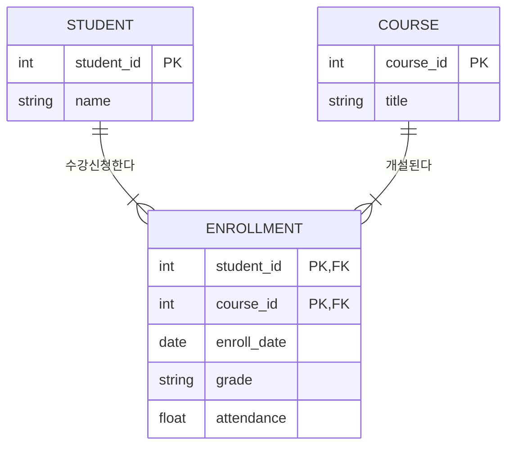

---
aliases:
  - ERD 구성요서
  - 엔터티
  - 속성
  - 관계
  - ERD 작성순서
tags:
  - SQL
related:
  - "[[Data_Modeling_Overview]]"
  - "[[SQL_Keys_and_Identifiers]]"
  - "[[00_SQL_HomePage]]"
---
# SQL ERD — 엔터티 · 속성 · 관계

## 개념 한 줄 요약

> **"데이터 모델링의 3대 재료(Entity · Attribute · Relationship)와 이를 그리는 설계도(ERD)."**

|개념|DB 에서|예시|
|---|---|---|
|엔터티 (Entity)|테이블 (Table)|학생, 과목, 부서|
|속성 (Attribute)|컬럼 (Column)|학번, 이름, 학점|
|관계 (Relationship)|FK · JOIN 조건|학생은 수강을 신청한다|

---

---

# ① ERD 작성 순서 — 도·배·설·명·차·선 ⭐️

> 순서 맞추기 문제로 자주 출제된다.

|순서|단계|내용|
|---|---|---|
|1|**도**출|엔터티를 찾아내서 그린다|
|2|**배**치|중요도와 관계 흐름에 따라 위치를 정한다|
|3|**설**정|엔터티 간의 관계를 연결한다|
|4|**명**기술|관계의 이름을 적는다 (예: 수강한다)|
|5|**차**수|1:1, 1:N 등 카디널리티를 표시한다|
|6|**선**택사양|필수인지 선택인지 표시한다|

## 배치 원칙

|원칙|설명|
|---|---|
|핵심 엔터티|왼쪽 상단에서 약간 아래쪽 중앙에 배치|
|상위 엔터티|부모는 왼쪽 상단, 자식은 오른쪽·하단으로|
|관계 흐름|왼쪽 → 오른쪽, 위 → 아래 방향으로 전개|
|가독성|관계선이 서로 교차하지 않도록 조정|

---

---

# ② 3대 표기법 비교

|구분|Peter Chen|Barker|IE (Information Engineering)|
|---|---|---|---|
|주요 사용 단계|개념적 모델링|논리적 모델링|논리적·물리적 모델링|
|관계 표현|**마름모** 도형|선(Line)|선(Line)|
|식별자 표기|속성 이름에 **밑줄**|속성 앞에 `#`|PK 레이블 또는 구분선|
|선택 표현|끝에 **동그라미**|**점선**|안쪽에 **동그라미**|
|엔터티 모양|**직각** 사각형|**둥근** 사각형|**직각** 사각형|
|다중도 표현|선 위에 숫자|까마귀 발 + 선|**까마귀 발 (Crow's Foot)**|

---

---

# ③ IE 표기법 — 관계선 해독기

> 선 끝에 달린 기호 2개만 보면 관계를 읽을 수 있다.

```
[엔터티 A]  ---|(안쪽)---(바깥쪽){  [엔터티 B]
               ↑                 ↑
          Optionality        Cardinality
          (필수/선택)          (몇 개?)
```

## 기호 의미

|위치|기호|이름|의미|
|---|---|---|---|
|안쪽 (Optionality)|`|`|실선|
|안쪽 (Optionality)|`o`|동그라미|**선택** (없을 수도 있음)|
|바깥쪽 (Cardinality)|`|`|실선|
|바깥쪽 (Cardinality)|`{`|까마귀 발|**N개** (복수, 최소 2개 이상)|

> **핵심:** 까마귀 발(`{`)은 "2개 이상"을 의미하고, 0까지 포함하느냐(선택)는 **안쪽 기호(Optionality)** 가 결정한다.

## 실전 조합 4가지

### ① 1:1 필수 — `||--||`

```
상황: 사원은 반드시 하나의 사원증을 발급받는다.
```



### ② 1:N 필수 — `||--|{`

```
상황: 부서는 반드시 여러 명의 직원을 보유한다. (직원 없는 부서는 폐지)
- 부서 쪽 || : 직원은 무조건 부서 하나에 소속
- 직원 쪽 |{ : 부서 하나엔 직원이 여러 명
```



### ③ 1:N 선택 — `||--o{` ⭐ 가장 흔함

```
상황: 고객은 주문을 안 할 수도 있고(0), 많이 할 수도 있다(N).
- 고객 쪽 || : 주문서는 반드시 고객이 있어야 함
- 주문 쪽 o{ : 고객은 주문을 0~N번 할 수 있음
```



### ④ 1:1 선택 — `||--o|`

```
상황: 사원은 법인카드를 가질 수도 있고, 없을 수도 있다.
- 사원 쪽 || : 카드는 반드시 주인(사원)이 있어야 함
- 카드 쪽 o| : 사원은 카드가 0개 또는 1개
```



---

---

# ④ 실선 vs 점선 — 식별자 관계 ⭐️

> **선 자체** 가 실선인지 점선인지를 본다. 부모의 PK 를 자식이 어떻게 물려받느냐의 차이다.

|구분|실선 (Identifying)|점선 (Non-Identifying)|
|---|---|---|
|이름|**식별자 관계** (강한 연결)|**비식별자 관계** (약한 연결)|
|핵심|부모 PK → 자식의 **PK** 로 들어감|부모 PK → 자식의 **일반 FK** 로 들어감|
|비유|부모 없이는 자식도 없다|부모 없어도 자식은 산다|
|예시|주문 - 주문상세 (주문 없으면 상세 불가)|부서 - 사원 (부서 폐지돼도 사원은 존재)|



---

---

# ⑤ 엔터티 (Entity) — "데이터를 담는 그릇"

## 엔터티 성립 조건 5가지

|조건|내용|
|---|---|
|① 필요 정보|업무에서 필요로 하는 정보여야 함|
|② 유일 식별자|인스턴스를 구분하는 PK 가 있어야 함|
|③ 인스턴스|**2개 이상의 행(Row)** 을 가져야 함|
|④ 속성|**2개 이상의 속성(Column)** 이 있어야 함|
|⑤ 관계|다른 엔터티와 **1개 이상의 관계** 가 있어야 함|

> ⚠️ **시험 오답 유형:** "속성이 1개만 있어도 엔터티가 될 수 있다" → **틀림! 최소 2개 필요**

**예시 — S병원에서 엔터티는 `병원`이 아니라 `환자`**

| |병원 ❌|환자 ✅|
|---|---|---|
|인스턴스|병원 1개뿐 → 인스턴스 1개|환자 여러 명 → 인스턴스 2개 이상|
|속성|관리할 반복 데이터 없음|이름·주소·생년월일 등 존재|
|식별자|구분할 필요 없음|환자ID 로 각 환자 구분 가능|

## 관계 생략이 허용되는 예외

|예외 유형|설명|예시|
|---|---|---|
|공통코드 엔터티|모든 엔터티와 연결 시 ERD 과복잡|국가코드, 상태코드|
|통계성 엔터티|집계·분석 목적. 원천 데이터와 직접 연결 불필요|월별 매출 통계|

---

## 엔터티 분류 A — 유무형 "개·사·유"

|분류|설명|예시|
|---|---|---|
|**개**념 (Conceptual)|눈에 안 보이는 개념적 존재|조직, 보험상품, 학과|
|**사**건 (Event)|업무 수행 중 발생. 데이터량 가장 많음|주문, 청구, 이벤트응모|
|**유**형 (Tangible)|눈에 보이는 물리적 실체|사원, 물품, 강사|

## 엔터티 분류 B — 발생 시점 "기·중·행"

|분류|설명|예시|
|---|---|---|
|**기**본 엔터티|독립적으로 생성. 다른 엔터티의 부모|고객, 상품, 사원|
|**중**심 엔터티|기본·행위 엔터티를 연결하는 업무 핵심|주문, 계약, 수강신청|
|**행**위 엔터티|두 엔터티 상호작용으로 발생하는 상세 내역|주문내역, 계약이력, 접속로그|

```
기본: 고객 ──┐
             ├──→ 중심: 주문 ──→ 행위: 주문상세 / 이력
기본: 상품 ──┘
```

## 엔터티 명명 규칙

|규칙|내용|
|---|---|
|현업 용어|약어보다 실제 업무 용어 사용|
|단수 명사|`학생들` ❌ → `학생` ✅|
|유일성|전체 모델 내에서 이름 중복 불가|
|영문|대문자(UPPERCASE) 로 표기|
|공백|띄어쓰기 없이 붙이거나 언더바 `_` 사용|
|관계 기술|명사가 아닌 **동사(현재형)** 으로 표현|

|❌ 잘못된 예|✅ 올바른 예|이유|
|---|---|---|
|고객 → 주문 관계|고객은 주문을 **한다**|명사 아닌 동사로|
|주문했다|주문**한다**|현재형 사용|
|학생 → 수강 연결|학생은 강좌를 **수강한다**|행위 동사로 서술|

---

---

# ⑥ 속성 (Attribute) — "그릇 안의 내용물"

> **"더 이상 쪼개지지 않는 데이터의 최소 단위."** 한 개의 속성은 반드시 **한 개의 값(Atomic Value)** 만 가진다.

## 용어 정리

```
[ 엔터티 = 테이블 전체: "학생" ]
┌────────┬────────┬────────┐
│ 학번   │ 이름   │ 학점   │  ← 속성 (Column)
├────────┼────────┼────────┤
│  101   │ 홍길동 │  A+    │  ← 인스턴스 (Row)
│  102   │ 이순신 │  B     │  ← 인스턴스 (Row)
└────────┴────────┴────────┘
    ↑
  속성값 (Attribute Value)
```

**관계의 법칙 (암기):**

- 한 개의 엔터티 → **2개 이상의 인스턴스(행)**
- 한 개의 엔터티 → **2개 이상의 속성(열)**
- 한 개의 속성 → **한 개의 속성값**

---

## 속성 분류 A — 특성 "기·설·파"

|분류|설명|예시|
|---|---|---|
|**기**본 속성|업무에 원래 존재하는 정보. 가장 많음|이름, 입사일, 주민번호|
|**설**계 속성|시스템이 관리 목적으로 새로 만든 정보|상품코드, 일련번호, 학번|
|**파**생 속성|다른 속성을 계산·변형해서 만든 정보|합계, 평균, 이자|

> 파생 속성은 정합성을 위해 꼭 필요한 경우에만 만든다.

## 속성 분류 B — 역할 "PK·FK·일반"

|분류|설명|예시|
|---|---|---|
|PK 속성|인스턴스를 유일하게 구분하는 식별자|학번, 사번|
|FK 속성|다른 엔터티와 연결되는 연결 고리|학과코드, 부서번호|
|일반 속성|PK 도 FK 도 아닌 나머지 정보|이름, 전화번호, 생년월일|

## 속성 분류 C — 분해 가능 여부

|분류|설명|예시|
|---|---|---|
|단일 속성|더 이상 못 쪼갬|나이, 학번|
|복합 속성|세부 속성으로 쪼갤 수 있음|주소 → 시·구·동|
|다중값 속성|값이 여러 개. **별도 엔터티로 분리 필요**|취미, 전화번호 목록|

---

## 도메인 (Domain) — 속성값의 범위와 타입

|속성|도메인|
|---|---|
|성별|`'남'` 또는 `'여'` 만 가능|
|학점|0.0 ~ 4.5 사이 실수|
|나이|0 ~ 120 사이 정수|

---

## 시스템 카탈로그 (System Catalog) — DB 의 신분증 ⭐️

> DBMS 가 생성 시 자동으로 만드는 데이터 사전. **메타 데이터(Meta-Data)** 라고도 부른다.

|특징|내용|
|---|---|
|조회|✅ 사용자가 `SELECT` 로 열람 가능|
|수정|❌ `INSERT / UPDATE / DELETE` 불가. DBMS 만 변경 가능|
|포함 정보|테이블·인덱스·뷰·도메인·권한 정보 등|

```sql
SELECT * FROM ALL_TABLES;   -- Oracle: 시스템 카탈로그 조회 예시
```

---

---

# ⑦ 관계 (Relationship) — "그릇 간의 연결 고리"

## 관계의 3대 요소 — "관·차·선"

|요소|의미|예시|
|---|---|---|
|**관**계명 (Membership)|무슨 사이야? 동사로 표현|소속된다, 주문한다|
|**차**수 (Cardinality)|몇 명이랑?|1:1, 1:N, M:N|
|**선**택사양 (Optionality)|필수야 선택이야?|Mandatory / Optional|

## 관계명 작성 원칙

|❌ 잘못된 예|✅ 올바른 예|이유|
|---|---|---|
|관계된다, 관련있다|소속된다, 포함한다|너무 포괄적|
|주문했다|주문**한다**|현재형 사용 필수|
|학생-수강 (명사)|수강신청**한다**|동사(행위)로 서술|
|A에 의한 B (수동)|생성한다, 소유한다|능동형 동사 사용|

---

## 관계의 종류

|구분|설명|예시|
|---|---|---|
|**존재 관계**|"소속"의 개념. 상대방이 있어서 내가 존재|부서 - 사원|
|**행위 관계**|"행동"의 개념. 이벤트로 연결됨|고객 - 주문|

---

## ERD vs 클래스 다이어그램 비교 ⭐️ SQLD 출제

> **ERD 에서는 존재·행위 관계를 구분하지 않고 같은 선으로 표현한다.** UML 클래스 다이어그램에서만 두 관계를 다른 기호로 구분한다.

|구분|ERD|클래스 다이어그램 (UML)|
|---|---|---|
|존재 관계|구분 없이 같은 선|**연관관계 (Association)**|
|행위 관계|구분 없이 같은 선|**의존관계 (Dependency)**|
|코드 구현|—|연관: **멤버 변수** / 의존: **파라미터·지역변수**|
|관계 지속성|—|연관: **항상** 유지 / 의존: 행위 **시점에만** 일시적|

> ❌ **오답 유형:** "ERD 에서는 존재 관계와 행위 관계를 다른 기호로 구분한다" → **틀림!**

---

## M:N 관계 처리 — 교차 엔터티 생성

> M:N 관계는 물리 DB 에서 그대로 구현할 수 없다. 
> 중간에 **교차 엔터티(Mapping Table)** 를 만들어 1:N + N:1 로 풀어줘야 한다.

```
❌ 물리 구현 불가:
학생 ────M:N──── 강좌

✅ 교차 엔터티로 변환:
학생 ──1:N──→ 수강신청 ←──N:1── 강좌
               (교차 엔터티)
```

---

## 관계 엔터티 (Relationship Entity) — "관계 자체가 엔터티가 되는 경우"

> **두 엔터티 사이의 관계가 그 자체로 속성을 가질 때, 그 관계를 엔터티로 승격시킨 것.**

### 왜 생기는가?

단순한 관계(연결선)는 속성을 가질 수 없다. 그런데 "학생이 강좌를 수강한다" 는 관계에 **수강일자**, **성적**, **출석률** 같은 정보가 붙으면, 이 관계 자체가 데이터를 담아야 하는 독립적인 엔터티가 된다.

```
관계에 속성이 생기는 순간 → 관계 엔터티로 승격!

학생 ────M:N──── 강좌
                ↓ 수강일자, 성적이 필요해지는 순간

학생 ──1:N──→ 수강 ←──N:1── 강좌
              (관계 엔터티)
              · 수강일자
              · 성적
              · 출석률
```

---

### 관계 엔터티의 특징

|특징|설명|
|---|---|
|**PK 구성**|양쪽 부모의 PK 를 모두 FK 로 받아 복합 PK 로 사용하는 경우가 많음|
|**발생 시점**|M:N 관계를 1:N + N:1 로 해소하는 과정에서 자연스럽게 생성됨|
|**엔터티 분류**|발생 시점 기준으로 **행위 엔터티** 에 해당|
|**식별자 관계**|부모 PK 가 자식 PK 로 들어가므로 **실선(식별자 관계)** 으로 연결|

---

### ⭐️ 속성 2개 이상 조건의 예외 — 관계 엔터티

> **엔터티 성립 조건 ④번 "속성이 2개 이상이어야 한다" 의 유일한 예외가 관계 엔터티다.**

일반 엔터티는 주식별자(PK) 외에 반드시 일반 속성이 1개 이상 있어야 엔터티로 인정된다. 하지만 **관계 엔터티는 주식별자 속성만 존재해도 엔터티로 인정**한다.

```
일반 엔터티:
┌──────────────┐
│ 학생          │
├──────────────┤
│ # 학번 (PK)  │ ← PK 만 있으면 엔터티 불인정
│ * 이름        │ ← 일반 속성 최소 1개 필요
└──────────────┘

관계 엔터티 (예외):
┌──────────────────────────────┐
│ 수강 (학생 ↔ 강좌의 관계 엔터티) │
├──────────────────────────────┤
│ # 학번 (PK, FK)              │ ← 주식별자만 있어도
│ # 강좌코드 (PK, FK)          │   엔터티로 인정!
└──────────────────────────────┘
  일반 속성(수강일자, 성적 등)이 없어도 M:N 관계를
  해소하기 위해 존재 자체가 의미를 가지므로 허용
```

> **왜 예외인가?** 관계 엔터티의 존재 목적은 두 엔터티 간의 **"연결 사실 그 자체"** 를 기록하는 것이다. "학생 A 가 강좌 B 를 수강했다" 는 사실만으로도 데이터로서 의미가 있기 때문에, 추가 속성이 없어도 엔터티로 인정한다.

|구분|속성 2개 이상 조건|근거|
|---|:-:|---|
|일반 엔터티|✅ 필수|PK 만으로는 정보가 없음|
|**관계 엔터티**|**❌ 예외 허용**|**연결 사실 자체가 데이터**|

---

### 실전 예시

#### ① 수강신청 — 학생과 강좌 사이



#### ② 주문상세 — 주문과 상품 사이

```
주문 ────M:N──── 상품
(주문 하나에 상품 여러 개 / 상품은 여러 주문에 포함)

→ 관계에 '수량', '단가', '할인율' 이 필요
→ 주문상세 관계 엔터티 생성
```

```sql
-- 관계 엔터티의 테이블 구현
CREATE TABLE 주문상세 (
    주문번호   INT  REFERENCES 주문(주문번호),   -- 부모1 FK → PK 참여
    상품코드   INT  REFERENCES 상품(상품코드),   -- 부모2 FK → PK 참여
    수량       INT  NOT NULL,
    단가       INT  NOT NULL,
    할인율     DECIMAL(3,2),
    PRIMARY KEY (주문번호, 상품코드)             -- 복합 PK
);
```

---

### 관계 엔터티 vs 일반 엔터티 구분법

|구분|관계 엔터티|일반 엔터티|
|---|---|---|
|PK 구성|**양쪽 부모 FK 의 복합 PK** 가 많음|독립적인 자체 PK|
|탄생 이유|M:N 해소 or 관계에 속성 발생|업무에 원래 존재|
|독립 존재|부모 없이 존재 불가|독립적으로 존재 가능|
|ERD 연결선|**실선** (식별자 관계)|실선 or 점선|
|엔터티 분류|**행위 엔터티**|기본 or 중심 엔터티|

---

---


---

