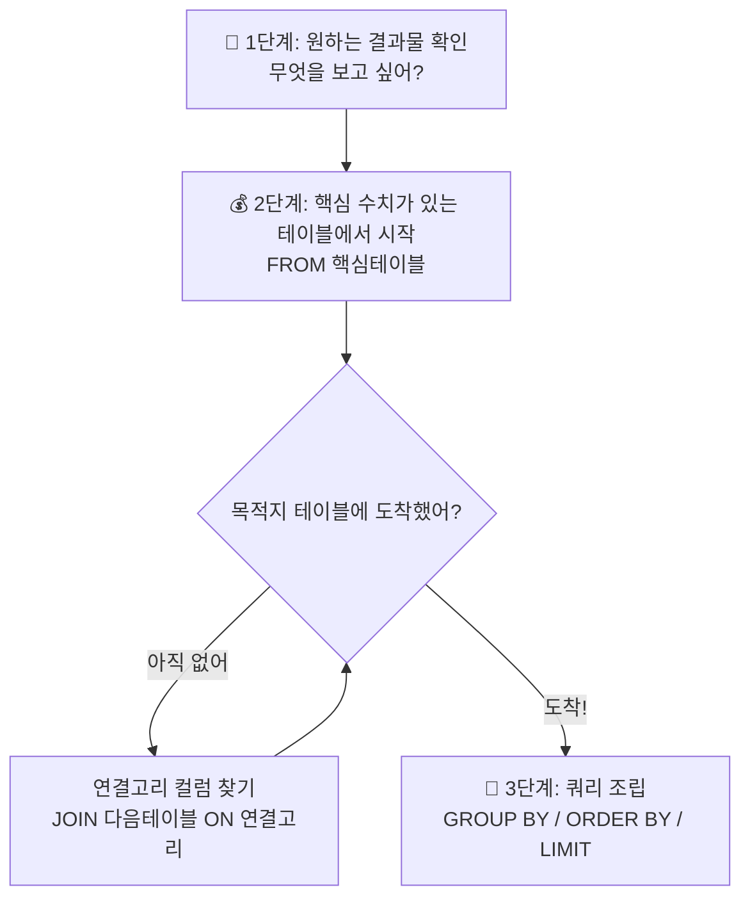

---
aliases:
  - SQL 조인
  - Inner Join
  - Left Join
  - Outer Join
  - 벤다이어그램
  - Join...ON
tags:
  - SQL
  - JOIN
related:
  - "[[Aggregation_GROUP_BY]]"
  - "[[SubQuery_CTE]]"
  - "[[Window_Functions]]"
---
## 개념 한 줄 요약 (Concept Summary)

**"공통된 열(Key)을 기준으로 두 개의 테이블을 하나로 합치는 연산이다."**
마치 엑셀의 `VLOOKUP`을 더 강력하게 사용하는 것과 같으며, 집합 이론(벤다이어그램)으로 이해하면 가장 정확하다.

**"두 테이블을 합치는 기준(ON)은 단순한 'ID 매칭'을 넘어, 여러 조건(AND)을 동시에 만족하는 정교한 필터링 연결이 가능하다."**

---
## 왜 필요한가? (Why)

**문제점 (Normalization):** 
데이터베이스는 중복을 피하기 위해 `회원정보`와 `주문내역`을 따로 저장한다. 따로 보면 "누가 무엇을 샀는지" 알 수 없다.

**해결책 (Join):** 
분석을 위해 두 테이블을 **연결고리(Key)** 로 묶어서 하나의 표로 만들어야 한다.

**심화 필요성:** 
단순히 ID만 연결하는 게 아니라, **"특정 그룹의 최댓값"** 이나 **"기간 조건"** 등 복합적인 로직을 처리하려면 `ON` 절에 `AND` 조건을 추가해야 한다.

---
##  실전 맥락 (Practical Context)

**데이터 엔지니어가 상황별로 쓰는 JOIN:**
- **INNER JOIN:** "주문 이력이 있는 **진성 고객**만 뽑아줘." (교집합)
- **LEFT JOIN:** "주문을 안 했어도 **전체 고객** 리스트를 보고 싶어. 주문 없으면 빈칸(NULL)으로 둬." (전체 + 부분)
- **다중 조건 JOIN:** "요일별로 **가장 매출이 높았던** 결제 건의 상세 영수증을 찾아줘." (그룹별 최댓값)


---
## 상세 분석: 벤다이어그램으로 이해하기 (Detailed Analysis)

두 개의 테이블, **Table A (왼쪽)** 와 **Table B (오른쪽)** 가 있다고 가정하자.

### ① INNER JOIN (교집합) ⭐️ 가장 많이 씀

> **"양쪽 모두에 존재하는 데이터만 남긴다."**

- **벤다이어그램:** 두 원이 겹치는 **가운데 부분**만 색칠.

- **특징:**
    - 짝이 없는 데이터는 가차 없이 버려진다.
    - 결과 행(Row)의 수가 줄어들 수 있다.

- **예시:** `회원` 테이블과 `주문` 테이블을 Inner Join 하면, **"주문 내역이 있는 회원"** 만 남는다. 
- (가입만 하고 주문 안 한 유령 회원은 사라짐)

```sql
SELECT *
FROM Customer A
INNER JOIN Orders B ON A.id = B.customer_id;
```


### ② LEFT (OUTER) JOIN (왼쪽 기준) 

> **"왼쪽 테이블은 무조건 다 살리고, 오른쪽은 있으면 붙이고 없으면 비워둔다."**

- **벤다이어그램:** **왼쪽 원 전체**를 색칠. (겹치는 부분 포함)
    
- **특징:**
    - 기준이 되는 왼쪽 테이블(`FROM`절)의 데이터는 절대 사라지지 않는다.
    - 오른쪽 테이블에 매칭되는 정보가 없으면 그 자리는 **`NULL`** 로 채워진다.

- **예시:** "모든 회원을 보여주되, 주문 내역이 있으면 보여주고 없으면 '없음(NULL)'으로 표시해."

```sql
SELECT *
FROM Customer A  -- A가 주인공(Left)
LEFT JOIN Orders B ON A.id = B.customer_id;
```

### ③ FULL (OUTER) JOIN (합집합)

> **"너랑 나랑 가진 거 다 합치자. 없는 건 빈칸으로 두고."**

- **벤다이어그램:** **두 원 전체**를 색칠.

- **특징:**
    - 양쪽 어디든 데이터가 있으면 결과에 나온다.
    - `MySQL`에서는 지원하지 않아서 `LEFT JOIN`과 `RIGHT JOIN`을 `UNION`해서 쓴다. 
    - (실무 사용 빈도 낮음)

----
## 고급 패턴

### 패턴 A: 연결고리는 ID가 아니어도 된다

- **개념:** ID가 없어도 **"의미가 같은 컬럼"** 이면 무엇이든 붙일 수 있다.
- **예시:** `지역(City)`으로 날씨 테이블과 매출 테이블 조인하기.


### 패턴 B: 다중 조건 조인 (Groupwise Max)

**"ID도 같고(AND) 값도 똑같은 행만 찾아라."** 
그룹별 최댓값 행 찾기**의 핵심 로직

- **상황:** 각 요일별로 가장 비싼 결제 내역(상세 정보 포함)을 보고 싶다.
- 해결: 
	- ① 서브쿼리로 `요일별 최고액`을 먼저 구한다.
	- ② 원본과 조인할 때 **`ON` 절에 `AND`**를 써서 두 가지 조건을 동시에 건다.

```sql
SELECT t.*
FROM tips t
JOIN (
    -- [1단계] 정답지: 요일별 최고 기록 구하기
    SELECT day, MAX(total_bill) AS max_bill
    FROM tips
    GROUP BY day
) m
  ON t.day = m.day              -- 조건 1: 요일이 같아야 하고 (그룹 매칭)
 AND t.total_bill = m.max_bill; -- 조건 2: 금액이 최고액과 같아야 함 (값 매칭)
```

- **핵심:** `ON` 절은 단순 연결 고리가 아니라, **복합 필터링 조건**으로 사용할 수 있다.

### 패턴 C: 체인 JOIN (다중 테이블 연결)

**"JOIN은 2개 테이블만 하는 게 아니다. 연결고리가 있으면 계속 이어붙일 수 있다."**

- **상황:** "배우별 총 매출을 구하고 싶다."
- **문제:** `payment`(결제) ↔ `actor`(배우) 사이에 직접 연결고리가 없다.
- **해결:** 중간 테이블들을 **다리 삼아** 체인처럼 연결한다.


```sql
-- payment → rental → inventory → film_actor → actor
-- 결제      임대      재고         영화-배우      배우
SELECT
    a.first_name,
    a.last_name,
    SUM(p.amount) AS total_revenue
FROM payment p
JOIN rental r     ON p.rental_id = r.rental_id        -- 결제 ↔ 임대
JOIN inventory i  ON r.inventory_id = i.inventory_id  -- 임대 ↔ 재고
JOIN film_actor fa ON i.film_id = fa.film_id           -- 재고 ↔ 영화-배우
JOIN actor a      ON fa.actor_id = a.actor_id          -- 영화-배우 ↔ 배우
GROUP BY a.actor_id, a.first_name, a.last_name
ORDER BY total_revenue DESC
LIMIT 5;
```

- **핵심 사고법:** JOIN을 쓰기 전에 **"어떤 테이블이 다리 역할을 하는가?"** 를 먼저 그려보자.

payment → rental → inventory → film_actor → actor
  결제  →  임대  →    재고   →  영화-배우  →  배우

### 📋 복잡한 JOIN 문제 풀이 전략



---
## 초보자가 자주 하는 실수 (Misconceptions)

### ① "LEFT JOIN을 하면 행 개수는 그대로겠죠?" (X)

- **현실:** 오른쪽 테이블에 매칭되는 데이터가 여러 개(1:N)라면, 왼쪽 데이터가 복제되어 **행 개수가 늘어납니다.** (뻥튀기 주의)

### ② "INNER JOIN 썼더니 데이터가 다 날아갔어요." (X)

- **현실:** 연결 고리 값이 일치하는 게 하나도 없으면 0건이 조회됩니다. 데이터 유실이 걱정되면 **LEFT JOIN**을 쓰세요.

### ③ "ON 절에는 조건 하나만 써야 하나요?" (X)

- **현실:** `ON A.id = B.id AND A.date > '2024-01-01'` 처럼 **여러 조건을 `AND`로 묶어서** 정교하게 조인할 수 있습니다.

### ④ "NULL 처리를 깜빡했어요." (X)

- **현실:** LEFT JOIN 결과에서 매칭되지 않은 오른쪽 컬럼은 `NULL`입니다. 이를 `SUM()`하거나 계산할 때 `COALESCE(col, 0)` 등으로 처리하지 않으면 결과가 망가집니다.

### ⑤ "최댓값이 여러 개면 한 명만 나오나요?" (X)

- **현실:** 위 **패턴 B** 쿼리에서 최고 기록(50불)을 낸 사람이 2명이면, **2명 다 출력**됩니다. (공동 1등). 딱 한 명만 뽑으려면 `ROW_NUMBER()` 윈도우 함수를 써야 합니다.

### ⑥ "JOIN은 두 테이블끼리만 하는 거 아닌가요?" (X)

- **현실:** 연결고리(Key)가 있으면 몇 개든 이어붙일 수 있습니다.
- 단, JOIN이 많아질수록 **성능이 느려질 수 있으니** 필요한 테이블만 연결하세요.