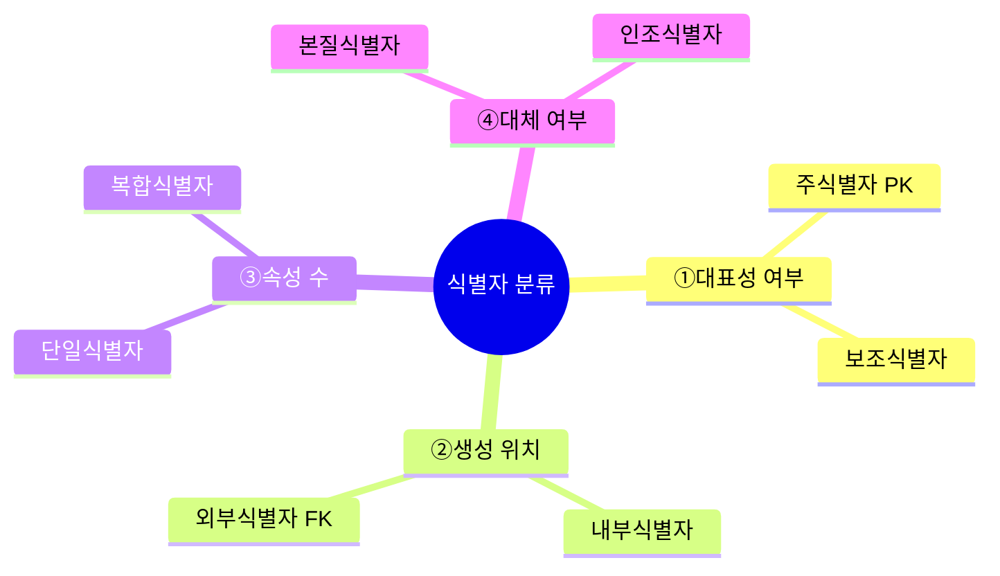
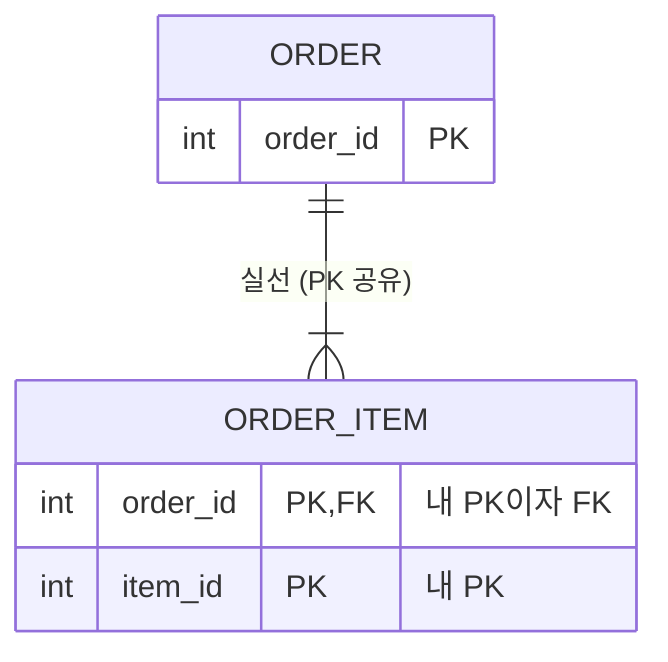
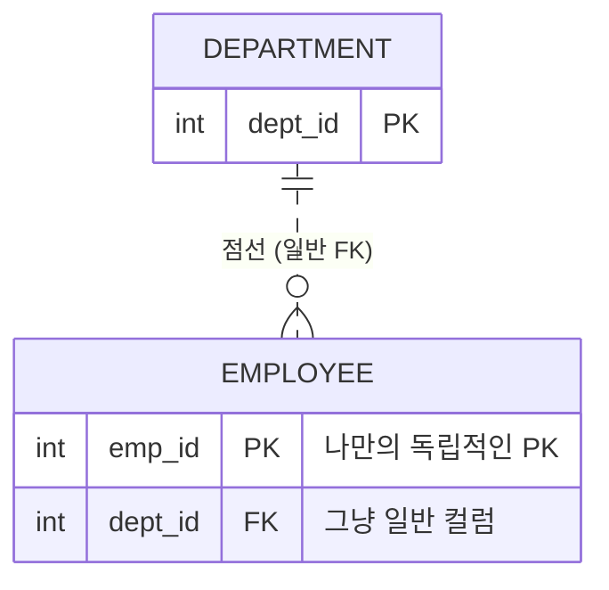

---
aliases:
  - 식별자 완벽 정리
  - DB Identifier Theory
  - 주식별자와 보조식별자
  - 식별자 분류
  - 인조식별자vs본질식별자
tags:
  - SQL
related:
  - "[[Data_Modeling_Overview]]"
  - "[[ERD_Components]]"
  - "[[00_SQL_HomePage]]"
  - "[[SQL_DML_CRUD]]"
---
# Identifier Theory: 식별자의 모든 것

> **핵심 요약** **"식별자(Identifier)"** 란 엔터티(Entity) 내에서 인스턴스들을 구분할 수 있는 **구분자**이다. 단순히 PK만 있는 것이 아니라, **대표성 · 생성 원인 · 속성 수 · 대체 여부**에 따라 다양하게 분류된다.

---
## 주식별자의 4대 특징 ⭐

주식별자(Primary Identifier)가 되려면 아래 4가지 조건을 **반드시** 만족해야 합니다.

> 💡 **암기 팁: "유.최.불.존"**

|특징|설명|위반 예시|
|:--|:--|:--|
|**유**일성 (Uniqueness)|모든 인스턴스를 유일하게 구분해야 함|이름 → 동명이인이 있으면 탈락|
|**최**소성 (Minimality)|유일성을 만족하는 **최소한의 속성 수**로 구성|사번+이름 → 사번만으로 구분되는데 이름은 불필요|
|**불**변성 (Immutability)|식별자의 값은 변하지 않아야 함|부서명 → 부서 이름이 바뀌면 식별자가 흔들림|
|**존**재성 (Not Null)|값이 반드시 존재해야 함 (NULL 불가)|취미 → 없는 사람이 있을 수 있음|

---
##  SQLD 표기법 — 테이블 다이어그램에서 PK 구분하기

SQLD 문제에서 테이블 구조는 아래처럼 표기됩니다.

>💡 **핵심 규칙:** 가로선 **위쪽 = PK**, 가로선 **아래쪽 = 일반 컬럼** PK는 자동으로 `NOT NULL + UNIQUE` 조건을 가집니다.

### 케이스 1 — 단일 PK (가장 흔한 형태)


```text
┌─────────────────┐
│      COL1       │  ← PK 1개
├─────────────────┤
│ COL2            │  ← 일반 컬럼
│ COL3 DEFAULT 'D'│
└─────────────────┘
```

### 케이스 2 — 복합 PK ⭐ (시험 자주 출제)

```text
┌─────────────────┐
│  회원번호(FK)   │  ← PK 2개가 선 위쪽에 함께 존재
│  배송지순번     │  ← = 복합식별자(Composite Identifier)!
├─────────────────┤
│  배송지         │  ← 일반 컬럼
└─────────────────┘
```

>선 위쪽에 **컬럼이 2개 이상** 있으면 → **복합 PK** 이 경우 두 컬럼이 **합쳐져야** 하나의 행을 유일하게 식별할 수 있습니다.

### 실전 예시 (1NF 정규화 문제):

```test
[정규화 전 - 1NF 위반]            [정규화 후 - 1NF 만족 ✅]

┌──────────────┐            회원              배송지
│   회원번호   │         ┌──────────┐    ┌────────────────┐
├──────────────┤         │  회원번호 │    │  회원번호(FK)  │ ← 복합 PK
│   아이디     │  →1NF→  ├──────────┤    │  배송지순번    │ ← 복합 PK
│   이름       │         │  아이디   │    ├────────────────┤
│   배송지1    │ ← 반복!  │  이름     │    │  배송지        │ ← 일반 컬럼
│   배송지2    │ ← 위반   └──────────┘    └────────────────┘
│   배송지3    │
└──────────────┘
```

### 케이스 3 — 일반 컬럼 없이 PK만 존재

```text
┌─────────────────┐
│      COL1       │  ← PK만 있음
├─────────────────┤
│                 │  ← 일반 컬럼 없음 (비어있음)
└─────────────────┘
```

>매핑(교차) 테이블이나 단순 코드 테이블에서 볼 수 있는 형태입니다.

---
## 식별자의 분류 체계 (Classification)

식별자는 바라보는 **관점**에 따라 4가지로 분류됩니다.



---
## 대표성 여부 — "엔터티를 대표하냐, 아니냐?"

|구분|설명|예시|특징|
|:--|:--|:--|:--|
|**주식별자** (Primary Identifier)|엔터티를 대표하며, FK 참조의 기준이 됨|사원번호, 고객ID|PK로 지정됨|
|**보조식별자** (Alternate Identifier)|유일성은 만족하지만 대표성은 없음|주민등록번호 — 유일하지만 보안상 PK로 안 씀|물리 테이블에서 **Unique Index**로 지정됨|

> 💡 **왜 주민번호를 PK로 안 쓸까?** 유일하긴 하지만, 외부 시스템에 노출될 수 있고 법적으로도 수집이 제한됩니다. 그래서 별도의 `고객ID`를 인조식별자로 만들어 PK로 씁니다.

---
## 생성 위치 — "어디서 왔냐?"

|구분|설명|예시|
|:--|:--|:--|
|**내부식별자** (Internal Identifier)|엔터티 내부에서 스스로 생성된 식별자|부서코드, 주문번호|
|**외부식별자** (Foreign Identifier / FK)|다른 엔터티와의 관계를 통해 외부에서 들어온 식별자|사원 테이블의 '부서코드(FK)'|

---
##  속성의 수 — "몇 개 컬럼으로 구성됐냐?"

|구분|설명|예시|
|:--|:--|:--|
|**단일식별자** (Single Identifier)|하나의 속성으로만 구성됨|고객ID|
|**복합식별자** (Composite Identifier)|두 개 이상의 속성이 묶여서 식별자 역할|수강이력 = `학번` + `과목코드` 가 합쳐져야 유일함|

> ⚠️ **복합식별자 주의사항:** 유일성을 위해 억지로 속성을 추가하지 말 것! **최소성 원칙**에 따라 꼭 필요한 속성만 묶어야 합니다.

---
## 대체 여부 — "업무에 원래 있던 거냐, 만든 거냐?"

|구분|설명|예시|장단점|
|:--|:--|:--|:--|
|**본질식별자** (Natural Identifier)|업무에 존재하는 데이터를 그대로 사용|이메일, 주민번호, 사업자번호|직관적이나 값이 길어지거나 **변경될 위험**이 있음|
|**인조식별자** (Surrogate Identifier)|업무적으로는 없지만, 편의상 인위적으로 만든 식별자|일련번호(Sequence), 로그ID|절대 중복 안 되고 관리가 편함|

> 💡 **인조식별자를 쓰는 이유:** 복합식별자(주문번호+상품번호)처럼 PK가 두 개 이상인 경우, 이것들을 **하나의 인조 ID로 통합**해서 쓰는 게 관리가 훨씬 편하기 때문입니다. **대리식별자(Surrogate Identifier)** 라고도 합니다.

---
##  ERD 식별자 판별 실전 예제 ⭐ (SQLD 출제 유형)

SQLD에서는 **"이 속성은 어떤 식별자에 해당하는가?"** 를 ERD 보고 판별하는 문제가 출제됩니다.

### ERD 예시

```
[고객]                       [주문]                        [주문상세]
──────────────              ──────────────────            ──────────────────────
고객ID   (PK)  ──1:N──▷    주문번호  (PK)    ──1:N──▷   주문번호  (PK, FK)
──────────────              ──────────────────            상품코드  (PK, FK)
이메일   (UQ)               고객ID    (FK)                ──────────────────────
이름                         주문일자                       수량
                             총금액                         단가
```

### 식별자 분류표

| 속성                 |   ① 대표성   |  ② 생성 위치   | ③ 속성 수 | ④ 대체 여부 | 비고                          |
| :----------------- | :-------: | :--------: | :----: | :-----: | :-------------------------- |
| 고객.`고객ID`          | **주식별자**  |   **내부**   | **단일** | **인조**  | 업무에 없던 걸 시스템이 만든 번호         |
| 고객.`이메일`           | **보조식별자** |     내부     |   단일   | **본질**  | 유일하지만 PK가 아님 → Unique Index |
| 주문.`주문번호`          | **주식별자**  |   **내부**   | **단일** | **인조**  | 시스템이 자동 생성한 Sequence        |
| 주문.`고객ID`          |     —     | **외부(FK)** |   단일   |    —    | 고객 테이블에서 넘어온 식별자            |
| 주문상세.`주문번호`+`상품코드` | **주식별자**  | **외부(FK)** | **복합** |    —    | 두 FK가 합쳐져야 유일함              |

---

### 시험 출제 패턴 3가지

**패턴 ① "다음 중 보조식별자에 해당하는 것은?"**

→ **유니크하지만 PK가 아닌 것** 찾기. → 위 예시에서 고객의 `이메일`이 정답. (유일하지만 보안/관리상 PK로 쓰지 않음)

**패턴 ② "주문상세 엔터티의 주식별자 유형으로 옳은 것은?"**

→ `주문번호 + 상품코드` 두 개가 합쳐져야 유일 → **복합식별자** → 두 속성 모두 다른 테이블에서 온 FK → **외부식별자**

**패턴 ③ "인조식별자를 사용하는 이유로 가장 적절한 것은?"**

→ 본질식별자(이메일, 주민번호)는 **값이 바뀔 수 있고 길어서** 관리가 어려움. → 짧고 불변하는 일련번호(Sequence)로 대체하는 것이 설계상 유리함.

---
##  식별 관계 vs 비식별 관계

부모 테이블의 PK를 자식 테이블이 **"어떻게 물려받느냐"** 에 따라 두 가지로 나뉩니다.

|구분|**식별 관계 (Identifying)**|**비식별 관계 (Non-Identifying)**|
|:--|:--|:--|
|**ERD 표기**|**실선** ────|**점선** - - - -|
|**PK 포함 여부**|부모의 PK가 자식의 **PK + FK**가 됨|부모의 PK가 자식의 **일반 속성(FK)**으로만 옴|
|**의존성**|**강한 의존** "부모 없이는 자식도 없다"|**약한 의존** "부모 없어도 자식 혼자 식별 가능"|
|**비유**|**유전자** — 부모의 피가 나의 정체성|**헬스장 회원권** — 내가 누구든 상관없고, 회원권만 가짐|
|**언제 쓰나**|부모 없이 자식이 존재 불가한 경우|대부분의 일반적인 관계|

---
## 식별 관계 (Identifying) — 실선

자식이 부모의 PK를 **자신의 PK 일부**로 사용하는 경우. 부모가 사라지면 자식도 존재 가치를 잃습니다.

**예시:** `주문` → `주문상품` 주문상품은 주문번호 없이는 존재할 수 없습니다. 주문번호가 곧 나의 PK 일부.



---
## 비식별 관계 (Non-Identifying) — 점선

자식이 부모의 PK를 **참고용(FK)** 으로만 가지는 경우. 자식은 독립적인 PK를 가지고 있고, 부모는 단지 참조만 할 뿐입니다.

**예시:** `부서` → `사원` 사원은 부서가 없어도(대기발령) 사번이라는 독립적인 PK가 있습니다.



> 💡 **설계 원칙:** 반드시 종속적이어야 하는 경우(주문-주문상세, 게시글-댓글)에만 **식별 관계(실선)** 를 고민하고, 나머지는 대부분 **비식별 관계(점선)** 으로 설계합니다.