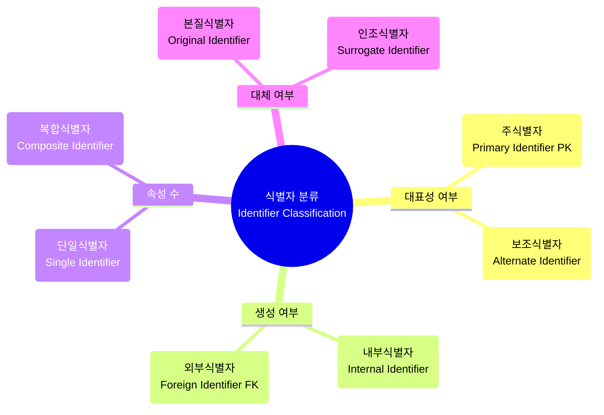
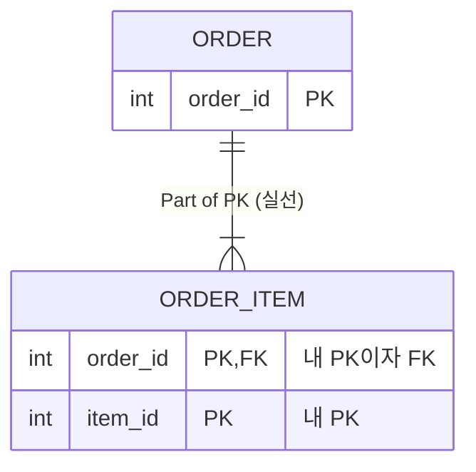
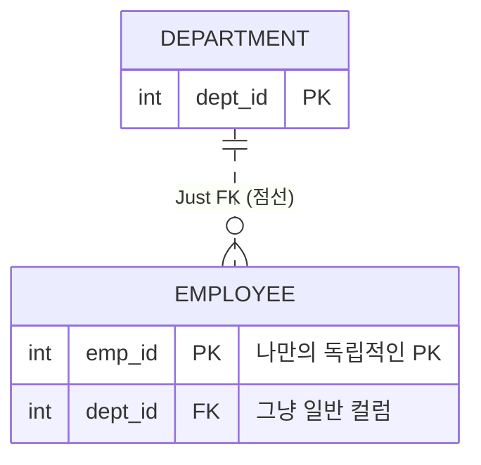

---
aliases:
  - 식별자 완벽 정리
  - DB Identifier Theory
  - 주식별자와 보조식별자
  - 식별자 분류
  - 인조식별자vs본질식별자
tags:
  - SQL
related:
  - "[[Data_Modeling_Overview]]"
  - "[[ERD_Components]]"
  - "[[00_SQL_HomePage]]"
  - "[[SQL_Constraints]]"
  - "[[SQL_DML_CRUD]]"
---
#  Identifier Theory: 식별자의 모든 것

> [!QUOTE] 핵심 요약
> **"식별자(Identifier)"**란 엔터티(Entity) 내에서 인스턴스들을 구분할 수 있는 **구분자**이다.
> 단순히 PK만 있는 것이 아니라, **대표성, 생성 원인, 속성 수, 대체 여부**에 따라 다양하게 분류된다.

---
##  주식별자의 4대 특징 (Featuers) ⭐

주식별자(Primary Identifier)가 되기 위해서는 반드시 아래 4가지 조건을 만족해야 합니다. **(암기 필수: 유.최.불.존)**

| 특징                        | 설명                                | 위반 예시                              |
| :------------------------ | :-------------------------------- | :--------------------------------- |
| **1. 유일성 (Uniqueness)**   | 모든 인스턴스를 유일하게 구분해야 함.             | 이름(동명이인이 있으면 탈락)                   |
| **2. 최소성 (Minimality)**   | 유일성을 만족하는 **최소한의 속성 수**로 구성되어야 함. | 사번+이름 (사번만으로 구분되는데 굳이 이름을 낄 필요 없음) |
| **3. 불변성 (Immutability)** | 식별자의 값은 변하지 않아야 함.                | 부서명 (부서 이름이 바뀌면 식별자가 흔들림)          |
| **4. 존재성 (Not Null)**     | 값이 반드시 존재해야 함 (Null 불가).          | 취미 (없는 사람이 있을 수 있음)                |

---
## SQLD 표기법 — 테이블 다이어그램에서 PK 구분하기

SQLD 문제에서 테이블 구조는 아래처럼 표기된다.

```scss
┌─────────────────┐
│      COL1       │  ← 선 위쪽 단독 = PK
├─────────────────┤
│ COL2            │
│ COL3 DEFAULT 'D'│  ← 선 아래쪽 = 일반 컬럼
└─────────────────┘
```

>가로선으로 분리되어 **위쪽에 단독으로 있는 컬럼 = PK** PK는 자동으로 `NOT NULL + UNIQUE` 조건을 가진다.


## 식별자의 분류 체계 (Classification) 

식별자는 바라보는 **관점**에 따라 4가지로 분류됩니다.

### ① 대표성 여부 (Who represents?)

* **주식별자 (Primary Identifier):**
    * 엔터티를 대표하며, 다른 엔터티와 참조 관계(FK)를 맺는 기준. (예: 사원번호)

* **보조식별자 (Alternate Identifier):**
    * 유일성은 만족하지만 대표성은 없는 식별자. (예: 주민등록번호 - 유일하지만 보안상 PK로 안 씀)
    * *특징: 물리적 테이블 레벨에서는 유니크 인덱스(Unique Index)로 지정됨.*

### ② 스스로 생성 여부 (Where from?)

* **내부식별자 (Internal Identifier):**
    * 엔터티 내부에서 스스로 생성된 식별자. (예: 부서코드, 주문번호)

* **외부식별자 (Foreign Identifier / FK):**
    * 다른 엔터티와의 관계(Relationship)를 통해 외부에서 들어온 식별자. (예: 사원 테이블의 '부서코드')

### ③ 속성의 수 (How many columns?)

* **단일식별자 (Single Identifier):**
    * 하나의 속성으로만 구성됨. (예: 고객ID)

* **복합식별자 (Composite Identifier):**
    * 두 개 이상의 속성이 묶여서 식별자 역할을 함. (예: 수강이력 = `학번` + `과목코드` 가 합쳐져야 유일함)

### ④ 대체 여부 (Artificial?)

* **본질식별자 (Original/Natural Identifier):**
    * 업무에 존재하는 데이터를 그대로 씀. (예: 이메일, 주민번호)
    * 원조식별자라고도 함
    * *단점: 값이 길어지거나 변경될 위험이 있음.

* **인조식별자 (Surrogate/Artificial Identifier):**
    * 업무적으로는 없지만, 편의상 인위적으로 만든 식별자. (예: **일련번호(Sequence)**, 로그ID,주문번호+상품번호로 구성된 주문목록번호)
    * 주식별자의 속성이 두 개이상인 경우 그 속성들을 하나로 묶어서 사용하는 식별자
    * 대리식별자라고도 함 
    * *장점: 절대 중복 안 되고 관리가 편함.*

---
## 식별자 관계 (Relationship) 도식화



---
## 식별 관계 vs 비식별 관계 (Identifying vs Non-Identifying)

부모 테이블의 PK(기본키)를 자식 테이블이 **"어떻게 물려받느냐"** 에 따라 두 가지로 나뉩니다.

| 구분 | **식별 관계 (Identifying)** | **비식별 관계 (Non-Identifying)** |
| :--- | :--- | :--- |
| **ERD 표기** | **실선 (Solid Line)** ──── | **점선 (Dashed Line)** - - - - |
| **PK 포함 여부** | 부모의 PK가 자식의 **PK + FK**가 됨. | 부모의 PK가 자식의 **일반 속성(FK)**으로만 옴. |
| **의존성** | **강한 의존 (종속적)**<br>"부모 없이는 자식도 없다." | **약한 의존 (독립적)**<br>"부모 없어도 자식 혼자 식별 가능." |
| **비유** | **DNA (유전자)**<br>(부모의 피가 나의 정체성) | **헬스장 회원권**<br>(내가 누구든 상관없고, 회원권만 가짐) |

### ① 식별 관계 (Identifying Relationship) - 실선

**"자식이 부모의 신분증을 자기 신분증(PK)의 일부로 쓰는 경우"**

자식 데이터는 부모 없이는 **존재할 수도, 식별될 수도 없는** 운명 공동체입니다.

* **예시:** `주문` - `주문상품`
    * 주문상품(`Order_Item`)은 `주문번호(Order_ID)` 없이는 세상에 존재할 수 없습니다.
    * `주문번호`가 곧 나의 PK 일부입니다.



### ② 비식별 관계 (Non-Identifying Relationship) - 점선

**"자식이 부모의 신분증을 그냥 주머니(일반 컬럼)에 넣고 다니는 경우"**

자식은 **독립적인 ID(PK)** 를 가지고 있고, 부모는 단지 **참조(Link)** 만 할 뿐입니다.

**예시:** `부서` - `사원`

- 사원(`Employee`)은 부서(`Dept_ID`)가 없어도(대기발령), `사번(Emp_ID)`이라는 독립적인 PK가 있습니다.
- 부서는 그냥 "내가 소속된 곳"일 뿐, 나를 정의하는 식별자는 아닙니다.


> **반드시 종속적이어야 하는 경우** (예: 주문-주문상세, 게시글-댓글)에만 **식별 관계(실선)** 를 고민하고,
>나머지는 대부분 **비식별 관계(점선)** 로 설계

---
