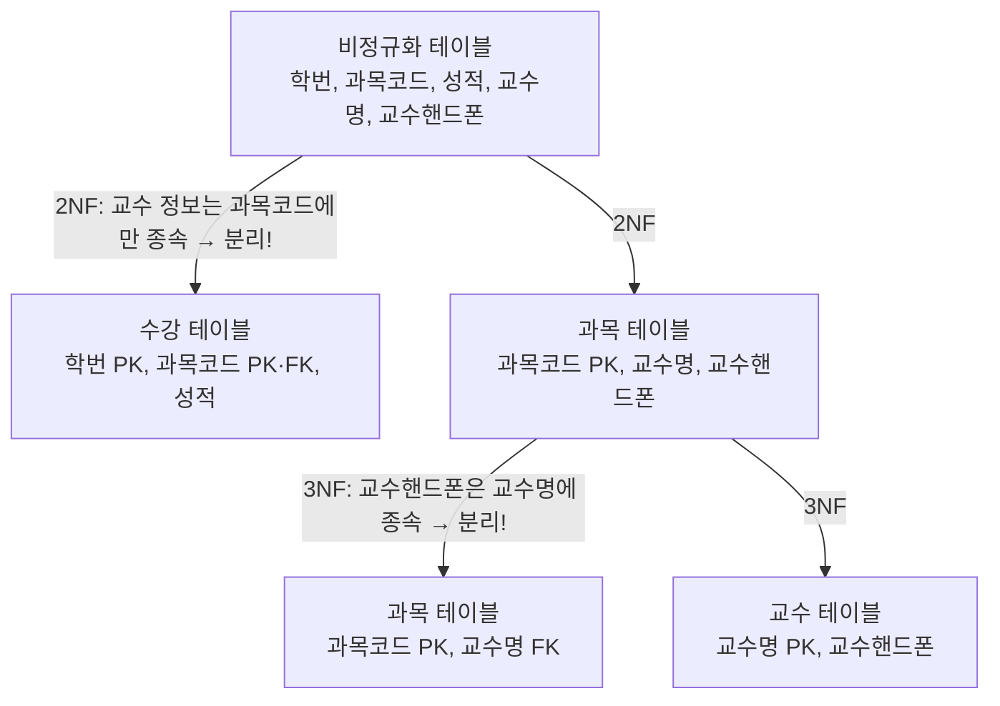

---
aliases:
  - DB 정규화
  - Normalization
  - 1NF 2NF 3NF
  - 정규형
  - 성능데이터모델링
tags:
  - SQL
related:
  - "[[SQL_Keys_and_Identifiers]]"
  - "[[SQL_ERD_Components]]"
  - "[[Data_Modeling_Overview]]"
  - "[[00_SQL_HomePage]]"
  - "[[SQL_De_Normalization_반정규화]]"
---
# Normalization Theory: 테이블 쪼개기의 미학

> **핵심 요약** **"정규화(Normalization)"** 란 뚱뚱하고 중복된 테이블을 잘게 쪼개서 **"데이터의 중복을 제거"** 하고 **"무결성(Integrity)을 유지"** 하는 과정입니다. 
> 목표: **이상 현상(Anomaly) 방지**

| 정규화의 목적              | 설명                                    |
| -------------------- | ------------------------------------- |
| **논리 데이터 모델 일관성 확보** | 데이터 구조가 업무 규칙과 일치하도록 논리적으로 정제된 모델을 만듦 |
| **중복 제거**            | 동일한 데이터가 여러 테이블에 반복 저장되는 것을 방지        |
| **데이터 품질 향상**        | 삽입·갱신·삭제 이상 현상을 원천 차단                 |
|   **유연한 구조 확보**      | 업무 변경 시 테이블 구조 변경 최소화                 |

---

## Why? 왜 쪼개야 하나요? — 이상 현상(Anomaly)

테이블을 하나에 몰아넣으면(비정규화 상태), 다음과 같은 **3대 이상 현상**이 발생합니다.

|현상|설명|예시 상황|
|:--|:--|:--|
|**삽입 이상** (Insertion)|불필요한 데이터를 넣지 않으면 새 데이터를 삽입할 수 없음|신입생이 들어왔는데 수강 신청을 안 했다고 학생 등록 자체가 불가능 (PK가 `학번+과목코드`라서)|
|**갱신 이상** (Update)|중복된 데이터 중 일부만 수정되어 데이터 불일치 발생|홍길동이 개명했는데 100개의 수강 내역 중 99개만 바뀌고 1개는 옛날 이름으로 남음|
|**삭제 이상** (Deletion)|지우려는 데이터 외에 필요한 데이터까지 덩달아 삭제됨|학생이 수강을 취소했는데 학생의 주소/전화번호 정보까지 같이 날아감|

---
##  정규화 단계별 정리 (Step-by-Step)

실무에서는 보통 **3정규형(3NF)** 까지만 진행합니다.

---

## ① 제1정규형 (1NF) — "원자값(Atomic Value)을 가져라"

**Rule:** 하나의 칸(Cell)에는 **오직 하나의 값**만 들어가야 한다.

> 💡 **핵심:** "가로(Column)로 늘어놓거나, 쉼표로 뭉치지 말고, **세로(Row)로 쌓아라!**"

### ❌ 흔한 위반 사례

**Type A. 쉼표로 우겨넣기 (Stuffing)**

상황: `취미` 컬럼에 `"축구,농구,야구"` 라고 텍스트로 저장.

문제점:

1. **검색 불가:** `WHERE 취미 = '축구'` 로 검색 안 됨
2. **성능 저하:** `LIKE '%축구%'` 는 인덱스를 못 타서 **Full Scan** 발생
3. **코드 지옥:** 꺼낼 때마다 앱에서 `SPLIT(',')` 하고 루프 돌려야 함

**Type B. 컬럼으로 늘어놓기 (Spreading) — 반복 그룹**

상황: `가족1`, `가족2`, `가족3` 처럼 컬럼을 계속 만듦.

문제점:

1. **확장성 꽝:** 가족이 4명이 되면 `ALTER TABLE` 필요 (서버 점검각)
2. **공간 낭비:** 가족 없으면 `NULL` 만 잔뜩 들어감
3. **쿼리 지옥:** `WHERE 가족1='철수' OR 가족2='철수' OR ...` (최악)

### ✅ 정규화 수행

두 가지 문제(쉼표, 반복 컬럼)의 해결책은 동일합니다. → **자식 테이블을 만들어서 세로(Row)로 데이터를 쌓는 것**

**[Before: 위반 상태]**

|회원번호|이름|취미 (Type A)|가족1 (Type B)|가족2|
|:-:|:--|:--|:--|:--|
|101|김철수|축구,농구|영희|민수|

**[After: 정규화 완료]**

회원 테이블 (부모)

|회원번호 (PK)|이름|
|:-:|:--|
|101|김철수|

취미/가족 테이블 (자식) → 행(Row)으로 데이터가 쌓임!

|회원번호 (FK)|구분|값|
|:-:|:--|:--|
|101|취미|축구|
|101|취미|농구|
|101|가족|영희|
|101|가족|민수|

> 이제 취미가 100개든, 가족이 10명이든 **테이블 수정 없이 `INSERT` 만 하면 해결**됩니다.

---

## ② 제2정규형 (2NF) — "부분 함수 종속 제거"

**조건:** PK가 **복합키(두 개 이상의 컬럼)** 일 때 발생합니다.

**Rule:** PK 전체가 아닌, **PK의 일부(부분)에만 의존**하는 컬럼을 분리하라.

|구분|내용|
|:--|:--|
|**PK**|`학번` + `과목코드`|
|**일반 컬럼**|`성적`, `교수명`|
|**문제**|`교수명`은 `과목코드`만 알면 결정됨 (`학번`과는 무관) → **부분 종속!**|
|**해결**|`과목` 테이블(`과목코드`, `교수명`)을 따로 분리|

```
[수강] 학번(PK) + 과목코드(PK) + 성적 + 교수명 + 교수핸드폰
         ↓ 2NF
[수강] 학번(PK) + 과목코드(FK) + 성적
[과목] 과목코드(PK) + 교수명 + 교수핸드폰
```

---

## ③ 제3정규형 (3NF) — "이행 함수 종속 제거"

**Rule:** PK가 아닌 **일반 컬럼끼리 의존**하는 관계(한 다리 건너는 관계)를 끊어라.

|구분|내용|
|:--|:--|
|**문제 구조**|`학번(PK)` → `소속학과` → `학과사무실위치`|
|**문제**|`학과사무실위치`는 `학번`이 아닌 `소속학과`에 따라 결정됨 (A→B→C 이행 구조)|
|**해결**|`학과` 테이블(`학과명`, `위치`)을 따로 분리|

```
[과목] 과목코드(PK) + 교수명 + 교수핸드폰
         ↓ 3NF
[과목] 과목코드(PK) + 교수명(FK)
[교수] 교수명(PK) + 교수핸드폰
```

---

## 3. 정규화 시각화 — 수강신청 테이블 Before & After

비정규화 → 2NF → 3NF 까지 전체 흐름입니다.

```
━━━━━━━━━━━━━━━━━━━━━━━━━━━━━━━━━━━━━━━━━━━━━━
 [비정규화 테이블]
  학번 | 과목코드 | 성적 | 교수명 | 교수핸드폰
━━━━━━━━━━━━━━━━━━━━━━━━━━━━━━━━━━━━━━━━━━━━━━
         ↓ 2NF: 부분 종속 제거
         (교수명, 교수핸드폰은 과목코드에만 종속)

 [수강] 학번(PK) | 과목코드(PK,FK) | 성적
 [과목] 과목코드(PK) | 교수명 | 교수핸드폰
━━━━━━━━━━━━━━━━━━━━━━━━━━━━━━━━━━━━━━━━━━━━━━
         ↓ 3NF: 이행 종속 제거
         (교수핸드폰은 교수명에 종속 → 교수 테이블로 분리)

 [수강] 학번(PK) | 과목코드(PK,FK) | 성적
 [과목] 과목코드(PK) | 교수명(FK)
 [교수] 교수명(PK) | 교수핸드폰
━━━━━━━━━━━━━━━━━━━━━━━━━━━━━━━━━━━━━━━━━━━━━━
```



---

## 성능 데이터 모델링 (Performance Data Modeling)

### 성능 데이터 모델링이란?

**데이터베이스의 성능을 향상시키기 위해, 설계 단계부터 성능과 관련된 사항들이 모델링에 반영될 수 있도록 하는 작업**입니다.

단순히 완성된 DB를 나중에 튜닝하는 것이 아니라, **ERD를 그리는 초기 단계부터** 아래 요소들을 함께 고려합니다.

- 정규화 / 반정규화 적용 여부
- 인덱스(Index) 설계
- 파티셔닝(Partitioning) 전략
- 이력 데이터 분리 여부

> 💡 **핵심 원칙:** 정규화로 설계 → 성능 문제 확인 → 반정규화로 튜닝

>[!warning] 정규화의 trade-off — 성능 저하 가능성 정규화를 진행할수록 테이블이 잘게 쪼개지기 때문에, **데이터 조회 시 JOIN이 증가**하여 **검색 성능이 저하**될 수 있습니다.
>| 정규화 단계 ↑ | 발생 현상                          |
>| -------- | ------------------------------ |
>| 테이블 수 증가 | 원하는 데이터를 얻으려면 여러 테이블을 JOIN해야 함 |
>| JOIN 증가  | 대용량 데이터에서 응답 속도 저하             |
>| 인덱스 분산   | 각 테이블마다 인덱스 관리 필요              |
>👉 이것이 바로 성능 문제가 확인된 경우에 한해 **반정규화(De-normalization)** 를 적용하는 이유입니다.


---
### 성능 데이터 모델링 유의사항 ⭐

|#|유의사항|설명|
|:-:|:--|:--|
|**1**|**정규화를 먼저 수행하라**|반정규화는 정규화 이후 성능 문제가 확인됐을 때만 적용. 처음부터 반정규화 금지|
|**2**|**반정규화는 최소화하라**|꼭 필요한 부분만 반정규화. 남용하면 유지보수가 지옥이 됨|
|**3**|**트랜잭션 유형을 분석하라**|조회가 많은지(Read Heavy), 쓰기가 많은지(Write Heavy)에 따라 전략이 달라짐|
|**4**|**데이터 정합성 관리 방안을 마련하라**|반정규화로 중복 컬럼이 생기면, 원본과 복사본이 항상 일치하도록 **트리거(Trigger)나 배치(Batch)** 로 동기화 필요|
|**5**|**인덱스(Index)를 우선 검토하라**|반정규화 전에 인덱스 추가로 해결되는지 먼저 확인. 인덱스가 반정규화보다 비용이 훨씬 적음|
|**6**|**대용량 데이터를 고려하라**|데이터가 수백만 건 이상이면 파티셔닝(수평 분할)이 효과적|
|**7**|**이력 데이터를 분리하라**|과거 데이터(이력)와 현재 데이터를 같은 테이블에 두면 성능 저하. 별도 이력 테이블로 분리 권장|


### 성능 데이터 모델링 수행 순서

|STEP|이름|핵심 질문|
|---|---|---|
|1|**정규화 수행**|이상 현상이 없는가?|
|2|**용량 및 트랜잭션 유형 파악**|데이터가 얼마나 쌓이는가? 조회가 많은가, 쓰기가 많은가?|
|3|**반정규화 수행**|JOIN이 너무 많아 느린 테이블이 있는가?|
|4|**이력 모델 구분**|현재/과거 데이터를 분리해야 하는가?|
|5|**PK/FK 조정**|식별자와 인덱스가 최적화되어 있는가?|
