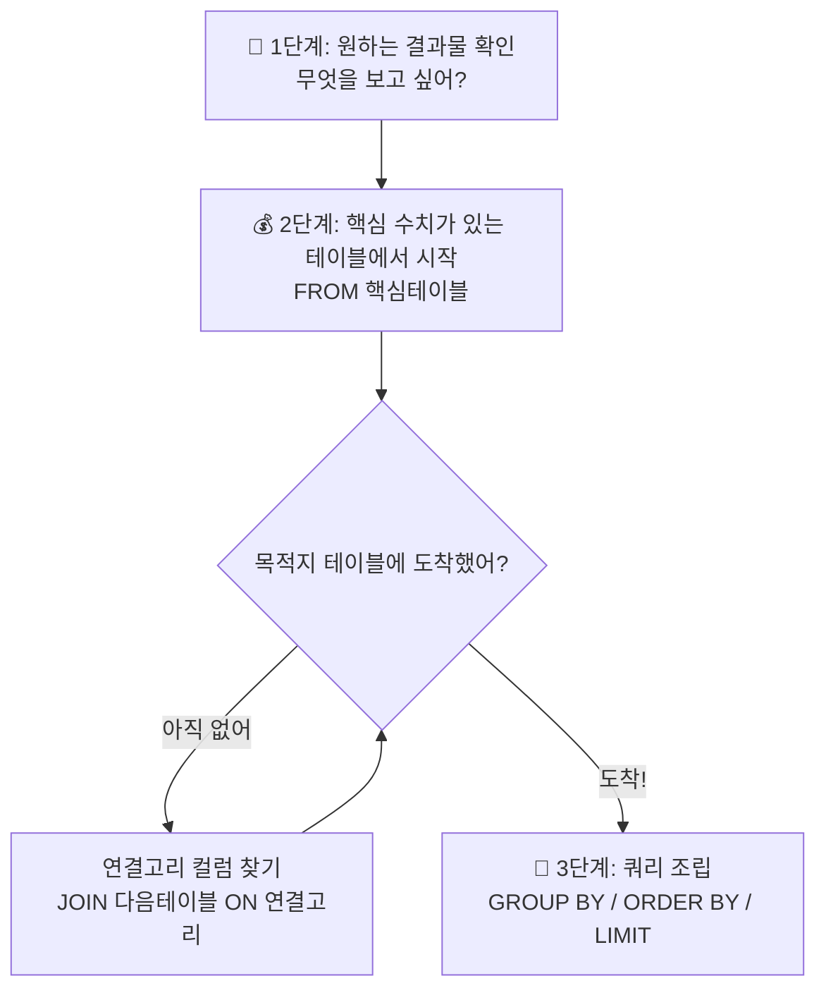

---
aliases:
  - join
  - inner JOIN
  - OUTER JOIN
  - CROSS JOIN
  - NATURAL JOIN
tags:
  - SQL
related:
  - "[[SQL_JOIN_Concept]]"
  - "[[00_SQL_HomePage]]"
  - "[[SQL_Filtering_WHERE]]"
---
# 표준 JOIN

## 개념 한 줄 요약 (Concept Summary)

**"공통된 열(Key)을 기준으로 두 개의 테이블을 하나로 합치는 연산이다."** 
마치 엑셀의 `VLOOKUP`을 더 강력하게 사용하는 것과 같으며, 집합 이론(벤다이어그램)으로 이해하면 가장 정확합니다. 
두 테이블을 합치는 기준(`ON`)은 단순한 'ID 매칭'을 넘어, 여러 조건(`AND`)을 동시에 만족하는 정교한 필터링 연결이 가능합니다.

>[!notice]
>🚨 `JOIN`으로 아무리 데이터를 살려두더라도, 그 이후에 실행되는 `WHERE` 절에서 조건을 걸어버리면 `LEFT`, `FULL`, `INNER`에 상관없이 조건에 맞지 않는 행은 최종적으로 모두 삭제됩니다.

>ANSI(미국국립표준협회)에서 제정한 전 세계 공통 조인 규격으로, 결합 방식(INNER/OUTER)과 결합 조건(`ON`)을 명시적으로 분리하여 어떤 DB에서든 100% 동일하게 동작하도록 만든 최신 문법입니다.

---
## 왜 필요한가? (Why)

**문제점 (Normalization):** 
데이터베이스는 중복을 피하기 위해 `회원정보`와 `주문내역`을 따로 저장한다. 따로 보면 "누가 무엇을 샀는지" 알 수 없다.

**해결책 (Join):** 
분석을 위해 두 테이블을 **연결고리(Key)** 로 묶어서 하나의 표로 만들어야 한다.

**심화 필요성:** 
단순히 ID만 연결하는 게 아니라, **"특정 그룹의 최댓값"** 이나 **"기간 조건"** 등 복합적인 로직을 처리하려면 `ON` 절에 `AND` 조건을 추가해야 한다.

---
##  실전 맥락 (Practical Context)

**데이터 엔지니어가 상황별로 쓰는 JOIN:**
- **INNER JOIN:** "주문 이력이 있는 **진성 고객**만 뽑아줘." (교집합)
- **LEFT JOIN:** "주문을 안 했어도 **전체 고객** 리스트를 보고 싶어. 주문 없으면 빈칸(NULL)으로 둬." (전체 + 부분)
- **다중 조건 JOIN:** "요일별로 **가장 매출이 높았던** 결제 건의 상세 영수증을 찾아줘." (그룹별 최댓값)
- **CROSS JOIN:** "성능 테스트용으로 더미 데이터 100만 건을 **뻥튀기**
- 실무에서는 오래된 시스템의 과거 문법(Oracle의 `(+)` 등)을 해석하고, 이를 최신 ANSI 표준 문법으로 리팩토링하는 작업이 아주 빈번하게 일어납니다.

---
## Code Core Points

표준 문법의 핵심은 레거시 문법(Oracle `(+)`)이 가진 '직관성 부족'을 완벽히 해결했다는 점입니다.

```sql
-- 🚨 [과거 레거시 방식] Oracle 고유의 OUTER JOIN 문법
-- 데이터가 '비워질 쪽(부족한 쪽)'에 (+) 기호를 붙입니다. 직관성이 떨어집니다. 
-- LEFT JOIN 일경우 오른쪽(+), RIGHT JOIN 일 경우 왼쪽(+)
-- 좌변이나 우변 한 곳에서만 사용가능 !!
SELECT A.customer_name, B.order_date
FROM Customer A, Orders B
WHERE A.id = B.customer_id(+); -- "A는 다 살리고, B는 없으면 억지로(+) 붙여라"

-- ✅ [최신 표준 방식] ANSI Standard LEFT OUTER JOIN
-- 결합의 주체(LEFT)와 연결 고리(ON)가 명확하게 분리되어 가독성이 압도적입니다.
SELECT A.customer_name, B.order_date
FROM Customer A
LEFT JOIN Orders B 
    ON A.id = B.customer_id;
```

---
## 상세 분석: 벤다이어그램으로 이해하기 (Detailed Analysis)

두 개의 테이블, **Table A (왼쪽)** 와 **Table B (오른쪽)** 가 있다고 가정하자.

### ① INNER JOIN (교집합) ⭐️ 가장 많이 씀

> "양쪽 모두에 데이터가 있는 완벽한 짝만 남긴다."

- **벤다이어그램:** 두 원이 겹치는 **가운데 부분**만 색칠.

- **특징:**
    - 짝이 없는 데이터는 가차 없이 버려진다.
    - 결과 행(Row)의 수가 줄어들 수 있다.

- **예시:** `회원` 테이블과 `주문` 테이블을 Inner Join 하면, **"주문 내역이 있는 회원"** 만 남는다. 
- (가입만 하고 주문 안 한 유령 회원은 사라짐)

```sql
SELECT A.customer_name, B.order_date
FROM Customer A
INNER JOIN Orders B 
    ON A.id = B.customer_id;
```


### ② LEFT (OUTER) JOIN(왼쪽 기준 다 살리기)

> "왼쪽 테이블은 무조건 다 살리고, 오른쪽은 없으면 빈칸(NULL)으로 둔다."

- **벤다이어그램:** **왼쪽 원 전체**를 색칠. (겹치는 부분 포함)
- `OUTER` 단어는 생략 가능하여 보통 `LEFT JOIN`이라 씁니다. 실무에서 데이터 유실을 막기 위해 가장 많이 씁니다. 
- (주문 안 한 회원도 'NULL' 상태로 전부 조회됨)

- **특징:**
    - **기준이 되는 왼쪽 테이블(`FROM`절)의 데이터는 절대 사라지지 않는다.**
    - 오른쪽 테이블에 매칭되는 정보가 없으면 그 자리는 **`NULL`** 로 채워진다.

- **예시:** "모든 회원을 보여주되, 주문 내역이 있으면 보여주고 없으면 '없음(NULL)'으로 표시해."

```sql
SELECT A.customer_name, B.order_date
FROM Customer A  -- A가 주인공(기준)
LEFT JOIN Orders B 
    ON A.id = B.customer_id;
```

>자주 하는 실수 — "없는 걸 찾아야 하는데 INNER JOIN을 쓰는 실수"
>"작품이 없는 작가를 찾아라" 같은 문제에서 반사적으로 `INNER JOIN`을 쓰는 실수를 자주 한다
>`INNER JOIN`은 두 테이블 모두에 매칭되는 행만 살아남기 때문에, 조인하는 순간 작품이 없는 작가는 결과에서 이미 사라져버린다. 
>나중에 `COUNT(...) = 0`이나 `IS NULL`을 붙여도 이미 날아간 데이터는 되살릴 수 없다.

```sql
-- ❌ 잘못된 접근: 작품 없는 작가가 조인 시점에 이미 제거됨
SELECT a.author_name
FROM Authors a
INNER JOIN Books b ON a.id = b.author_id
WHERE COUNT(b.id) = 0;  -- 소용없다. 데이터가 이미 없다.

-- ✅ 올바른 접근: LEFT JOIN으로 작가를 먼저 다 살린 뒤 NULL로 필터링
SELECT a.author_name
FROM Authors a
LEFT JOIN Books b ON a.id = b.author_id
WHERE b.id IS NULL;  -- 매칭된 책이 없는 작가만 걸러낸다.
```


### ③ RIGHT (OUTER) JOIN (오른쪽 기준 다 살리기)

>"오른쪽 테이블은 무조건 다 살리고, 왼쪽은 없으면 빈칸(NULL)으로 둔다."

- **벤다이어그램:** **오른쪽 원 전체**를 색칠.
- **특징:**
	- `LEFT JOIN`과 방향만 반대일 뿐 원리는 똑같습니다.
	- **실무 꿀팁:** 사람의 시선 이동(왼쪽 ➡️ 오른쪽)과 맞지 않아 쿼리를 읽을 때 몹시 헷갈립니다. 
	- 그래서 실무에서는 **`RIGHT JOIN`은 아예 쓰지 않고, 테이블 위치를 바꿔서 무조건 `LEFT JOIN`으로 통일해서 짜는 것이 암묵적인 룰**입니다.


### ④ FULL (OUTER) JOIN (합집합)

> **"너랑 나랑 가진 거 다 합치자. 없는 건 빈칸으로 두고."**

- **벤다이어그램:** **두 원 전체**를 색칠.

- **특징:**
    - 양쪽 어디든 데이터가 있으면 결과에 나온다.
    - `MySQL`에서는 지원하지 않아서 `LEFT JOIN`과 `RIGHT JOIN`을 `UNION`해서 쓴다. 
    - (실무 사용 빈도 낮음)

### ⑤ CROSS JOIN (교차 조인 - 카테시안 곱)

> "조건 없이 무식하게 다 곱해버린다."

- **특징:** 조인 조건인 `ON` 절이 아예 없습니다. 여기서 곱해지는 것은 컬럼이 아니라 **'데이터 건수(행, Row)'** 입니다.
	- **행(Row, 데이터 건수):** A테이블 10건 * B테이블 10건 = **총 100건**의 모든 경우의 수가 뻥튀기되어 생성됩니다. (곱하기)
	- **열(Column, 필드):** A테이블 컬럼 3개 + B테이블 컬럼 4개 = **총 7개**의 컬럼이 옆으로 나란히 이어 붙습니다. (더하기)
- **원리 예시:** 상의(빨강, 파랑 - 2건) 테이블과 하의(청바지, 면바지, 반바지 - 3건) 테이블을 CROSS JOIN 하면? 2 * 3 = 총 6벌의 모든 코디 조합(행)이 쏟아져 나옵니다.
- **실무 맥락:** 일반적인 비즈니스 로직에는 거의 쓰지 않습니다. 단, 시스템 부하 테스트를 위해 **대용량 더미(Dummy) 데이터를 기하급수적으로 뻥튀기할 때** (예: 1,000건 테이블 * 1,000건 테이블 = 순식간에 100만 건 생성) 아주 유용하게 쓰는 꼼수 문법입니다.

```sql
SELECT BOY_NAME,GIRL_NAME
FROM GIRL,BOY B;

--- 위에 와 같은 결과 출력 
SELECT BOY_NAME,GIRL_NAME
FROM GIRL CROSS JOIN BOY B;
```

### ⑥ NATURAL JOIN & USING 

> "DB가 이름 같은 컬럼 찾아서 알아서 엮어줄게." 
> ON절을 쓸수 없다!

- **NATURAL JOIN:** 조인 조건(`ON`)을 안 써도 DB가 두 테이블에서 '이름이 똑같은 컬럼'을 알아서 찾아 조인합니다.(SQL Sever 지원 안함)
	- **치명적 특징:** 단순히 컬럼명만 찾는 게 아니라, **이름이 겹치는 '모든' 컬럼의 데이터 값까지 100% 일치해야** 조인 결과에 나옵니다.
	- **결과 제외 예시:** A테이블에 `(id:1, val:100)`, B테이블에 `(id:1, val:200)`이 있다면, `id`는 같지만 우연히 이름이 겹친 `val` 데이터가 다르므로 **결과에서 완전히 제외(탈락)**됩니다. (의도치 않은 데이터 유실 발생)

- **USING(컬럼명) (✅ 명시적 축약형):** 조인할 컬럼 이름이 양쪽이 100% 똑같을 때 `ON A.id = B.id` 대신 `USING(id)`로 축약해서 씁니다.
	- **NATURAL JOIN과의 결정적 차이:** 내가 지정한 괄호 안의 컬럼(`id`)만 조인 조건으로 씁니다!
	- **결과 포함 예시:** 위와 똑같이 `val`이라는 동일한 이름의 컬럼이 있고 데이터가 `100`과 `200`으로 다르더라도, **`USING(id)`라고 명시했기 때문에 `val` 데이터가 다른 것은 신경 쓰지 않고 `id`만 같으면 정상적으로 조인됩니다. (결과에서 제외되지 않음!)**
	- 단, USING 절을 사용할경우 USING 절로 정의된 컬럼 앞에는 별도의 테이블명이나 ALIAS를 표기할수 없다.

> **💡 실무 맥락:** `NATURAL JOIN`은 나중에 누군가 테이블에 같은 이름의 컬럼(예: `updated_at`, `status` 등)을 추가하는 순간, 기존 쿼리가 소리소문없이 망가지는 시한폭탄입니다. 실무에서는 절대 쓰지 마시고, 무조건 의도가 명확한 `ON` 절이나 `USING()`을 쓰는 것이 데이터 엔지니어의 철칙입니다.

---
## [핵심 원리] JOIN 결과 행(Row) 수는 어떻게 결정될까? (데이터 뻥튀기의 비밀)

실무에서 가장 많이 터지는 사고가 바로 조인 후 데이터가 예상치 못하게 늘어나는 **'뻥튀기(Data Explosion)'** 현상입니다. 
JOIN의 결과 행 수는 철저하게 **"매칭되는 조합의 수 (왼쪽 매칭 건수 X 오른쪽 매칭 건수)"** 로 결정됩니다. 조인 컬럼 값이 같으면 가능한 모든 조합을 다 생성해 버립니다.

**상황 예시: LEFT JOIN을 한다면?**

- **왼쪽 테이블 (회원 ID):** `1`, `3`, `5`
- **오른쪽 테이블 (주문한 회원 ID):** `2`, `3`, `3` (3번 회원이 두 번 주문함)

초보자들은 LEFT JOIN이니까 왼쪽 테이블 그대로 `1`, `3`, `5` 세 줄이 나올 거라고 착각합니다. 하지만 실제 결과는 다릅니다!

1.  **ID 1번:** 오른쪽 테이블에 짝이 없네? ➡️ `[1, NULL]` (1줄 생성)
2. **ID 3번:** 오른쪽 테이블에 3이 두 개나 있네? ➡️ 1(왼쪽) x 2(오른쪽) = **모든 조합 생성!** ➡️ `[3, 3]`, `[3, 3]` (2줄 생성)
3.  **ID 5번:** 오른쪽 테이블에 짝이 없네? ➡️ `[5, NULL]` (1줄 생성)

결과적으로 최종 데이터는 `1, 3, 5`가 아니라 **`1, 3, 3, 5` (총 4줄)** 로 늘어납니다!
만약 양쪽 테이블에 동일한 값이 수십 개씩 있다면 곱하기(X) 연산으로 뻥튀기되어 데이터가 기하급수적으로 늘어나니 항상 1:N 관계를 파악하고 조인해야 합니다.

----
## 고급 패턴

### [실전 패턴 A] 다중 조건 조인 (Groupwise Max)

>**"ID도 같고(AND) 값도 똑같은 행만 찾아라."** (그룹별 최댓값 찾기의 핵심 로직)

**상황:** 각 요일별로 가장 비싼 결제 내역(상세 정보 포함)을 보고 싶을 때.
`ON` 절에 `AND`를 써서 두 가지 조건을 동시에 겁니다.

핵심:** `ON` 절은 단순 연결 고리가 아니라, **복합 필터링 조건**으로 사용할 수 있다.

```sql
SELECT t.*
FROM tips t
JOIN (
    -- [1단계]서브쿼리로 요일별 최고액 정답지를 먼저 구함
    SELECT day, MAX(total_bill) AS max_bill
    FROM tips
    GROUP BY day
) m
  ON t.day = m.day              -- 조건 1: 요일이 같아야 하고 (그룹 매칭)
 AND t.total_bill = m.max_bill; -- 조건 2: 금액이 최고액과 같아야 함 (값 매칭)
```

### [실전 패턴 B] 체인 JOIN (다중 테이블 연결)

>"JOIN은 2개만 하는 게 아니다. 다리(연결고리)만 있으면 계속 이어붙인다."

**상황:** "배우별 총 매출을 구하고 싶다." (`payment` ↔ `actor` 사이에 직접적인 연결고리가 없을 때 중간 테이블을 다리 삼아 연결)


```sql
-- 💡 흐름: payment(결제) → rental(임대) → inventory(재고) → film_actor(영화배우) → actor(배우)
SELECT 
    a.first_name, 
    a.last_name, 
    SUM(p.amount) AS total_revenue
FROM payment p
JOIN rental r      ON p.rental_id = r.rental_id         -- 결제 ↔ 임대
JOIN inventory i   ON r.inventory_id = i.inventory_id   -- 임대 ↔ 재고
JOIN film_actor fa ON i.film_id = fa.film_id            -- 재고 ↔ 영화-배우
JOIN actor a       ON fa.actor_id = a.actor_id          -- 영화-배우 ↔ 배우
GROUP BY a.actor_id, a.first_name, a.last_name
ORDER BY total_revenue DESC
LIMIT 5;
```

- **핵심 사고법:** JOIN을 쓰기 전에 **"어떤 테이블이 다리 역할을 하는가?"** 를 먼저 그려보자.

payment → rental → inventory → film_actor → actor
  결제  →  임대  →    재고   →  영화-배우  →  배우

### 📋 복잡한 JOIN 문제 풀이 전략



---
## 초보자가 자주 하는 실수 (Misconceptions)

#### "LEFT JOIN을 하면 행 개수는 그대로겠죠?" (X)

- **현실:** 오른쪽 테이블에 매칭되는 데이터가 여러 개(1:N)라면, 왼쪽 데이터가 복제되어 **행 개수가 늘어납니다.** (뻥튀기 주의)

#### "OUTER JOIN 할 때 `ON` 절에 조건(AND)을 거는 것과 `WHERE` 절에 조건을 거는 건 똑같지 않나요?" (X )

- OUTER JOIN에서 이 둘은 결과가 완전히 다릅니다!
- **`ON` 절에 걸 때:** 두 테이블을 "엮을지 말지"의 기준입니다. 조건에 안 맞으면 오른쪽 데이터를 `NULL`로 만들 뿐, **왼쪽 기준 데이터는 절대 날아가지 않습니다.**
- **`WHERE` 절에 걸 때:** 일단 다 엮어놓고 만들어진 거대한 결과물 전체에서 **"행 자체를 삭제"** 하는 필터링입니다. LEFT JOIN을 해놓고 WHERE 절에 무턱대고 오른쪽 테이블의 조건을 걸면, 결국 INNER JOIN을 한 것과 똑같이 왼쪽 데이터마저 날아가 버리는 대참사가 발생합니다.


####  "INNER JOIN 썼더니 데이터가 다 날아갔어요." (X)

- **현실:** 연결 고리 값이 일치하는 게 하나도 없으면 0건이 조회됩니다. 데이터 유실이 걱정되면 **LEFT JOIN**을 쓰세요.

####  "ON 절에는 조건 하나만 써야 하나요?" (X)

- **현실:** `ON A.id = B.id AND A.date > '2024-01-01'` 처럼 **여러 조건을 `AND`로 묶어서** 정교하게 조인할 수 있습니다.

#### "NULL 처리를 깜빡했어요." (X)

- **현실:** LEFT JOIN 결과에서 매칭되지 않은 오른쪽 컬럼은 `NULL`입니다. 이를 `SUM()`하거나 계산할 때 `COALESCE(col, 0)` 등으로 처리하지 않으면 결과가 망가집니다.

#### "최댓값이 여러 개면 한 명만 나오나요?" (X)

- **현실:** 위 **패턴 B** 쿼리에서 최고 기록(50불)을 낸 사람이 2명이면, **2명 다 출력**됩니다. (공동 1등). 딱 한 명만 뽑으려면 `ROW_NUMBER()` 윈도우 함수를 써야 합니다.

#### ⑥ "JOIN은 두 테이블끼리만 하는 거 아닌가요?" (X)

- **현실:** 연결고리(Key)가 있으면 몇 개든 이어붙일 수 있습니다.
- 단, JOIN이 많아질수록 **성능이 느려질 수 있으니** 필요한 테이블만 연결하세요.