---
aliases:
  - SQL 사고 흐름도
  - 쿼리 작성 로드맵
  - SQL 실행 순서
tags:
  - SQL_Guide
related: []
---
## 개념 한 줄 요약

쿼리를 작성할 때 막막하지 않도록, **'어떤 순서로 생각하고 결정해야 하는지'** 를 데이터베이스 엔진의 실행 순서에 맞춰 시각화한 의사결정 지도입니다.

## 왜 필요한가 (Why)

**문제 상황:**
초보자는 보통 `SELECT`부터 적기 시작합니다. 
"음.. 이름이랑 매출액을 뽑아야지(SELECT)" -> "어느 테이블에서?(FROM)" -> "조건은?(WHERE)"
하지만 데이터베이스는 **정반대**로 일합니다. "데이터를 가져오고(FROM) -> 거르고(WHERE) -> 묶고(GROUP BY) -> 마지막에 보여줍니다(SELECT)".
이 생각의 순서가 꼬이면 **"Alias(별칭)를 찾을 수 없습니다"** 에러를 만나거나, 엉뚱한 집계 결과를 얻게 됩니다.

**해결책:**
이 로드맵은 **DB가 데이터를 처리하는 순서(Step 0~5)** 대로 사고하도록 강제합니다. 
특히 **"지금 서브쿼리가 필요한가?", "JOIN 하면 데이터가 늘어나지 않는가?"** 같은 실무적인 체크포인트를 미리 거치게 하여 삽질을 줄여줍니다.

## 실무 맥락에서의 사용 이유

실무에서 1,000줄짜리 복잡한 쿼리를 짤 때, 시니어 엔지니어도 머릿속으로 이 지도를 그립니다.
1.  **뻥튀기 방지:** `1:N` 조인을 할 때 무지성으로 조인하면 데이터가 수백만 배로 불어납니다. 로드맵의 `Step 1`에서 이를 경고해줍니다.
2.  **윈도우 함수 vs 그룹바이:** "행을 줄일 것인가(GROUP BY) 유지할 것인가(Window)"는 데이터 분석의 가장 핵심적인 갈림길입니다. `Step 3`가 이 결정을 도와줍니다.

## 🗺️ SQL 사고 로드맵 (Flowchart)

```mermaid
flowchart TD
    Start((🚀 쿼리 설계 시작)) --> Q_Complex

    %% 0. 설계 단계 (Architect)
    subgraph Step0_Architect ["Step 0: 큰 그림 그리기"]
        direction TB
        Q_Complex{"이미 계산된 결과(집계/순위)를<br>재사용하거나<br>다시 조인해야 하는가?"}
        Q_Complex -- Yes: 복잡함 --> Op_CTE["WITH 절(CTE)로<br>논리 블록 분리"]
        Q_SetOp{"결과물을 위아래로<br>합쳐야 하는가?"}
        Q_Complex -- No --> Q_SetOp
        Op_CTE --> Q_SetOp
        Q_SetOp -- Yes: 합치기 --> Op_Union["UNION / UNION ALL<br>(설계 후 마지막에 결합)"]
        
        %% Step 0 -> Step 1 연결
        Q_SetOp -- No: 단일 쿼리 --> Q_Sources
        Op_Union --> Q_Sources
    end

    %% 1. 데이터 준비 (Data & Join)
    subgraph Step1_Data ["Step 1: 데이터 판 깔기 & 조인 전략"]
        direction TB
        Q_Sources{"데이터 소스가<br>여러 개인가?"}
        Q_Sources -- No --> Op_From["FROM 테이블"]
        Q_Sources -- Yes --> Q_Fanout{"1:N 조인으로<br>행 뻥튀기 위험?"}
        
        Q_Fanout -- Yes: 위험 --> Op_PreAgg["Pre-Aggregation<br>(먼저 GROUP BY 후 조인)"]
        Q_Fanout -- No: 안전 --> Q_JoinType{"모든 행이<br>다 필요한가?"}
        
        Q_JoinType -- "교집합만 (필수)" --> Op_Inner["INNER JOIN"]
        Q_JoinType -- "원본 유지 (옵션)" --> Op_Left["LEFT JOIN"]
        
        Op_From --> Q_Where
        Op_Inner --> Q_Where
        Op_Left --> Q_Where
        Op_PreAgg --> Q_Where
    end

    %% 2. 필터링 (Filter)
    subgraph Step2_Filter ["Step 2: 재료 손질 (WHERE)"]
        direction TB
        Q_Where{"미리 걸러낼 조건?<br>(날짜, 상태코드)"}
        Q_Where -- Yes --> Op_Where["WHERE 절 작성"]
        Q_Where -- No --> Q_Granularity
        Op_Where --> Q_Granularity
    end

	%% 3. 핵심 로직 (Core Logic)
    subgraph Step3_Core ["Step 3: 행(Row)의 운명 결정"]
        direction TB
        Q_Granularity{"🎯 결과 집합의<br>행 수를 줄일 것인가?"}

        %% === 왼쪽: 집계 (Aggregation) ===
        Q_Granularity -- Yes: 압축 --> Op_Group["GROUP BY"]
        Op_Group --> Q_AggType{"집계 목적"}
        Q_AggType -- 건수/합계 --> Op_BasicAgg["COUNT / SUM / AVG"]
        Q_AggType -- 조건부 집계 --> Op_FilterAgg["COUNT() FILTER<br>(CASE WHEN 대용)"]
        
        %% === 오른쪽: 윈도우 (Window) ===
        Q_Granularity -- No: 유지 --> Q_WindowNeed{"이전/다음 행 참조?<br>(LAG, LEAD)"}
        
        Q_WindowNeed -- Yes: 시계열 비교 --> Q_Partition{"누구끼리 경쟁/합산?"}
        Q_WindowNeed -- No: 순위/번호 --> Q_RankFunc{"순위 매기기?<br>(RANK, ROW_NUMBER)"}
        
        Q_RankFunc --> Q_Partition
        
        Q_Partition -- 그룹별 --> Op_Win_Part["OVER (PARTITION BY..)"]
        Q_Partition -- 전체 --> Op_Win_All["OVER ()"]
        
        Op_Win_Part --> Q_WinOrder{"순서 중요?"}
        Op_Win_All --> Q_WinOrder
        Q_WinOrder -- Yes: 필수 --> Op_Win_Ord["ORDER BY 추가"]
        
        %% 경로 합류
        Q_AggType --> Q_Having
        Op_BasicAgg --> Q_Having
        Op_FilterAgg --> Q_Having
        
        Q_WindowNeed -- No --> Q_Logic
        Q_WinOrder -- No --> Q_Logic
        Op_Win_Ord --> Q_Logic
    end

    %% 4. 후처리 (Post-Filter)
    subgraph Step4_PostFilter ["Step 4: 결과 솎아내기"]
        direction TB
        Q_Having{"집계 후 필터링?<br>(예: 매출 100이상)"}
        Q_Having -- Yes --> Op_Having["HAVING"]
        Q_Having -- No --> Q_Logic
        Op_Having --> Q_Logic
    end

    %% 5. 최종 가공 (Final Polish)
    subgraph Step5_Final ["Step 5: 마무리 데코레이션"]
        direction TB
        Q_Logic{"조건부 값/변환 필요?"}
        Q_Logic -- Yes --> Op_CaseCast["CASE WHEN (조건문)<br>::Type (형변환)"]
        Q_Logic -- No --> Op_SelCol["SELECT 컬럼 확정"]
        Op_CaseCast --> Op_Null
        
        Op_SelCol --> Q_Null
        Q_Null{"NULL 처리?"}
        Q_Null -- Yes --> Op_Null["COALESCE"]
        Q_Null -- No --> Q_Order
        Op_Null --> Q_Order
        
        Q_Order{"최종 정렬?"}
        Q_Order -- Yes --> Op_FinalOrder["ORDER BY"]
        Q_Order -- No --> End((🏁 완성))
        Op_FinalOrder --> End
    end

    %% 스타일링
    linkStyle default stroke:#555,stroke-width:2px
    classDef startend fill:#2c3e50,stroke:#34495e,color:white
    class Start,End startend
    classDef decision fill:#fff9c4,stroke:#fbc02d,stroke-width:2px
    class Q_Complex,Q_SetOp,Q_Sources,Q_Fanout,Q_JoinType,Q_Where,Q_Granularity,Q_AggType,Q_WindowNeed,Q_Partition,Q_WinOrder,Q_Having,Q_Logic,Q_Null,Q_Order decision
    classDef critical fill:#ffe0b2,stroke:#e65100,stroke-width:3px
    class Q_Complex,Q_Fanout,Q_Granularity critical
    classDef action fill:#e3f2fd,stroke:#1e88e5,stroke-width:2px
    class Op_CTE,Op_Union,Op_From,Op_PreAgg,Op_Inner,Op_Left,Op_Where,Op_Group,Op_BasicAgg,Op_FilterAgg,Op_Win_Part,Op_Win_All,Op_Win_Ord,Op_Having,Op_CaseCast,Op_SelCol,Op_Null,Op_FinalOrder action
```

---
## 초보자가 자주 착각하는 포인트

1. **WHERE vs HAVING:**
    
    - `WHERE`: 데이터를 가져오자마자(그룹핑 전) 거르는 것. (가벼움)
    - `HAVING`: 그룹핑하고 계산까지 다 끝난 뒤에 거르는 것. (무거움)
    - 가능하면 `WHERE`에서 미리 다 걸러내야 쿼리가 빠릅니다.

2. **ORDER BY 위치:**
    - 쿼리를 다 짜고 맨 마지막에 하는 것입니다. 중간에 로직에 영향을 주지 않습니다 (윈도우 함수 내부 `ORDER BY` 제외).