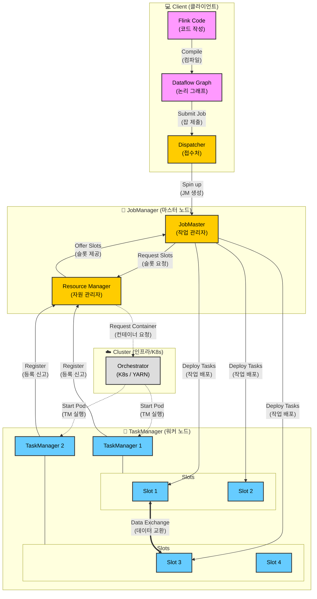
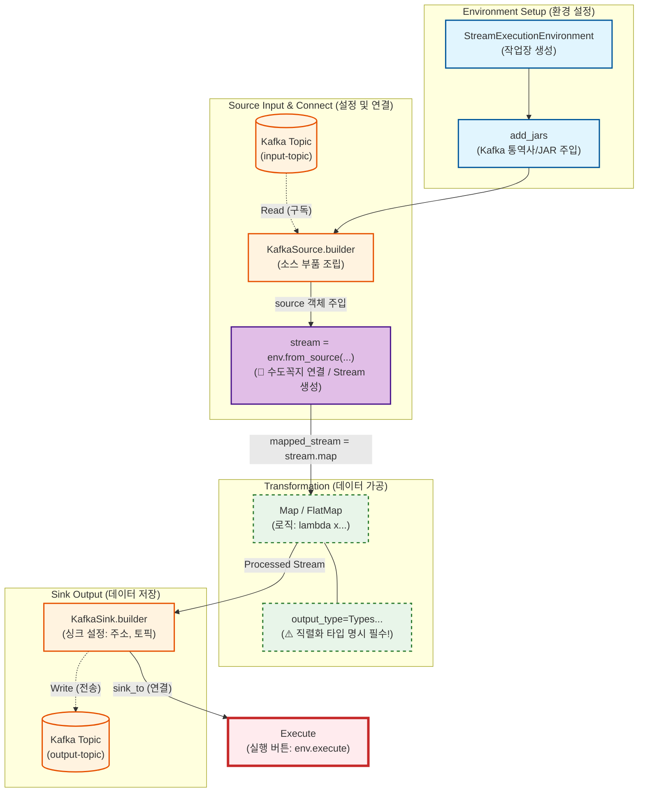

## Flink Job 실행 흐름도 (Mermaid)

클라이언트가 코드를 제출(Submit)하고, 실제 태스크(Task)가 실행되기까지의 **내부 동작 과정**입니다.

---
### 1️⃣ 제출 (Submission)

- **Client:** 작성한 자바/파이썬 코드를 컴파일하여 논리적인 `Dataflow Graph`를 만듭니다.
- **Dispatcher:** 클라이언트의 요청을 받아주는 대문(REST API)입니다. 잡(Job)을 접수하면, 이 잡을 전담할 **`JobMaster`** (JM)를 생성합니다.

### 2️⃣ 스케줄링 & 자원 요청 (Scheduling)

- **JobMaster:** 실행 계획(JobGraph)을 물리적인 태스크로 변환하고, 이를 실행하는 데 필요한 자원(Slot)이 얼마나 필요한지 계산합니다.
- **Resource Manager:** JobMaster가 "슬롯 좀 줘"라고 요청하면, 현재 유휴 자원이 있는지 확인합니다. 없다면 K8s나 YARN에게 "컨테이너 더 띄워줘"라고 요청합니다.

### 3️⃣ 할당 & 배포 (Allocation & Deploy)

- **TaskManager(TM):** 새로 뜨거나 기존에 있던 워커들이 Resource Manager에게 "나 준비됐어(Register)"라고 신고합니다.
- **JobMaster(TM):** Resource Manager로부터 슬롯을 할당받으면, TaskManager의 **슬롯(Slot)** 에 실제 작업(Task)을 배포(Deploy)합니다.

### 4️⃣ 실행 (Execution)

- **Task Slot:** 할당받은 태스크(예: `Source`, `Map`, `Window`)를 실행합니다.
- **Data Exchange:** 서로 다른 TaskManager에 있는 슬롯끼리 네트워크를 통해 데이터를 주고받으며 스트림을 처리합니다.

---

## **코드 작성 순서(Logic Flow)** 와 **데이터 흐름(Data Flow)**

