---
aliases:
  - Flink 배포 모드
  - Session Mode vs Application Mode
  - Flink Cluster Modes
tags:
  - PyFlink
related:
  - "[[Flink_Architecture_Overview]]"
  - "[[Flink_Execution_Models]]"
  - "[[00_Apache Flink_HomePage]]"
---
#  Flink 클러스터 배포 모드 (Session vs Application)

## 개념 요약 (Concept Summary) 

Flink 잡(Job)을 실행할 때, **클러스터(JobManager + TaskManager)의 수명 주기(Lifecycle)** 를 어떻게 관리할지 결정하는 모델이다.
크게 **Session Mode(공유형)** 와 **Application Mode(독립형)** 로 나뉜다.

---
## 두 가지 모델 비교 (Comparison)

### ① Session Cluster (세션 클러스터)

> **비유: "이미 문 열려 있는 스타벅스 (공유 공간)"**

* **동작 방식:** 미리 클러스터(JM + TM)를 띄워놓고, 여러 개의 Job을 계속 이어서 제출한다.
* **특징:** 하나의 클러스터 자원을 여러 Job이 **공유**한다.
* **장점:** 클러스터가 이미 켜져 있으니 **제출 속도가 빠르다.** (개발/테스트용으로 최적)
* **단점:** **격리(Isolation)가 안 된다.** Job A가 메모리를 다 써서 터지면, 같은 JM을 쓰는 Job B도 같이 죽을 수 있다.

### ② Application Cluster (애플리케이션 클러스터)

> **비유: "나 혼자 쓰는 독서실 (전용 공간)"**

* **동작 방식:** Job을 제출할 때마다 **전용 클러스터**를 새로 만들고, Job이 끝나면 클러스터도 같이 사라진다.
* **특징:** **1 Job = 1 Cluster**. 완벽하게 독립적이다.
* **장점:** **안전(Isolation)하다.** 옆 Job이 터져도 나는 상관없다. (운영 환경 표준)
* **단점:** 매번 컨테이너를 새로 띄워야 하니 **시작 시간(Startup)** 이 조금 걸린다.

---
##  구조도 (Architecture Diagram)

```mermaid
graph TD
    %% 스타일 정의
    classDef client fill:#f9f,stroke:#333,stroke-width:2px,color:black;
    classDef cluster fill:#e1f5fe,stroke:#01579b,stroke-width:2px,stroke-dasharray: 5 5,color:black;
    classDef component fill:#ffcc00,stroke:#333,stroke-width:2px,color:black;
    classDef tm fill:#66ccff,stroke:#333,stroke-width:2px,color:black;

    %% ==========================================================
    %% 1. Session Mode (공유)
    %% ==========================================================
    subgraph Session_Mode ["☕️ Session Mode (공유형: 스타벅스)"]
        direction TB
        
        %% 클라이언트들
        ClientA["Job A Client<br>(손님 A)"]:::client
        ClientB["Job B Client<br>(손님 B)"]:::client

        %% 이미 떠 있는 클러스터
        subgraph Shared_Cluster ["Running Flink Cluster (공유 클러스터)"]
            direction TB
            JM_Shared["JobManager<br>(공용 매니저)"]:::component
            TM_Pool["TaskManager Pool<br>(공용 자원)"]:::tm
            
            JM_Shared --- TM_Pool
        end

        %% 흐름
        ClientA -->|"Submit Job<br>(제출)"| JM_Shared
        ClientB -->|"Submit Job<br>(제출)"| JM_Shared
        
        Note1[/"특징: 매니저 하나를 여러 Job이 공유함.<br>하나가 터지면 다 같이 위험!"/]
    end

    %% ==========================================================
    %% 2. Application Mode (독립)
    %% ==========================================================
    subgraph App_Mode ["🏢 Application Mode (독립형: 독서실)"]
        direction TB
        
        %% 그룹 1
        subgraph Job_Group_C ["Job C 환경"]
            ClientC["Job C Client<br>(손님 C)"]:::client
            
            subgraph Cluster_C ["Cluster C (전용)"]
                JM_C["JobManager<br>(전용)"]:::component
                TM_C["TaskManager<br>(전용)"]:::tm
                JM_C --- TM_C
            end
            
            ClientC -->|"Spin up<br>(생성)"| JM_C
        end
        
        %% 그룹 2
        subgraph Job_Group_D ["Job D 환경"]
            ClientD["Job D Client<br>(손님 D)"]:::client
            
            subgraph Cluster_D ["Cluster D (전용)"]
                JM_D["JobManager<br>(전용)"]:::component
                TM_D["TaskManager<br>(전용)"]:::tm
                JM_D --- TM_D
            end
            
            ClientD -->|"Spin up<br>(생성)"| JM_D
        end

        Note2[/"특징: Job마다 클러스터를 새로 만듦.<br>완벽하게 격리되어 안전함!"/]
    end
```

---
## 언제 무엇을 써야 할까? (Best Practice)

|**상황**|**추천 모드**|**이유**|
|---|---|---|
|**개발 / 테스트 (Dev)**|**Session**|코드를 계속 수정하고 재배포해야 하는데, 매번 클러스터를 띄우면 답답하다.|
|**단기 작업 (Short Jobs)**|**Session**|아주 빨리 끝나는 작은 작업들을 할 때, 자원을 효율적으로 쓴다.|
|**상용 배포 (Production)**|**Application**|장애 전파를 막고, K8s 환경에서 깔끔하게 관리하기 위함이다.|
|**K8s / YARN 배포**|**Application**|컨테이너 오케스트레이션 툴과 궁합이 가장 좋다 (Default Mode).|

>실습할 때는 로컬에서 **Session Mode**로 돌리는 게 편하겠지만, 회사 가서 **"자, 이제 배포하자!"** 할 때는 무조건 **Application Mode**로 패키징해야 한다.