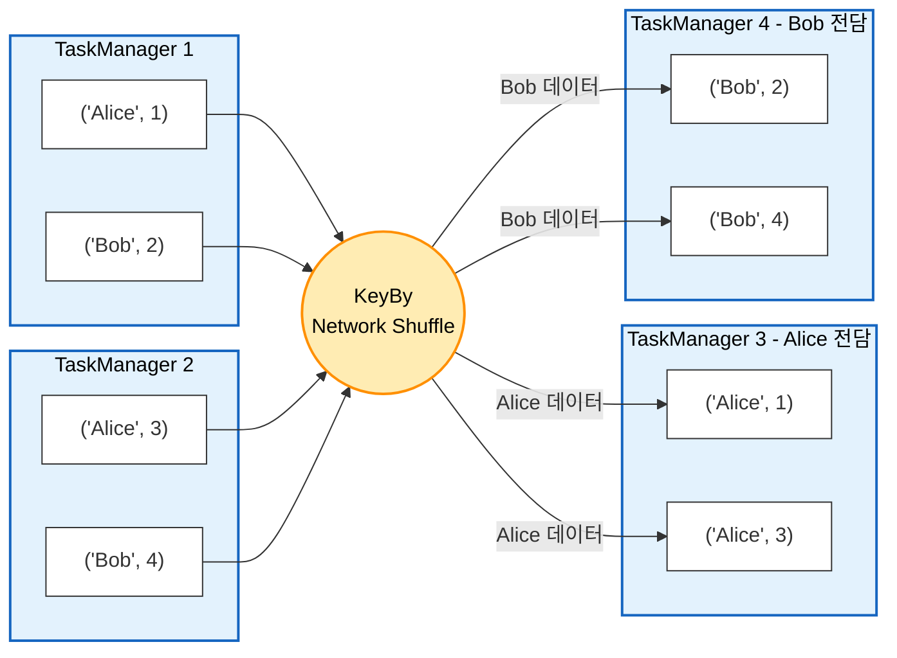

---
aliases:
  - PyFlink KeyBy
  - KeyedStream
  - Data Partitioning
  - Data Shuffle
tags:
  - PyFlink
related:
  - "[[PyFlink_Operators_Basic]]"
  - "[[PyFlink_Windows]]"
  - "[[00_Apache Flink_HomePage]]"
---
#  PyFlink KeyBy: 데이터를 그룹으로 묶는 기술 

> [!QUOTE] 핵심 요약
> **"흩어져 있던 데이터들을 기준(Key)에 맞춰 같은 작업장(Task Slot)으로 모으는 과정."**
> SQL의 `GROUP BY`와 같으며, 합계(`sum`), 평균(`reduce`), 윈도우(`window`) 연산을 하려면 **반드시** 먼저 수행해야 합니다.

---
## KeyedStream의 정체: "리스트가 아니라 '전용 창구'다"

많은 분들이 `key_by`를 하면 데이터가 리스트(`[1, 2, 3]`)로 묶인다고 착각합니다. 
하지만 스트리밍에서 데이터는 여전히 **하나씩(One by one)** 들어옵니다.

- **Before (`mapped_stream`):** 무작위로 섞여서 들어오는 튜플들.
- **After (`keyed_stream`):** **"Alice 데이터는 1번 창구로, Bob 데이터는 2번 창구로 가세요"** 라고 줄을 세운 상태.

> **핵심:** 데이터의 **모양(Type)** 은 변하지 않았습니다. 여전히 `("Alice", 1)` 입니다. 단지 **"누구한테 배달될지(Routing)"** 가 정해졌을 뿐입니다.

---
## Reduce(a, b)의 비밀: "기억(a)과 현실(b)"

`reduce` 함수에 들어가는 `lambda a, b`는 각각 다음을 의미합니다.

* **`a` (Accumulator):** 지금까지 합쳐진 **과거의 결과값 (기억/State)**
*  **`b` (Current Value):** 방금 들어온 **새로운 데이터 (현실)**

```python
#예시:("Alice", 1)
lambda a, b: (a[0], a[1] + b[1])
# a[0]: 이름은 그대로 유지 ("Alice")
# a[1] + b[1]: 기억하고 있던 점수(a) + 새로 들어온 점수(b)
```

> **State(상태):** `reduce`는 항상 **"직전 결과(`a`)"** 를 기억하고 있어야 합니다. 그래서 **Stateful Operator**라고 부릅니다.

---
##  문법 (Syntax) 

`DataStream` ➡ `KeyedStream`으로 변환합니다.
주로 **Lambda 함수**를 사용하여 "어떤 필드를 기준으로 묶을지" 정해줍니다.

### Case 1. 튜플(Tuple)일 때 (인덱스 사용)

데이터가 `("Alice", 100)` 처럼 순서가 있는 튜플일 때.

```python
# 0번째 필드(이름)를 기준으로 묶어라
keyed_stream = stream.key_by(lambda x: x[0])
```

### Case 2. Row/객체일 때 (필드명 사용)

데이터가 `Row(name="Alice", score=100)` 처럼 객체(Row, JSON 등)일 때 사용합니다. (가독성 좋음)

```python
# 'name' 컬럼을 기준으로 묶어라
keyed_stream = stream.key_by(lambda x: x.name)
# 또는
keyed_stream = stream.key_by(lambda x: x['name'])
```

### Case 3. 복합 키 (Composite Key) ⭐️

기준이 하나가 아닐 때 (예: "지역"별 + "성별"별로 묶고 싶을 때). 
새로운 튜플로 묶어서 리턴하면 됩니다.

```python
# (지역, 성별)을 묶어서 하나의 키로 간주
keyed_stream = stream.key_by(lambda x: (x[0], x[1]))
```

----
## 작동 원리 (Mechanism): "Network Shuffle

`key_by`는 단순한 논리적 그룹핑이 아닙니다. 
**물리적인 데이터 이동**이 일어납니다.




- **Hashing:** 들어온 데이터의 Key(예: "Alice")를 해시 함수에 넣습니다. (`hash("Alice") = 12345`)
- **Modulo:** 해시값을 전체 병렬도(Parallelism)로 나눕니다. (`12345 % 4 = 1`)
- **Routing:** 나머지가 `1`이므로, 이 데이터는 무조건 **1번 Task Manager**로 전송됩니다.

---
## 언제 쓰나요? (Use Cases)

다음 연산자들은 **반드시 `key_by` 뒤에** 와야 합니다. (`KeyedStream`에서만 동작함)

| **연산자**              | **설명**                    | **예시**                         |
| -------------------- | ------------------------- | ------------------------------ |
| **Aggregation**      | `sum()`, `min()`, `max()` | 각 사용자별 총 점수 구하기                |
| **Reduce**           | `reduce()`                | 사용자가 정의한 로직으로 계속 합치기 (누적)      |
| **Window**           | `window()`                | "지난 10분간"의 사용자별 평균 구하기         |
| **State Processing** | `ProcessFunction`         | 복잡한 상태 관리 (예: 3번 연속 로그인 실패 감지) |

>[!WARNING] KeyBy 유무에 따른 성능 차이
> **`DataStream.sum()` (Non-Keyed):**
> 전체 데이터를 **단 하나의 서버**로 모아서 계산합니다. (Parallelism = 1 강제)
> **결과:** 처리 속도가 매우 느리고 병목 현상 발생.
> 
>**`KeyedStream.sum()` (Keyed):**
> 키별로 여러 서버에서 **동시에(Parallel)** 계산합니다.
> **결과:** 분산 처리의 이점을 100% 활용.

---
## 실무 주의사항 (Data Skew) ⚠️

**"특정 키에 데이터가 몰리면 망한다."**

- **상황:** 쇼핑몰 데이터를 `key_by(category)`로 묶었는데, "전자기기" 카테고리 데이터가 90%이고 "도서"는 1%라면?
- **문제:** "전자기기"를 담당하는 서버 혼자 과부하(CPU 100%)가 걸리고, 나머지 서버는 놉니다. 이걸 **Data Skew(데이터 편향)** 라고 합니다.
- **해결:** 키를 더 잘게 쪼개거나(예: 카테고리+지역), `rebalance()` 등을 고민해야 합니다.

