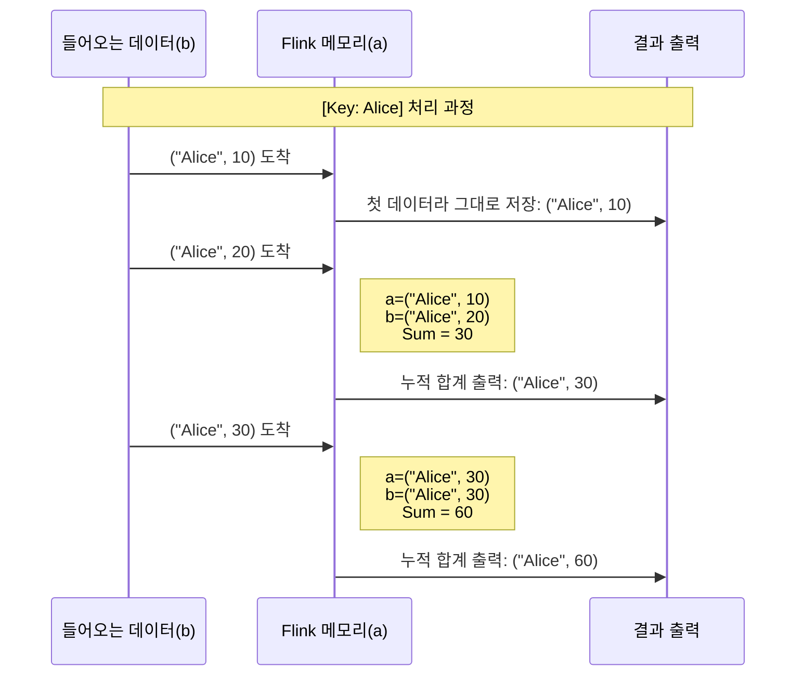

---
aliases:
  - PyFlink Operators
  - Flink Map Reduce
  - KeyBy
  - Stateful vs Stateless
  - ast.literal_eval
  - ㅁㄴㅅ
tags:
  - PyFlink
related:
  - "[[PyFlink_Kafka_코드해부_Common ⭐️]]"
  - "[[01_Apache Flink_Flow#**코드 작성 순서(Logic Flow)** 와 **데이터 흐름(Data Flow)**]]"
  - "[[PyFlink_KeyBy_DeepDive]]"
  - "[[Python_AST_Structure_Analysis]]"
  - "[[PyFlink_Windows]]"
linked:
  - file:///Users/gong/gong_study_de/apache-flink/playground/src/kafka_operator.py
---
# PyFlink Operators: 데이터를 요리하는 주방장들

> [!NOTE] Operator란?
> Flink에서 **Operator**는 데이터 스트림(`DataStream`)을 받아서 변형(Transform), 그룹화(Group), 집계(Aggregate)하여 새로운 스트림으로 내보내는 **함수(Function)** 들을 말합니다.
> * 쉽게 말해, 컨베이어 벨트 위의 재료를 썰고(Map), 분류하고(KeyBy), 합치는(Reduce) **작업 공정**입니다.

---
## Operator의 두 가지 종류 (Types)

Flink Operator는 **"기억력(Memory)"** 이 있느냐 없느냐로 크게 나뉩니다.

### ① Stateless Operator (기억 상실증)

과거 데이터는 신경 안 쓰고, **지금 들어온 데이터 하나**만 보고 처리합니다. 메모리를 거의 안 씁니다.

* **`map()`**: 데이터를 1:1로 변환 (예: "apple" -> "APPLE").
* **`filter()`**: 조건에 안 맞는 데이터 버리기 (예: "음수는 통과 금지").
* **`flatMap()`**: 데이터 하나를 여러 개로 쪼개기 (예: 문장 -> 단어들).

### ② Stateful Operator (기억력 천재) 

과거의 데이터를 **기억(State)** 하고 있어야 계산이 가능합니다. 체크포인트(저장)가 필수입니다.

* **`keyBy()`**: 데이터를 그룹별로 나누기 (예: "Alice는 1번 창구, Bob은 2번 창구").
* **`reduce()` / `window()`**: 모아서 계산하기 (예: "지금까지 Alice가 쓴 돈 합계").

---
## Operators  주요 문법! 

데이터 스트림을 가공하는 단계입니다. 크게 **Stateless(단순변환)** 와 **Stateful(상태기반)** 로 나뉩니다.

### [Step 1] Map (Stateless)

* **역할:** 데이터를 1:1로 변환합니다. (입력 1개 -> 출력 1개)
* **문법:** `{python}stream.map(lambda x: ..., output_type=...)`

```python
# 입력: "Alice,1" -> 출력: ("Alice", 1)
mapped_stream = stream.map(
    lambda x: (x.split(',')[0], int(x.split(',')[1])),
    output_type=Types.TUPLE([Types.STRING(), Types.INT()])
)
```

### [Step 2] KeyBy (Stateful) 

- **역할:** 특정 키(Key)를 기준으로 데이터를 **그룹핑(Partitioning)** 합니다.
- **중요성:** 이 단계에서 **데이터 이동(Shuffle)** 이 발생하며, `reduce`나 `sum`을 쓰기 전 필수 단계입니다.
- **상세 설명:** 더 깊은 원리와 주의사항은 👉 **[[PyFlink_KeyBy_DeepDive]]** 참조

```python
# 0번째 필드(이름)를 기준으로 그룹핑
# 이제부터 같은 이름은 같은 서버로 모입니다.
keyed_stream = mapped_stream.key_by(lambda x: x[0])
```

### [Step 3] Reduce (Stateful) 📉

- **역할:** 들어오는 데이터들을 계속해서 합쳐나갑니다. (누적 계산)
- **특징:** `KeyedStream` 뒤에서만 작동합니다.

```python
# 점수(1번째 필드)를 계속 누적
reduced_stream = keyed_stream.reduce(
    lambda a, b: (a[0], a[1] + b[1])
)
```

>**State(상태):** `reduce`는 항상 **"직전 결과(`a`)"** 를 기억하고 있어야 합니다. 그래서 **Stateful Operator**라고 부릅니다.




---
## PyFlink 실전에서는 **Kafka에서 실시간으로 들어오는 튜플 (`("Alice,1")`)** 을 처리

### 🏗️ 변환 로직 설계

1.  **Source:** Kafka에서 문자열 읽기 (`SimpleStringSchema`)
	- 입력 데이터 예시: `"('Alice', 1)"` (문자열 형태)
2. **Map (Stateless):** **파싱(Parsing)**
	- `ast.literal_eval`을 사용해 문자열을 **진짜 파이썬 튜플** `('Alice', 1)`로 안전하게 변환.
3.  **KeyBy (Stateful):** **그룹핑(Grouping)**
	- 튜플의 **0번째 요소(이름)** 를 기준으로 데이터를 모음. (Alice는 Alice끼리, Bob은 Bob끼리)
4.  **Reduce (Stateful):** **집계(Aggregation)**
	- 들어오는 튜플의 **1번째 요소(횟수)** 를 계속 더해서 누적(`Sum`).
	- 로직: `(기존_횟수 + 신규_횟수)`
5.  **Sink:** **출력(Output)**
	- 집계된 튜플 `('Alice', 5)`를 보기 좋은 문자열 `"Alice:5"`로 변환하여 Kafka로 전송.

###  PyFlink 코드 

```python
"""
[PyFlink] Kafka Reduce Operator Example
목표: ("Alice", 1) 형태의 문자열 데이터를 안전하게 파싱하여, 이름별 합계를 구한다.
핵심: ast.literal_eval을 사용한 안전한 튜플 변환 ⭐️
"""

import os
import ast  # 👈 문자열을 파이썬 객체로 바꿔주는 마법의 도구
from pyflink.common import SimpleStringSchema, WatermarkStrategy
from pyflink.common.typeinfo import Types
from pyflink.datastream import StreamExecutionEnvironment
from pyflink.datastream.connectors.kafka import KafkaSource, KafkaSink, KafkaRecordSerializationSchema, KafkaOffsetsInitializer

def run_reduce():
    # 1. 환경 설정
    env = StreamExecutionEnvironment.get_execution_environment()
    
    # JAR 파일 로딩
    jar_path = "file:///opt/flink/lib/flink-sql-connector-kafka-3.1.0-1.18.jar"
    env.add_jars(jar_path)
    
    # 2. Source: Kafka 연결
    source = KafkaSource.builder() \
        .set_bootstrap_servers("kafka:9092") \
        .set_topics("input-topic") \
        .set_group_id("operator-group") \
        .set_starting_offsets(KafkaOffsetsInitializer.earliest()) \
        .set_value_only_deserializer(SimpleStringSchema()) \
        .build()
    
    # Stream 생성 (수도꼭지 연결)
    stream = env.from_source(source, WatermarkStrategy.no_watermarks(), "Kafka Source")
    
    # 3. Operators (가공 단계)
    
    # [Step 1] Map: 문자열 파싱 
    # Case A: 입력이 "Alice,1" (CSV) 라면 -> x.split(',') 사용
    # Case B: 입력이 "('Alice', 1)" (튜플 문자열) 라면 -> ast.literal_eval(x) 사용
    # 🚨 주의: split(',') 쓰면 괄호랑 따옴표 처리가 안 됨!
    # ✅ 해결: ast.literal_eval()로 안전하게 변환
    mapped_stream = stream.map(
        lambda x: ast.literal_eval(x),
        output_type=Types.TUPLE([Types.STRING(), Types.INT()])
    )
    
    # [Step 2] KeyBy: 이름 기준 그룹핑
    keyed_stream = mapped_stream.key_by(lambda x: x[0])
    
    # [Step 3] Reduce: 누적 합계 계산 (Stateful)
    # a: 누적된 값 (기억), b: 들어온 값 (현실)
    reduced_stream = keyed_stream.reduce(
        lambda a, b: (a[0], a[1] + b[1])
    )
    
    # 4. Sink: Kafka로 결과 전송
    sink = KafkaSink.builder() \
        .set_bootstrap_servers("kafka:9092") \
        .set_record_serializer(
            KafkaRecordSerializationSchema.builder()
                .set_topic("output-topic")
                .set_value_serialization_schema(SimpleStringSchema())
                .build()
        ) \
        .build()
    
    # 튜플을 다시 보기 좋은 문자열("Alice:10")로 바꿔서 전송
    reduced_stream \
        .map(lambda x: f"{x[0]}:{x[1]}", output_type=Types.STRING()) \
        .sink_to(sink)
    
    env.execute("Kafka Reduce Operator Example")

if __name__ == "__main__":
    run_reduce()
```

---
### 왜 `ast`인가?

#### ❌ 기존 방식 (`split`)의 문제점

입력이 `("Alice", 1)` 처럼 들어오면...

1. `x.split(',')` 결과: `['("Alice"', ' 1)']` (지저분함)
2. `int(' 1)')` 시도: **ValueError 발생!** (괄호 `)` 때문에 숫자로 못 바꿈)

#### ✅ 해결사 (`ast.literal_eval`)

- **역할:** 문자열이 파이썬 코드(리스트, 튜플, 딕셔너리)처럼 생겼으면, 진짜 그 객체로 변환해줍니다.
- **장점:** `eval()` 함수는 해킹 위험이 있지만, `literal_eval`은 오직 데이터 구조만 해석하므로 **보안상 안전**합니다.
- **결과:** `"('Alice', 1)"` ➡ `('Alice', 1)` (완벽한 튜플 탄생 ✨)

> **💡 더 자세한 원리와 고급 사용법(코드 해부)은 👉 [[Python_AST_Structure_Analysis#안전한 파싱 (`ast.literal_eval`|안전한 파싱(ast.literal_eval)]] 참고** 