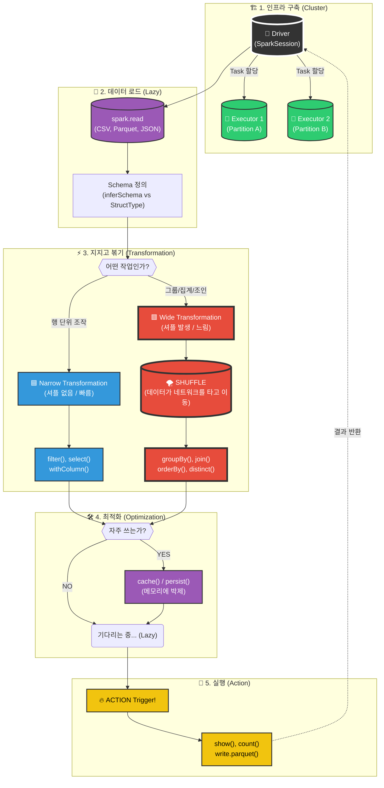

```mermaid
graph TD
    %% 스타일 정의
    classDef driver fill:#333,stroke:#fff,stroke-width:4px,color:#fff;
    classDef executor fill:#2ecc71,stroke:#333,stroke-width:2px,color:#fff;
    classDef narrow fill:#3498db,stroke:#333,stroke-width:2px,color:#fff;
    classDef wide fill:#e74c3c,stroke:#333,stroke-width:4px,color:#fff;
    classDef action fill:#f1c40f,stroke:#333,stroke-width:2px,color:#000;
    classDef storage fill:#9b59b6,stroke:#333,stroke-width:2px,color:#fff;

    %% 1. 시작 (Architecture)
    subgraph Architecture ["🏗️ 1. 인프라 구축 (Cluster)"]
        Driver[("🧠 Driver<br>(SparkSession)")]:::driver
        Exec1[("👷 Executor 1<br>(Partition A)")]:::executor
        Exec2[("👷 Executor 2<br>(Partition B)")]:::executor
        
        Driver --"Task 할당"--> Exec1
        Driver --"Task 할당"--> Exec2
    end

    %% 2. 읽기 (Ingestion)
    subgraph Ingest ["📂 2. 데이터 로드 (Lazy)"]
        Read[("spark.read<br>(CSV, Parquet, JSON)")]:::storage
        Schema["Schema 정의<br>(inferSchema vs StructType)"]
        
        Driver --> Read --> Schema
    end

    %% 3. 변환 (Transformation)
    subgraph Transform ["⚡ 3. 지지고 볶기 (Transformation)"]
        Decision{{"어떤 작업인가?"}}
        
        %% Narrow Route
        Narrow["🟦 Narrow Transformation<br>(셔플 없음 / 빠름)"]:::narrow
        Ops_Narrow["filter(), select()<br>withColumn()"]:::narrow
        
        %% Wide Route
        Wide["🟥 Wide Transformation<br>(셔플 발생 / 느림)"]:::wide
        Ops_Wide["groupBy(), join()<br>orderBy(), distinct()"]:::wide
        Shuffle[("🌪️ SHUFFLE<br>(데이터가 네트워크를 타고 이동)")]:::wide

        Schema --> Decision
        Decision --"행 단위 조작"--> Narrow --> Ops_Narrow
        Decision --"그룹/집계/조인"--> Wide --> Shuffle --> Ops_Wide
    end

    %% 4. 최적화 (Optimization)
    subgraph Opt ["🛠️ 4. 최적화 (Optimization)"]
        CacheQuestion{{"자주 쓰는가?"}}
        Cache["cache() / persist()<br>(메모리에 박제)"]:::storage
        
        Ops_Narrow --> CacheQuestion
        Ops_Wide --> CacheQuestion
        CacheQuestion --"YES"--> Cache
        CacheQuestion --"NO"--> ActionWait
    end

    %% 5. 실행 (Action)
    subgraph ActionPhase ["🚀 5. 실행 (Action)"]
        ActionWait("기다리는 중... (Lazy)")
        Trigger["🔥 ACTION Trigger!"]:::action
        Result["show(), count()<br>write.parquet()"]:::action
        
        Cache --> ActionWait
        ActionWait --> Trigger --> Result
    end

    %% 흐름 연결
    Result -.->|"결과 반환"| Driver
```
