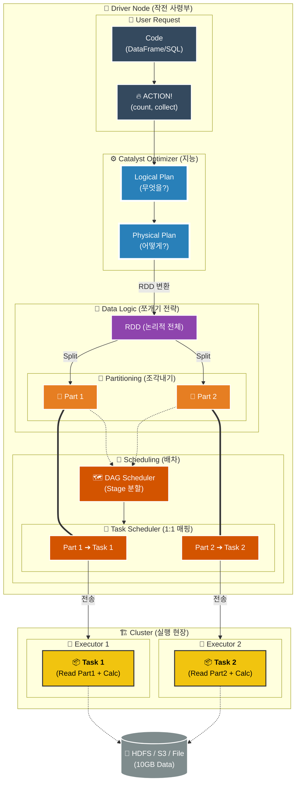

---
>RDD
> **Action 이후 Executor가 실제로 실행하는 단위**
> - ⭕ **Partition = RDD 조각**
> - ⭕ 장애 나면 **RDD Lineage로 재계산**

### Grand Map 완전 해석

이 지도는 **위에서 아래로** 흐릅니다.

1. **User Layer (입력):** 사용자가 코드를 짜고 Action(`count`)을 때립니다.
2. **Catalyst (두뇌):** 스파크가 "어떻게 처리할지" 머리를 굴려 **Physical Plan**을 짭니다.
3. **Data Logic (쪼개기):**
    - Physical Plan은 **RDD**라는 논리적 설계도가 됩니다.
    - 10GB짜리 RDD는 **2개의 Partition(`Part 1`, `Part 2`)** 으로 쪼개집니다. 

4. **Scheduler (매핑):**
    - **Task Scheduler**가 파티션을 보고 **"어? 조각이 2개네? 그럼 Task도 2개!"** 하고 1:1 매핑을 합니다.
        
5. **Cluster (실행):**
    - `Task 1`은 `Executor 1`로, `Task 2`는 `Executor 2`로 배달됩니다.
    - 각 Task는 저장소(HDFS)에서 **자기 몫의 데이터(Part 1, Part 2)만 쏙 빼서(Read)** 처리합니다.