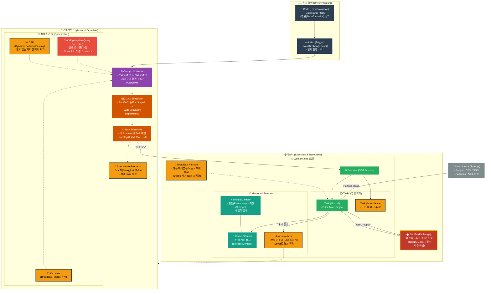

---

### 이 지도를 읽는 법 (범례)

1. **파란색 (User):** 우리가 작성하는 코드입니다. `Action`을 때리기 전까진 아무 일도 안 일어납니다 (Lazy).
    
2. **보라색/주황색 (Driver):** 스파크의 두뇌입니다.
    - **Catalyst:** 코드를 분석해서 최적의 경로를 짭니다.
    - **Scheduler:** 작업을 스테이지(Stage)와 태스크(Task)로 쪼개서 일꾼에게 던집니다.

3. **노란색/빨간색 (Optimization):** **Level 3에서 배운 핵심 기술들**입니다.
    - **Hints, AQE, DPP:** 더 똑똑한 계획을 짜도록 도와줍니다.
    - **Speculation:** 느린 태스크를 처리합니다.
    - **Broadcast:** 셔플 비용을 없앱니다.

4. **초록색 (Executor):** 실제 일을 하는 일꾼입니다
    - **Cache:** 자주 쓰는 건 메모리에 저장합니다.
    - **Accumulator:** 작업 현황(카운트)을 드라이버에게 보고합니다.

5. **빨간색 (Shuffle):** **성능의 주적!** 데이터가 네트워크를 타고 섞이는 과정입니다. (최대한 피해야 함)