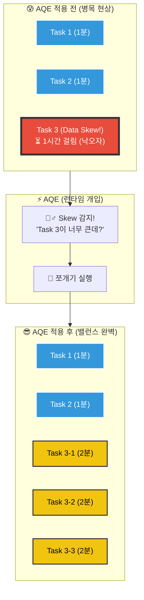

---
aliases:
  - AQE
  - Skew Join
  - Coalesce Partitions
  - Adaptive Query Execution
tags:
  - Spark
related:
  - "[[Spark_Catalyst_Optimizer]]"
  - "[[Spark_Memory_Management]]"
  - "[[00_Apache_Spark_HomePage]]"
---
## 개념 한 줄 요약 ⚡️

**"계획(Plan)대로만 가지 않는다! 실행 도중(Runtime)에 실제 데이터를 까보고 전략을 수정하는 스파크의 임기응변 기술."**

* **과거:** 통계 추정치(Estimate)만 믿고 계획을 짰다가, 실제 데이터가 예상과 다르면 망했습니다.
* **현재 (Spark 3.0+):** 셔플(Shuffle) 단계에서 실제 데이터 크기를 확인하고, **즉시 계획을 수정(Re-planning)** 합니다

---
## AQE가 해결하는 3가지 난제 

AQE는 다음 3가지 상황에서 빛을 발합니다.

### ① 파티션 자동 합치기 (Coalescing Shuffle Partitions)

* **문제:** 셔플 후 파티션이 너무 잘게 쪼개져 있으면(Small Files), 작업 스케줄링 오버헤드가 커집니다
* **해결:** 데이터가 적은 파티션들을 묶어서 **적절한 크기(기본 64MB)의 큰 파티션 하나로 합칩니다**
* **설정:** `{python}spark.sql.adaptive.coalescePartitions.enabled` (Default: `true`) 

### ② 조인 전략 변경 (Switching Join Strategies)

* **문제:** 원래는 데이터가 클 줄 알고 느린 **Sort-Merge Join (SMJ)** 을 계획했는데, 막상 까보니 한쪽 데이터가 작을 수 있습니다
* **해결:** 런타임에 데이터가 작다는 게 확인되면, 즉시 빠른 **Broadcast Hash Join (BHJ)** 으로 전략을 바꿉니다
* **설정:** `{python}spark.sql.adaptive.enabled` (Default: `true`)

### ③ 데이터 쏠림 해결 (Optimizing Skew Join) 

* **문제:** 특정 키(예: `Country='USA'`)에 데이터가 90% 몰려있으면, 다른 애들 다 퇴근할 때 혼자 밤새 일하는 **Straggler(낙오자)** 가 발생합니다
* **해결:** 뚱뚱한 파티션을 감지해서 **여러 개의 작은 서브 파티션으로 쪼개고**, 각각 병렬 처리합니다
* **설정:** `{python}spark.sql.adaptive.skewJoin.enabled` (Default: `true`) 

---
## 그림으로 보는 AQE 작동 원리 (Mermaid) 

    