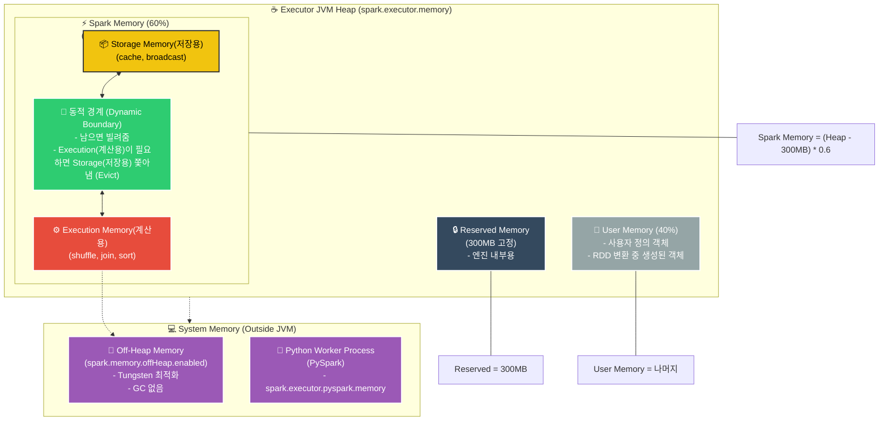

---
aliases:
  - Executor Memory
  - Unified Memory Manager
  - Storage Memory
  - Execution Memory
  - Off-heap
tags:
  - Spark
related:
  - "[[Spark_Architecture]]"
  - "[[00_Apache_Spark_HomePage]]"
  - "[[Spark_Catalyst_Optimizer]]"
  - "[[Spark_DataFrame_SQL_Intro]]"
---
## 개념 한 줄 요약️

**"스파크 Executor의 메모리는 '계산용(Execution)'과 '저장용(Storage)'이 땅따먹기를 하는 구조다."**

* 과거(Spark 1.6 이전)에는 영역이 고정되어 있어 비효율적이었으나,
* 현재(Spark 2.0+)는 **Unified Memory Manager**가 도입되어, 한쪽이 안 쓰면 다른 쪽이 빌려 쓰는 **유동적인 구조**로 바뀌었습니다.

---
## Executor Memory 구조 (JVM Heap) 

`spark.executor.memory`로 할당한 힙 메모리(Heap Memory)는 크게 세 구역으로 나뉩니다.

### ① Reserved Memory (예약된 메모리)

* **크기:** 300MB (고정)
* **용도:** 스파크 엔진 내부의 동작을 위해 무조건 남겨두는 공간입니다. 사용자가 건들 수 없습니다.

### ② User Memory (사용자 메모리)

* **비율:** `(Java Heap - Reserved) * (1 - spark.memory.fraction)`
* **기본값:** 전체의 약 **40%** (기본 설정 시)
* **용도:**
    * 스파크가 관리하지 않는 **사용자 정의 객체**나 데이터 구조를 저장합니다.
    * `Map`, `List` 같은 파이썬/자바 객체들이 여기에 삽니다.
    * **주의:** 여기가 꽉 차면 **OOM(Out Of Memory)** 이 발생합니다.

### ③ Spark Memory (스파크 메모리) - "핵심" ⭐

* **비율:** `(Java Heap - Reserved) * spark.memory.fraction`
* **기본값:** 전체의 약 **60%** (설정값 `0.6`)
* **구성:** 이 안에서 다시 **Execution**과 **Storage**가 나뉩니다.

---
## Spark Memory 내부: Execution vs Storage 

이 두 영역은 **Unified Memory Manager**에 의해 경계가 유동적입니다.

###  Execution Memory (계산용)

* **용도:** `Join`, `Aggregation`, `Shuffle`, `Sort` 등 **실제 계산**을 할 때 필요한 임시 데이터(Buffer)를 저장합니다.
* **특징:** **"한번 차지하면 절대 뺏기지 않습니다."** 계산 도중에 메모리를 뺏기면 작업이 터지니까요.

### Storage Memory (저장용)

* **용도:** `cache()`, `persist()`, `Broadcast Variable` 등 **데이터를 재사용**하기 위해 저장해두는 공간입니다.
* **특징:** Execution 영역이 부족하면 **쫓겨날(Eviction) 수 있습니다.** (쫓겨난 데이터는 디스크로 가거나 삭제됨).

###  동적 할당 (Dynamic Occupancy) 규칙

1.  **평화 시:** 둘 다 공간이 남으면 사이좋게 씁니다.
2.  **전쟁 시 (Execution이 부족할 때):**
    * Storage가 쓰고 있는 공간을 **강제로 뺏어옵니다(Evict).**
    * 캐시된 데이터는 날아가고, 나중에 다시 계산해야 합니다.
3.  **반대 경우 (Storage가 부족할 때):**
    * Execution이 안 쓰고 남은 공간만 빌려 쓸 수 있습니다.
    * Execution이 이미 차지한 공간은 **뺏을 수 없습니다.** (계산이 최우선!)

---
## Off-Heap Memory (힙 외부 메모리) 

JVM 힙(Heap) 밖에 있는 시스템 메모리를 직접 끌어다 쓰는 방식입니다.

* **설정:** `{python}spark.memory.offHeap.enabled = true`
* **장점:**
    * **GC(Garbage Collection) 프리:** JVM이 관리하지 않으므로 GC 렉이 없습니다.
    * **Tungsten 엔진 최적화:** 바이너리 데이터 처리에 최적화되어 있습니다. 
* **용도:** 주로 Spark SQL의 정렬/셔플 연산이나 Python Worker(PySpark)와의 데이터 교환에 쓰입니다.

---
##  PySpark의 메모리 구조 (Python Process) 🐍

PySpark를 쓰면 JVM 옆에 **Python Worker 프로세스**가 따로 뜹니다.

* **구조:** Executor(JVM) ↔ (Socket 통신) ↔ Python Worker(Python)
* **메모리:**
    * Python Worker는 JVM 힙을 쓰지 않고, **시스템 메모리(Off-Heap)** 를 별도로 씁니다.
    * **설정:** `{python}spark.executor.pyspark.memory` (기본값: 0, 설정 안 하면 시스템 남는 메모리 사용)
* **주의:** 파이썬 쪽에서 판다스(Pandas)로 대용량 변환을 하다가 터지는 경우가 많습니다.

---
###  TIP

"OOM이 났다고 무조건 `spark.executor.memory`만 늘리지 마.
로그를 봤는데 **'GC overhead limit exceeded'** 가 뜬다면, **User Memory**에 너무 큰 객체(리스트 등)를 만들지 않았는지 코드를 점검해야 해.
반대로 셔플하다가 터지면 **Execution Memory** 부족일 수 있으니 파티션 수를 늘리거나(`repartition`) 메모리 비율을 튜닝해야 하고!"

>Executor JVM Heap:  `spark.executor.memory`로 설정한 전체 공간입니다.
>Reserved Memory (300MB): 스파크 엔진이 살아가기 위해 무조건 떼어놓는 공간입니다. (건들지 마세요!)
>**Spark Memory (60%):** 스파크가 실제로 일하는 공간입니다.
> **📦 Storage:** `cache()`한 데이터가 머무는 곳.
>  **⚙️ Execution:** `Join`이나 `Shuffle` 할 때 계산하는 곳
> **🔄 동적 경계:** 이 둘은 땅따먹기를 합니다. **Execution(계산)** 이 깡패라서, 공간이 부족하면 Storage 데이터를 쫓아냅니다.
> **User Memory (40%):** 내가  짠 코드에서 만든 리스트나 딕셔너리가 사는 곳입니다. 여기가 터지면 OOM이 납니다.
> **Off-Heap & PySpark:** JVM 밖의 시스템 메모리를 씁니다. GC(Garbage Collection) 영향을 받지 않아 빠릅니다.