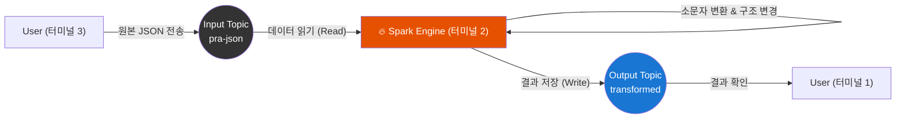

---
aliases:
  - JSON ETL
  - Spark Kafka JSON
  - 실전 프로젝트
tags:
  - Spark
  - Kafka
related:
  - "[[Spark_Streaming_Kafka_Integration]]"
  - "[[00_Apache_Spark_HomePage]]"
  - "[[Spark_JSON_Handling]]"
  - "[[DataFrame_Transform_Basic]]"
  - "[[Spark_Streaming_Fault_Tolerance]]"
linked:
  - file:///Users/gong/gong_study_de/apache-spark/notebooks/kafka_json.py
---
##  프로젝트 목표: "데이터 세탁기" 만들기 FACTORY 

이번 실습의 목표는 **더러운 데이터(Raw Data)** 를 받아서, 깨끗하게 **가공(Transform)** 한 뒤, **새로운 상자(Topic)** 에 담는 파이프라인을 만드는 것입니다.

### ❓ 초보자를 위한 핵심 Q&A

**Q1. 왜 터미널이 3개나 필요한가요?**

혼자 북 치고 장구 치는 게 아니라, 역할이 분담되어 있기 때문입니다.

1.  **터미널 1 (감시자/Consumer):** "결과가 잘 나왔나?" 하고 **완성품 나오는 곳(Output)** 을 지켜보는 눈입니다.
2.  **터미널 2 (공장 기계/Spark):** 실제로 데이터를 씹고 뜯고 맛보고 즐기는 **스파크 엔진**입니다. (계속 돌아가야 함)
3.  **터미널 3 (재료 투입구/Producer):** 공장에 **재료(Input 데이터)** 를 던져주는 역할입니다.

**Q2. 왜 토픽 이름이 달라야 하나요? (`pra-json` vs `transformed`)**

**"빨래통(Input)"** 과 **"옷장(Output)"** 이 같으면 안 되기 때문입니다!
* **`pra-json` (Input Topic):** 막 들어온 원본 데이터가 쌓이는 곳. (스파크가 여기서 읽어감 = `subscribe`)
* **`transformed` (Output Topic):** 스파크가 가공을 마친 깨끗한 데이터가 저장되는 곳.

---
##  전체 설계도 (Architecture)


---
## 🔗 학습 가이드 (Reference)

코드 전에 한번 복습해보세요!!!~

> **JSON 파싱 상세:** `from_json`, `to_json`의 상세 문법과 스키마 작성법
> 👉 **[[Spark_JSON_Handling|JSON 데이터 핸들링 정리]]**

> **기본 변환:** `selectExpr`, `cast`, `struct`,`expr` 등 데이터 조작법
> 👉 **[[DataFrame_Transform_Basic|데이터프레임 변환 기초]]**
---
## 파이썬 코드 작성 (`kafka_json.py`)

이 코드는 **"공장 설계도"** 입니다. 
`/notebooks` 폴더에 `kafka_json.py` 이름으로 저장하세요.

```python
from pyspark.sql import SparkSession
from pyspark.sql.types import StructType, StructField, StringType
from pyspark.sql.functions import expr, from_json, col, lower, to_json, struct

# 1. 스파크 공장 가동 (설정)
spark = SparkSession \
    .builder \
    .appName("StructuredJSONETL") \
    .master("spark://spark-master:7077") \
    .config("spark.streaming.stopGracefullyOnShutdown", "true") \
    .config("spark.sql.shuffle.partitions", "3") \
    .getOrCreate()

# 2. 데이터 구조 정의 (들어올 데이터 모양)
schema = StructType([
            StructField("city", StringType()),
            StructField("domain", StringType()),
            StructField("event", StringType())
        ])

# 3. [입력] 빨래통(pra-json)에서 데이터 가져오기
events = spark \
    .readStream \
    .format("kafka") \
    .option("kafka.bootstrap.servers", "kafka:9092") \
    .option("subscribe", "pra-json") \
    .option("startingOffsets", "earliest") \
    .option("failOnDataLoss", "false") \
    .load()

# 4. [가공] 더러운 데이터를 씻고 다림질하기
# 4-1. JSON 문자열을 구조체로 변환
value_df = events.select(
            col('key'),
            from_json(col("value").cast("string"), schema).alias("value"))

# 4-2. 실제 변환 로직 (대문자 -> 소문자 등)
tf_df = value_df.selectExpr(
            'value.city',
            'value.domain',
            'value.event as behavior') # 이름 변경 (event -> behavior)

concat_df = tf_df.withColumn('lower_city', lower(col('city'))) \
                .withColumn('domain', expr('domain')) \
                .withColumn('behavior', expr('behavior')).drop('city')

# 5. [포장] 다시 전송하기 위해 JSON 문자열로 묶기
output_df = concat_df.select(
    to_json(struct(col("lower_city"), col("domain"), col("behavior"))).alias("value")
)

# 6. [출력] 옷장(transformed)으로 보내기
query = output_df \
    .writeStream \
    .queryName("transformed writer") \
    .format("kafka") \
    .option("kafka.bootstrap.servers", "kafka:9092") \
    .option("topic", "transformed") \
    .option("checkpointLocation", "checkpoint") \
    .outputMode("append") \
    .start()

query.awaitTermination()
```

---
##  코드 상세 분석 (Deep Dive)

방금 작성한 코드의 핵심 로직(4단계~5단계)을 **"택배 상자"** 에 비유해서 이해해봅시다.

### ① 상자 뜯기 (`from_json`)

카프카에서 온 데이터는 `value`라는 이름의 **닫힌 택배 상자(Binary/String)** 상태입니다. 
내용물을 꺼내려면 상자를 뜯어야 합니다.

```python
value_df = events.select(
    col('key'),
    # from_json: "이 문자열은 JSON 모양이니까, schema(설계도)대로 뜯어줘!"
    from_json(col("value").cast("string"), schema).alias("value")
)
```

**결과:** `{"city": "Seoul", ...}` 문자열이 **구조체(Struct)** 라는 열린 상태로 변합니다. 
이제 `value.city` 처럼 내부 데이터에 접근할 수 있습니다.

### ② 물건 손질하기 (`selectExpr`, `withColumn`)

상자에서 꺼낸 물건을 우리가 원하는 대로 고치고 다듬는 과정입니다.

```python
# 1단계: 필요한 것만 꺼내고 이름 바꾸기
tf_df = value_df.selectExpr(
    'value.city',              # city 꺼냄
    'value.domain',            # domain 꺼냄
    'value.event as behavior'  # event를 꺼내서 'behavior'라고 이름표 바꿔다기
)

# 2단계: 실제 내용물 변경 (소문자 변환)
concat_df = tf_df.withColumn('lower_city', lower(col('city'))) \ # city를 소문자로 바꿔서 'lower_city' 생성
                .drop('city') # 원본 city는 이제 필요 없으니 버림
```

### ③ 다시 포장하기 (`to_json` + `struct`) 

**이 부분이 가장 중요합니다!** 카프카는 데이터를 보낼 때 **반드시 하나의 덩어리(Column)** 로 묶어서 보내야 합니다. (카프카는 컬럼이 여러 개라는 개념을 모릅니다.) 그래서 손질한 물건들(`lower_city`, `domain`, `behavior`)을 다시 **JSON 문자열이라는 하나의 상자**에 포장해야 합니다.

```python
output_df = concat_df.select(
    # struct(*): 여러 컬럼을 하나로 묶음 (그룹화)
    # to_json(*): 묶은 것을 문자열로 변환 (직렬화)
    to_json(struct(col("lower_city"), col("domain"), col("behavior"))).alias("value")
)
```

**이유:** 이렇게 안 하고 컬럼 3개인 채로 `.writeStream`을 하면 **"Kafka only supports one value column"** 이라는 에러가 납니다.

### 💡 요약: 데이터의 변신 과정

1. **Raw (Kafka):** `[Binary]` (뜯지 않은 상자)
2. **Parsed (Spark):** `[Struct]` (내용물이 보임)
3. **Transformed:** `[seoul, naver, click]` (손질된 내용물들)
4. **Output (Kafka):** `{"lower_city":"seoul",...}` (다시 포장된 상자)

---

## 실행 가이드 (순서대로 따라하기) 

창을 3개 띄우고 순서대로 실행해야 헷갈리지 않습니다.

### ⓵ [터미널 1] 감시자 (Consumer) 켜기

먼저 **결과가 나오는 구멍**을 지켜보고 있어야 합니다.

- **역할:** `transformed` 토픽(옷장)을 계속 쳐다봄.

```bash
docker exec -it kafka /opt/kafka/bin/kafka-console-consumer.sh \
  --bootstrap-server kafka:9092 \
  --topic transformed \
  --property print.value=true
```

(실행 후 아무 반응 없이 커서만 깜빡이면 정상! 대기 중인 상태입니다.)

---
### ⓶ [터미널 2] 스파크 공장 (Engine) 가동

이제 설계도(`kafka_json.py`)를 스파크에게 전달해 공장을 돌립니다.

- **역할:** `pra-json`에서 가져와서 변환하고 `transformed`로 보냄.

```bash
/opt/spark/bin/spark-submit \
  --packages org.apache.spark:spark-sql-kafka-0-10_2.12:3.5.1 \
  kafka_json.py
```

- **`/opt/spark/bin/spark-submit`**: 스파크에게 일을 시키는 전용 실행 도구입니다.
- **`kafka_json.py`**: 우리가 작성한 실제 공장 설계도 파일입니다.

(로그가 막 뜨다가 멈추면 정상! 공장이 돌아가기 시작한 겁니다.)

---
### ⓷ [터미널 3] 재료 투입 (Producer)

마지막으로, **새로운 터미널**을 열어서 원본 데이터를 던져줍니다.

- **역할:** `pra-json` 토픽(빨래통)에 데이터를 입력함.

```bash
docker exec -it kafka /opt/kafka/bin/kafka-console-producer.sh \
  --bootstrap-server kafka:9092 \
  --topic pra-json
```

( `>` 표시가 나오면 채팅 입력 준비 완료!)

---
### ⓸ 결과 확인 (피날레 🎉)

**터미널 3(투입구)** 에 아래 데이터를 복사해서 넣고 엔터를 치세요.

```json
{"city": "DAEGU", "domain": "naver.com", "event": "click"}
```

그 순간, **터미널 1(감시자)** 에 아래처럼 변환된 결과가 뜨면 성공입니다!

```json
{"lower_city":"seoul","domain":"naver.com","behavior":"click"}
```

(SEOUL이 seoul로 바뀌었고, event가 behavior로 바뀌었죠?)

---
### 자주 발생하는 에러 (Checkpoint)

코드를 수정하고 다시 실행할 때 에러가 난다면, **이전 작업의 기억(Checkpoint)** 때문에 충돌이 난 것입니다. 그럴 땐 기억을 지워주세요.

```bash
# 로컬 터미널(notebooks 폴더)에서 실행
rm -rf checkpoint
```

