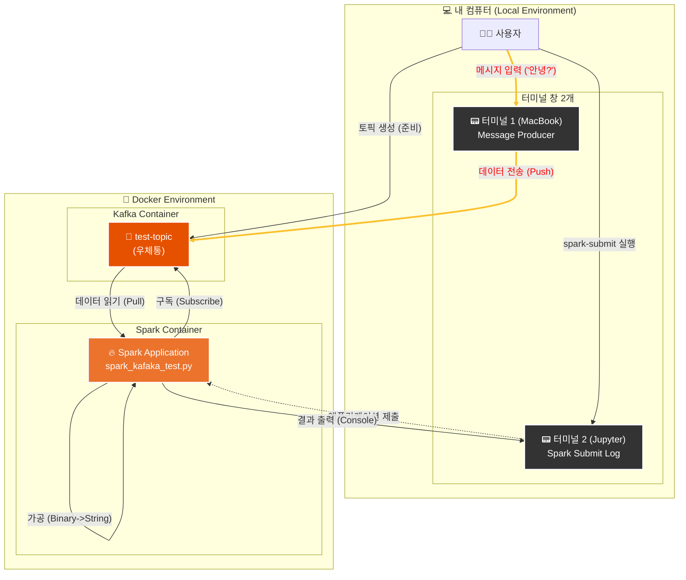

---
aliases:
  - Spark Kafka Integration
  - readStream kafka
  - writeStream kafka
tags:
  - Streaming
  - Kafka
  - Spark
related:
  - "[[Spark_Kafka_Docker_Setup]]"
  - "[[Apache_Kafka_Concept]]"
  - "[[kafka_spark_streaming_code]]"
  - "[[00_Apache_Spark_HomePage]]"
  - "[[DataFrame_Transform_Basic]]"
---
## 개요: 카프카 데이터 수집 (Ingest Kafka Event) 

스파크 스트리밍의 가장 강력하고 흔한 사용 패턴은 **"카프카에서 데이터를 읽어와서(Read), 가공한 뒤(Process), 다시 카프카나 DB에 저장하는(Write)"** 것입니다.

* **필수 라이브러리:** 스파크 기본에는 카프카 연결 기능이 없습니다. 반드시 외부 패키지를 로드해야 합니다.
    * `{python}org.apache.spark:spark-sql-kafka-0-10_2.12:3.5.1` (스파크 버전에 맞춰야 함)

---
## 카프카에서 데이터 가져오기 (Source)

`readStream`을 사용하며 `.format("kafka")`를 지정합니다.

```python
# SparkSession 생성 (라이브러리 로드 필수!)
spark = SparkSession.builder \
    .appName("KafkaReadTest") \
    .config("spark.jars.packages", "org.apache.spark:spark-sql-kafka-0-10_2.12:3.5.1") \
    .getOrCreate()

# 카프카 읽기 설정
df = spark \
    .readStream \
    .format("kafka") \
    .option("kafka.bootstrap.servers", "kafka:9092") \
    .option("subscribe", "test-topic") \
    .option("startingOffsets", "earliest") \
    .load()
```

### 주요 옵션 설명

- **`{python}kafka.bootstrap.servers`**: 카프카 브로커 주소 (Docker 내부 통신이므로 `kafka:9092`).
- **`{python}subscribe`**: 구독할 토픽 이름 (쉼표로 구분해 여러 개 가능).
- **`{python}startingOffsets`**:
    - `earliest`: 처음부터 다 읽기 (데이터 유실 방지).
    - `latest`: 지금부터 들어오는 것만 읽기 (기본값).

---
## 카프카 데이터의 구조 (Schema) 

카프카에서 읽어온 DataFrame(`df`)은 아래와 같은 고정된 컬럼을 가집니다.

|**컬럼명**|**데이터 타입**|**설명**|
|---|---|---|
|**key**|Binary|메시지의 키 (옵션)|
|**value**|**Binary**|**실제 데이터 내용 (가장 중요!)**|
|topic|String|토픽 이름|
|partition|Integer|파티션 번호|
|offset|Long|오프셋 번호|
|timestamp|Timestamp|메시지 생성 시간|

👉 **주의:** `value` 컬럼이 **이진 데이터(Binary)** 로 들어옵니다.
사람이 읽을 수 있는 문자열(String)로 바꿔주는 작업(Casting)이 반드시 필요합니다!

```python
from pyspark.sql.functions import col, expr

# Binary -> String 변환
kafka_text_df = df.selectExpr("CAST(key AS STRING)", "CAST(value AS STRING)")
```

---
## [쓰기] 카프카로 데이터 보내기 (Sink)

가공한 데이터를 다시 카프카로 쏠 수도 있습니다. 이때는 `value` 컬럼이 필수입니다.

```python
query = kafka_text_df \
    .writeStream \
    .format("kafka") \
    .option("kafka.bootstrap.servers", "kafka:9092") \
    .option("topic", "output-topic") \
    .option("checkpointLocation", "checkpoint_kafka") \
    .start()
```

---
##  JSON 데이터로 변환해서 보내기 (Publish)

실무에서는 데이터를 가공한 뒤 **JSON 문자열**로 묶어서 카프카로 보내는 경우가 대부분입니다.
하지만 카프카는 오직 `value`라는 하나의 컬럼만 받기 때문에, 여러 컬럼을 하나로 합치는 과정이 필요합니다.

### 핵심 함수: `to_json`과 `struct`

* **`{python}struct(*)`**: 모든 컬럼을 하나의 구조체(바구니)로 묶습니다.
* **`{python}to_json(...)`**: 그 구조체를 JSON 문자열로 변환합니다.

### 💻 실습 코드 (Write to Kafka)

```python
from pyspark.sql.functions import to_json, struct, col

# 1. 가공된 데이터가 있다고 가정 (예: city, count 컬럼)
# processed_df = ... 

# 2. [핵심] 여러 컬럼을 'value'라는 하나의 JSON 컬럼으로 변환
kafka_output_df = processed_df.select(
    to_json(struct("*")).alias("value") 
)

# 3. 카프카로 전송 (Checkpoint 필수!)
query = kafka_output_df \
    .writeStream \
    .format("kafka") \
    .option("kafka.bootstrap.servers", "kafka:9092") \
    .option("topic", "json-output-topic") \
    .option("checkpointLocation", "checkpoint_json") \
    .start()

query.awaitTermination()
```

### 🔍 데이터 변환 과정

1. **Original:** `[Seoul, 10]` (컬럼 2개)
2. **Struct:** `[[Seoul, 10]]` (컬럼 1개로 묶임)
3. **JSON:** `{"city": "Seoul", "count": 10}` (문자열로 변환됨 -> **Kafka 전송 가능!**)


---
## 자주 만나는 에러와 해결법 (Troubleshooting) 

실습 도중 겪었던 **죽음의 에러들**과 그 해결책입니다. 

### ① `ModuleNotFoundError: No module named 'pyspark'`

- **원인:** 코드를 **내 맥북(로컬)** 터미널에서 실행했기 때문입니다. 내 맥북엔 pyspark가 안 깔려 있습니다.
- **해결:** 코드는 반드시 **Docker 컨테이너 안**에서 실행해야 합니다.

```bash
# Docker 안으로 명령 쏘기
docker exec -it spark-jupyter python3 /workspace/내파일.py
```

### ② `AnalysisException: Failed to find data source: kafka`

- **원인:** "카프카를 써라"라고 했지만, 스파크가 **카프카 연결용 라이브러리(JAR)** 를 갖고 있지 않아서입니다.
- **해결 (Jupyter):** 코드 안에 `.config("spark.jars.packages", "...")`를 꼭 넣어야 합니다.
- **해결 (Terminal / .py 실행):** `spark-submit` 명령어 뒤에 **패키지 옵션**을 붙여서 실행해야 합니다. **(이걸 빼먹어서 고생함!)**

```bash
# ✅ 올바른 실행 명령어 (.py 파일 실행 시)
/opt/spark/bin/spark-submit \
  --packages org.apache.spark:spark-sql-kafka-0-10_2.12:3.5.1 \
  spark_kafka_test.py
```

### ③ `AnalysisException: Missing option 'subscribe'`

- **원인:** 카프카 서버 주소는 적었지만, **"어떤 토픽"** 을 읽을지 설정을 안 했습니다.
- **해결:** `.option("subscribe", "토픽이름")`을 반드시 추가하세요

---
## 실행 방법 정리 (.ipynb vs .py)

|**구분**|**Jupyter Notebook (.ipynb)**|**Python Script (.py)**|
|---|---|---|
|**용도**|데이터 분석, 시각화, 테스트|**실무 배포**, 자동화, 스케줄링|
|**실행법**|셀(Cell) 단위 실행 (`Shift + Enter`)|터미널에서 `spark-submit` 명령어로 실행|
|**특징**|결과를 바로 눈으로 확인 가능|`Ctrl + C`로 끌 때까지 백그라운드에서 계속 돔|


---
## 흐름도 이대로 따라하기 !

### 전체 흐름 미리보기

1. **준비:** 우체통(Topic) 만들기 (데이터 담을 공간)
2. **수신 대기 (Spark):** 스파크 켜서 "편지 오면 읽어줘" 시키기 (`spark-submit`)
3. **발신 (Kafka):** 다른 터미널에서 편지 보내기 (Producer)
4. **확인:** 스파크 화면에 편지가 뜨는지 보기

---
## 1단계: 우체통(Topic) 만들기 

**"편지를 받으려면 우체통이 먼저 있어야겠죠?"** 스파크를 켜기 전에, 카프카에 데이터를 담을 공간(Topic)을 먼저 만들어야 합니다.

1. **내 맥북 터미널(Terminal)** 을 켭니다.
2. 아래 명령어를 복사해서 붙여넣고 엔터! (이미 만들었다면 생략 가능)

```bash
# 카프카 컨테이너에 접속해서 'test-topic'이라는 토픽(우체통)을 만듭니다.
docker exec -it kafka /opt/kafka/bin/kafka-topics.sh --create --topic test-topic --bootstrap-server kafka:9092 --replication-factor 1 --partitions 1
```

---
## 2단계: 스파크 실행 준비 (터미널 열기) 

이제 스파크 코드를 실행할 **주피터 랩 터미널**을 열 차례입니다.

**📍 방법 1. 상단 메뉴바 이용하기 (가장 쉬움)**

1. 주피터 랩 화면 맨 위 메뉴에서 **File**을 누르세요.
2. **New** → **Terminal**을 클릭하세요.
3. 화면 아래쪽에 **검은색 창(터미널)** 이 새로 열릴 겁니다.

**📍 방법 2. 파란색 + 버튼 누르기**

1. 왼쪽 상단의 파란색 **`+`** 버튼(Launcher)을 누르세요.
2. 여러 아이콘 중 **"Terminal"** (검은색 창 아이콘)을 클릭하세요.

---
## 3단계: 스파크 코드 실행하기 (`spark-submit`) 

**여기가 가장 중요합니다!** 아까 열어둔 **주피터 랩 터미널**에 명령어를 입력합니다.

### 💡 잠깐! `spark-submit`이 뭔가요?

- **.ipynb**에서는 그냥 셀 옆의 `▶` 버튼을 눌렀죠?
- **.py** 파일은 버튼이 없습니다. 그래서 **"이 코드를 스파크한테 제출(Submit)할게! 실행해줘!"** 라고 말하는 명령어가 필요합니다.
- 그게 바로 `spark-submit`입니다. 실무에서는 자동화를 위해 무조건 이 방식을 씁니다.

👇 아래 명령어를 주피터 랩 터미널에 복사해서 넣고 엔터!

```bash
/opt/spark/bin/spark-submit \
  --packages org.apache.spark:spark-sql-kafka-0-10_2.12:3.5.1 \
  kafka_json.py
```

**명령어 해석:**

1. `{python}/opt/spark/bin/spark-submit`: "스파크야, 일감 받아라!"
2. `{python}--packages ...`: "카프카 연결할 때 필요한 도구(라이브러리)도 같이 챙겨서 가!" (이게 없으면 에러남)
3. `{python}spark_kafaka_test.py`: "이 파일을 실행해!"

**👉 실행 결과:** 
막 영어로 된 로그들이 촤라락 뜨다가... 어느 순간 멈춘 듯이 가만히 있을 겁니다. 
(에러가 난 게 아니라, **"데이터 언제 오나?" 하고 귀를 쫑긋 세우고 기다리는 중**입니다. 성공입니다!)


---
## 4단계: 메시지 보내기 (Producer) 

스파크는 지금 기다리고 있습니다. 이제 데이터를 던져줘야겠죠? **내 맥북의 터미널(새 창)** 을 하나 더 엽니다. 
(주피터 랩 터미널은 스파크가 쓰고 있으니 건드리지 마세요!)

👇 내 맥북 터미널에 아래 명령어 입력:

```bash
# 카프카 컨테이너 안에 있는 '채팅 프로그램(Producer)'을 실행해라!
docker exec -it kafka /opt/kafka/bin/kafka-console-producer.sh --bootstrap-server kafka:9092 --topic test-topic
# ocker exec -it kafka /opt/kafka/bin/kafka-console-producer.sh --bootstrap-server kafka:9092 --topic 만들어둔 토픽이름
```

---
## 5단계: 실시간 확인 (마법의 순간) 

이제 화면을 반반 나눠서 보세요.

1. **오른쪽(맥북 터미널):** 채팅창에 아무 말이나 쓰고 엔터를 치세요.
    - `안녕?`
2. **왼쪽(주피터 랩 터미널):** 아까 멈춰있던 스파크 화면에 글자가 뜹니다!
```text
-------------------------------------------
Batch: 1
-------------------------------------------
+-----+
|value|
+-----+
|안녕? |
+-----+
```


---

---
### 흐름도 해설 (우리가 한 일)

1. **준비 (1번 화살표):**
    
    - 먼저 카프카 컨테이너 안에 `test-topic`이라는 **우체통**을 만들었습니다.
        
2. **수신 대기 (2, 3번 화살표):**
    
    - **터미널 2(Jupyter)**에서 `spark-submit`으로 파이썬 파일을 실행했습니다.
    - 이제 스파크 앱(`🔥`)이 켜져서 카프카 우체통(`📮`)을 빤히 쳐다보고(Subscribe) 있습니다.
        
3. **데이터 전송 (4, 5번 화살표):**
    
    - **터미널 1(MacBook)**에서 채팅 프로그램(Producer)을 켰습니다.
    - "안녕?"이라고 치는 순간, 이 메시지는 카프카 우체통으로 슝~ 날아갑니다.
        
4. **처리 및 출력 (6, 7, 8번 화살표):**
    
    - 우체통에 편지가 떨어지자마자, 지켜보고 있던 스파크가 낚아챕니다(Pull).
    - 이진 데이터(Binary)를 우리가 읽을 수 있는 문자열(String)로 바꿉니다.
    - 마지막으로 **터미널 2** 화면에 결과를 보여줍니다!