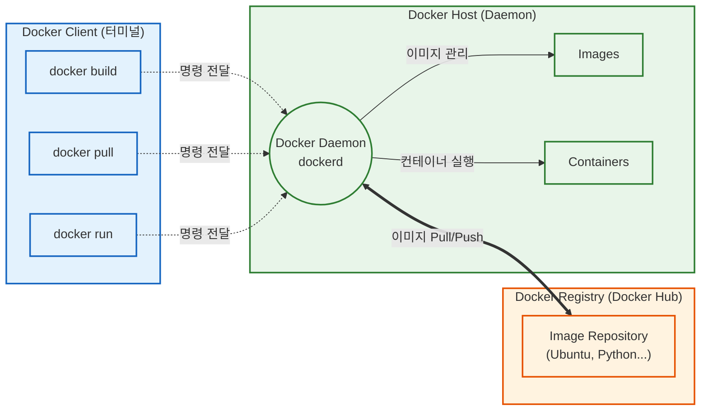

---
aliases:
  - Docker Architectrue
  - 도커 구조
  - Client-Server Architecture
tags:
  - Docker
related:
  - "[[Docker_Concept_vs_VM]]"
  - "[[00_Docker_HomePage]]"
---
# Docker Architecture: 명령과 실행의 분리

> [!QUOTE] 핵심 요약
> **"도커는 클라이언트-서버(Client-Server) 구조다."**
> 내가 명령을 내리는 곳(Client)과 실제로 일을 하는 곳(Daemon/Server)이 분리되어 있으며, 필요한 물건(Image)은 창고(Registry)에서 가져온다.

---
##  The Big 3 Components (핵심 3대장)

도커 시스템을 지탱하는 세 가지 기둥입니다. 

### ① Docker Client (주문자) 

* **역할:** 사용자가 도커와 소통하는 유일한 창구(Interface).
* **특징:**
    * 우리가 터미널에 치는 명령어(`docker build`, `docker run`)가 바로 클라이언트 도구(CLI)입니다. 
    * 이 명령어를 **REST API** 형태로 변환해서 Daemon에게 전달합니다. 

### ② Docker Daemon (`dockerd` / 일꾼) 

* **역할:** 실제 작업을 수행하는 **백그라운드 프로세스(Server)**. 
* **특징:**
    * Client의 주문(API 요청)을 받아서 이미지(Image), 컨테이너(Container), 네트워크, 볼륨 등을 관리합니다. 
    * "컨테이너를 띄워라!", "이미지를 구워라!" 하는 명령을 묵묵히 수행합니다.

### ③ Docker Registry (물류 창고) 

* **역할:** 도커 이미지(Image)를 저장하고 공유하는 저장소. 
* **특징:**
    * **Docker Hub**가 대표적인 공용 레지스트리(Public Registry)입니다. 
    * 개발자는 여기서 이미지를 다운로드(`pull`)하거나, 내 이미지를 업로드(`push`)합니다. 

### 💡 실전 예시: `docker compose up -d` 의 정체

* **나(User):** 터미널을 켜고 `docker compose up -d`를 입력함.
* **이것이 바로 CLI (Client):** * 나는 마우스(GUI)가 아니라 **키보드(CLI)** 로 주문서를 작성한 것임.
    * 이 명령어는 **"주문서(Client)"** 가 되어 **Docker Daemon(주방장)** 에게 전달됨.
* **그다음 벌어지는 일 (Daemon):**
    * Daemon이 주문을 받고, "어? 컴포즈 파일(docker-compose.yml)대로 요리하라고?" 하면서 컨테이너를 하나하나 띄우기 시작함.

> [!TIP] CLI vs GUI
> * **CLI (Command Line Interface):** `docker run...`, `docker compose...` 처럼 글자로 명령하는 방식. (전문가용, 자동화 가능)
> * **GUI (Graphic User Interface):** 'Docker Desktop' 처럼 마우스로 클릭해서 켜고 끄는 방식. (초보자용, 직관적)

---
##  The Workflow (작동 원리) 

이 세 가지가 어떻게 협력하는지 흐름으로 보면 명확해집니다.

---
