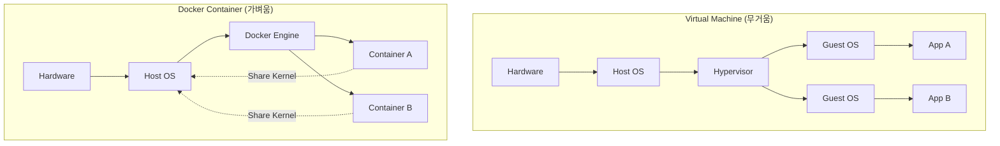

---
aliases:
  - Docker vs VM
  - Container Concept
  - 도커와 가상머신 차이
tags:
  - Docker
related:
  - "[[Docker_Architecture]]"
  - "[[00_Docker_HomePage]]"
---
# Docker Concept: "방 한 칸"의 혁명

> [!QUOTE] 핵심 비유
> **"Virtual Machine(VM)이 '집 전체(House)'를 빌리는 것이라면, Docker는 '방 한 칸(Room)'만 빌리는 것이다."**

---
## Concept Summary (개념 정리)

### Virtual Machine (가상머신) = "집 전체 임대"

* **구조:** 건물(Server) 위에 집(VM)을 짓는데, 집마다 기초 공사(Guest OS)부터 배관, 전기 시설(Kernel)까지 다 따로 설치함.
* **특징:**
    * **무거움:** 집 하나 지을 때마다 자재(Resource)가 엄청 듬.
    * **느림:** 입주(Booting) 하려면 기초 공사부터 해야 해서 오래 걸림.
    * **완벽한 격리:** 옆집이 불나도 우리 집은 안전함 (보안성 높음).

###  Docker Container (컨테이너) = "쉐어하우스의 방 한 칸"

* **구조:** 튼튼한 건물(Host OS)과 배관/전기(Kernel)는 공유하고, **내 방(Container)** 만 따로 씀. 
* **특징:**
    * **가벼움 (Lightweight):** 내 짐(App & Libs)만 챙기면 됨. 
    * **빠름 (Speed):** 건물은 이미 지어져 있으니 문만 열고 들어가면 됨 (**Instant Start**). 
    * **이식성 (Portability):** 내 방을 그대로 들어서 다른 건물(Server)로 옮길 수 있음. 

---
##  Architecture Comparison (구조 비교)

|**구분**|**Virtual Machine (VM)**|**Docker Container**|
|---|---|---|
|**핵심 차이**|**Guest OS 포함** (운영체제 전체 설치)|**Host OS Kernel 공유** (운영체제 핵심 빌려 씀)|
|**용량**|수 GB (기가바이트)|수 MB (메가바이트)|
|**부팅 속도**|분 단위 (느림)|밀리초 단위 (즉시 실행)|
|**이식성**|낮음 (환경마다 설정 다를 수 있음)|높음 (**Build, Ship, and Run** Anywhere)|

---
## Why Docker? (도커를 쓰는 이유)

1. **Efficiency (효율성):** 운영체제 커널(Kernel)을 공유하므로 시스템 자원을 훨씬 적게 씀.
2. **Consistency (일관성):** "내 컴퓨터에선 되는데 서버에선 안 돼요" 라는 말이 사라짐. 개발(Dev), 테스트(Stage), 운영(Prod) 환경이 똑같음.
3. **Portability (이식성):** 컨테이너 하나만 있으면 노트북, 클라우드, 데이터센터 어디서든 똑같이 돌아감.
4. **Microservices (MSA):** 애플리케이션을 작은 기능 단위로 쪼개서 독립적으로 배포/관리하기 최적화됨

---
## Workflow (작동 원리)

도커는 **"건설 도면(File) -> 자재 세트(Image) -> 실제 방(Container)"** 순서로 만들어집니다.

1. **Dockerfile (설계도):** 어떤 OS를 쓰고, 어떤 파일을 복사할지 적은 문서.
2. **Docker Image (자재 세트):** 설계도를 바탕으로 만든 **읽기 전용(Read-only)** 템플릿.
3. **Docker Container (실제 방):** 이미지를 실행한 상태(Runtime Instance). 여기서 앱이 돌아감.

[!TIP] 명령어 흐름
>`docker build` (설계도로 이미지 만들기) -> `docker run` (이미지로 컨테이너 실행하기)