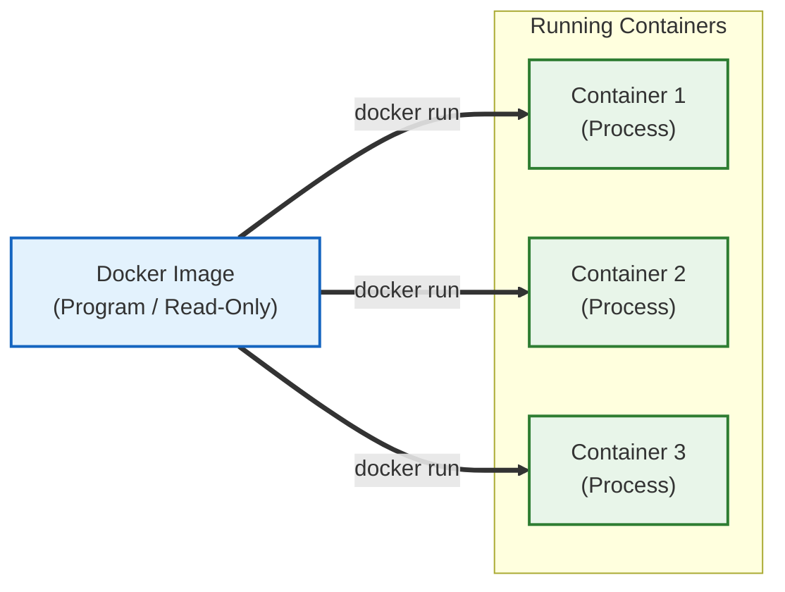

---
aliases:
  - Docker Image vs Container
  - Program vs Process
tags:
  - Docker
related:
  - "[[Docker_Concept_vs_VM]]"
  - "[[Docker_Architecture]]"
---
# Docker_Image_vs_Container

## 한 줄 요약

```
이미지  = 얼어있는 프로그램 (Program) → 변하지 않음 (Immutable)
컨테이너 = 살아서 움직이는 프로세스 (Process) → 상태가 변함 (Mutable)
```

---

---

# ① 비유로 이해하기

|구분|OS 관점|OOP 관점|실생활 비유|
|---|---|---|---|
|**Image**|프로그램 (`chrome.exe` 파일)|클래스 (설계도)|요리 레시피 (종이)|
|**Container**|프로세스 (실행된 크롬 창)|인스턴스 (실체화)|실제 요리 (먹을 수 있음)|

```
레시피(Image) 는 아무리 많이 봐도 닳지 않는다
요리(Container) 는 먹으면 없어지거나 맛이 변할 수 있다
```

---

---

# ② Docker Image — "세팅 다 끝난 컴퓨터 하드디스크"

```
단순한 코드가 아니라
"리눅스 컴퓨터 한 대를 통째로 압축해 둔 것"
```

## 파일 시스템 포함 ⭐️

```
이미지를 다운받는 순간
그 안에는 /bin / /usr / /opt 같은 리눅스 폴더 구조가 이미 다 만들어져 있음

예: kafka-console-producer.sh 가
    /opt/kafka/bin/ 안에 미리 설치되어 있는 이유

이미지 제작자(Apache 재단)가
"님들이 편하게 쓰세요" 라고
리눅스 환경에서 apt-get install 하고
설정 파일 만들고 실행 스크립트까지 배치해둔 상태로 얼려버림
→ 우리는 Pull 받아서 쓰기만 하면 됨
```

## 불변 (Immutable)

```
이미지는 읽기 전용
컨테이너에서 뭔가 설치해도 이미지는 변하지 않음
→ 컨테이너 삭제 후 다시 실행하면 원래 상태로 돌아옴
```

## 계층 구조 (Layered)

```
1층: 리눅스(Ubuntu) 설치
2층: 자바(Java) 설치
3층: 카프카(Kafka) 설치

이 과정이 층층이 쌓여서 하나의 이미지가 됨
→ 공통 레이어는 여러 이미지가 공유 → 디스크 절약
```

---

---

# ③ Docker Container — "Runtime Instance"

```
이미지를 실행해서 메모리에 올라온 실제 격리된 공간
```

## 특징

```
휘발성 (Ephemeral):
  컨테이너 삭제하면 그 안에서 생성된 데이터도 사라짐
  → Volume 이 필요한 이유

격리성 (Isolated):
  컨테이너 A 와 컨테이너 B 는 서로 독립적
  포트 / 파일시스템 / 프로세스 격리

쓰기 가능 (Writable):
  이미지 위에 얇은 "쓰기 레이어" 를 얹어서
  파일 생성 / 수정 가능
  (이미지 원본은 변하지 않음)
```

---

---

# ④ 생명주기 — 1개 이미지 → N개 컨테이너



```
같은 이미지로 컨테이너 여러 개 실행 가능
각 컨테이너는 독립적으로 동작
```

---

---

# ⑤ Bitnami vs Apache 공식 이미지

## ⚠️ Bitnami 이미지 사용 불가

```
2025년 9월 29일부터
Bitnami 가 Broadcom 인수 후 버전별 이미지를 유료로 전환

bitnami/kafka:3.7    → ❌ 유료 (Bitnami Secure Images 구독 필요)
bitnami/kafka:latest → ⚠️  무료지만 버전 고정 안됨 (운영 불안정)
bitnami/spark:3.5    → ❌ 동일하게 유료 전환
```

## ✅ Apache 공식 이미지 사용

```
apache/kafka:3.7.0  → ✅ 완전 무료 / Apache 공식 / 버전 고정 가능
apache/spark:3.5.0  → ✅ 완전 무료 / Apache 공식 / 버전 고정 가능
```

## 환경변수 차이 ⭐️

```
Bitnami → Apache 공식 이미지로 바꾸면
환경변수 체계가 달라짐 → docker-compose.yml 수정 필요
```

```yaml
# Kafka 환경변수 비교
# ❌ Bitnami 방식 — KAFKA_CFG_ 접두사 필수
environment:
  KAFKA_CFG_NODE_ID: 1
  KAFKA_CFG_PROCESS_ROLES: broker,controller
  KAFKA_CFG_LISTENERS: PLAINTEXT://:9092

# ✅ Apache 공식 방식 — 접두사 없이 직접 설정
environment:
  KAFKA_NODE_ID: 1
  KAFKA_PROCESS_ROLES: broker,controller
  KAFKA_LISTENERS: PLAINTEXT://:9092
```

```yaml
# Spark 환경변수 비교
# ❌ Bitnami 방식 — 환경변수로 역할 지정
environment:
  SPARK_MODE: master
  SPARK_MASTER_URL: spark://spark-master:7077

# ✅ Apache 공식 방식 — command 로 직접 클래스 실행
command: /opt/spark/bin/spark-class org.apache.spark.deploy.master.Master

# Worker
command: /opt/spark/bin/spark-class org.apache.spark.deploy.worker.Worker spark://spark-master:7077
```

```
핵심 차이 요약:
  Bitnami  KAFKA_CFG_* 접두사 / 환경변수로 역할 지정
  Apache   접두사 없음 / command 로 직접 클래스 실행
```