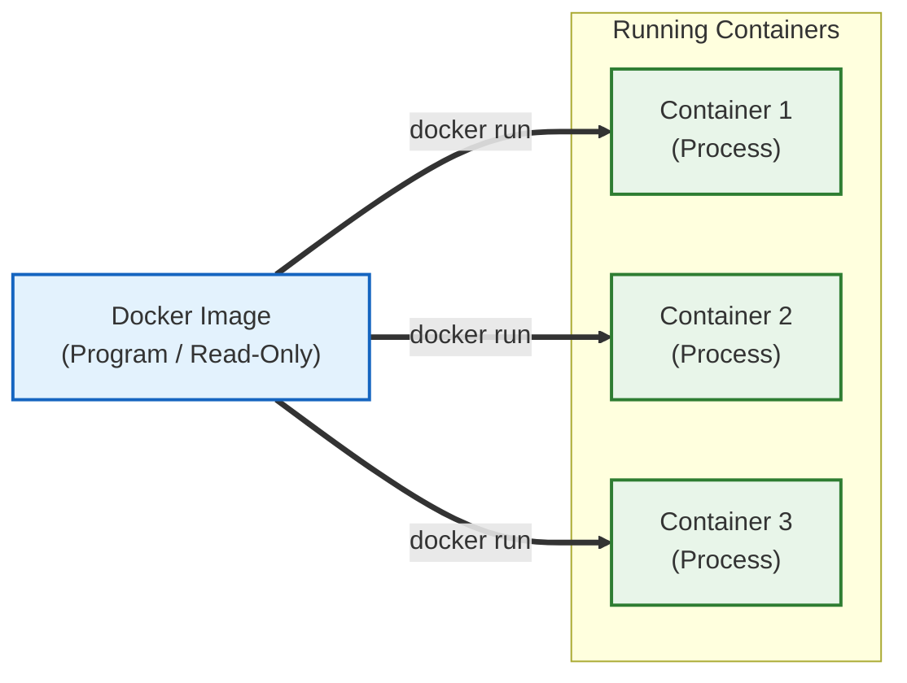

---
aliases:
  - Docker Image vs Container
  - Program vs Process
tags:
  - Docker
related:
  - "[[Docker_Concept_vs_VM]]"
  - "[[Docker_Architecture]]"
---
# Docker Image vs Container: "요리책과 요리의 차이"

> [!QUOTE] 핵심 요약
> **"이미지는 얼어있는 프로그램(Program)이고, 컨테이너는 살아서 움직이는 프로세스(Process)다."**
> 이미지는 변하지 않지만(Immutable), 컨테이너는 계속 상태가 변한다(Mutable).

---
## Concept Analogy (비유로 이해하기)

이 관계를 이해하는 3가지 완벽한 비유가 있습니다. 

| 구분 | **Operating System (OS)** | **Object-Oriented (OOP)** | **Real World** |
| :--- | :--- | :--- | :--- |
| **Docker Image** | **프로그램 (Program)** (`chrome.exe` 파일 그 자체) | **클래스 (Class)** (설계도) | **요리 레시피** (종이) |
| **Docker Container** | **프로세스 (Process)** (더블 클릭해서 실행된 크롬 창) | **인스턴스 (Instance)** (실체화된 객체) | **실제 요리** (먹을 수 있음) |

* **핵심:** 레시피(Image)는 아무리 많이 봐도 닳지 않지만, 요리(Container)는 먹으면 없어지거나 맛이 변할 수 있습니다. 

---
## 2. Docker Image (이미지) = "만능 공구함 (Toolbox)" 

> **"이미지 = 세팅 다 끝난 컴퓨터 하드디스크"**

* **정의:** 컨테이너 실행에 필요한 **모든 파일(OS, 라이브러리, 실행 스크립트 등)이 얼어있는 상태**.
    * 단순한 코드가 아니라, **"리눅스 컴퓨터 한 대를 통째로 압축해 둔 것"** 과 같습니다.

* **특징:**
    * **파일 시스템 포함 (File System Snapshot):** ⭐️ (중요)
        * 이미지를 다운받는 순간, 그 안에는 `/bin`, `/usr`, `/opt` 같은 리눅스 폴더 구조가 이미 다 만들어져 있습니다.
        * **예시:** 우리가 쓴 `kafka-console-producer.sh` 같은 파일들이 이미 `/opt/kafka/bin/` 폴더 안에 **미리 설치(Pre-installed)** 되어 있는 이유가 바로 이것입니다.
    * **불변 (Immutable):**
        * 이 공구함의 내용물은 읽기 전용입니다. (컨테이너에서 무언가 설치해도, 이미지는 변하지 않음).
    * **계층 구조 (Layered):**
        * 1층: 리눅스(Ubuntu) 깔고 -> 2층: 자바(Java) 깔고 -> 3층: 카프카(Kafka) 설치함.
        * 이 모든 과정이 층층이 쌓여서 하나의 이미지가 됩니다.

> [!TIP] "왜 스크립트가 들어있죠?"
> 이미지 제작자(Apache 재단)가 "님들이 편하게 쓰세요" 라고 미리 리눅스 환경에 접속해서 `apt-get install` 하고, 설정 파일(`server.properties`) 만들고, 실행 스크립트(`.sh`)까지 다 배치해둔 상태로 얼려버렸기 때문입니다. 우리는 그걸 **"다운(Pull)"** 받아서 쓰기만 하면 되는 거죠!

----
## Docker Container (컨테이너) = "Runtime Instance" 

* **정의:** 이미지를 실행해서 메모리에 올라온 **"실제 격리된 공간"**. 
* **특징:**
    * **휘발성(Ephemeral):** 컨테이너를 삭제하면 그 안에서 생성된 데이터도 기본적으로는 사라집니다. (그래서 Volume이 필요함).
    * **격리성(Isolated):** 컨테이너 A와 컨테이너 B는 서로 독립적입니다. 
    * **쓰기 가능(Writable):** 이미지 위에 얇은 "쓰기 레이어"를 얹어서 파일을 생성하거나 수정할 수 있습니다.

---
## The Lifecycle (생명주기 관계)

**"1개의 이미지로 N개의 컨테이너를 만들 수 있다."**

