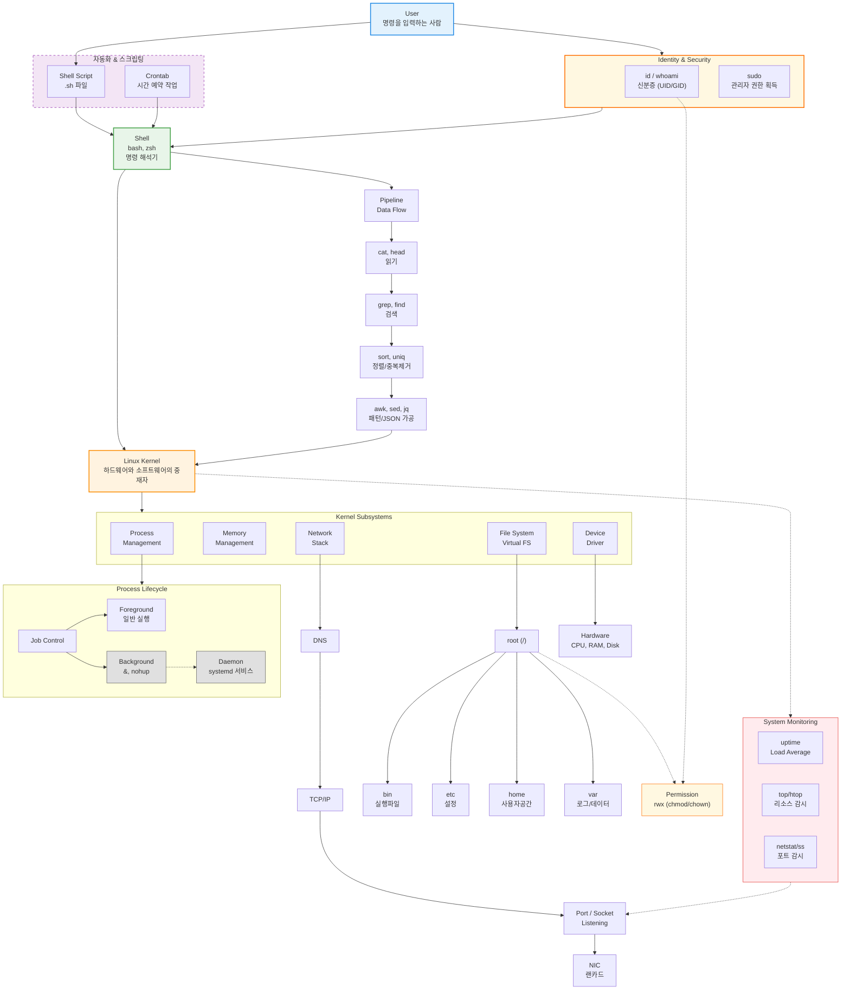

> **"리눅스는 암기과목이 아니라, 데이터가 흐르는 파이프라인을 건설하는 기술이다."** 
>  지금까지 학습한 모든 개념이 이 한 장의 그림에 담겨 있습니다.
>  리눅스에서 사용자의 명령이 하드웨어까지 도달하는 전체 여정

```mermaid
flowchart TB
    %% ===== 사용자 영역 =====
    User["User<br/>명령을 입력하는 사람"]
    
    %% [추가됨] 신분증 확인 절차
    subgraph Auth [Identity & Security]
        direction TB
        ID["id / whoami<br/>신분증 (UID/GID)"]
        Sudo["sudo<br/>관리자 권한 획득"]
    end

    subgraph Automation [자동화 & 스크립팅]
        direction TB
        Script["Shell Script<br/>.sh 파일"]
        Cron["Crontab<br/>시간 예약 작업"]
    end

    Shell["Shell<br/>bash, zsh<br/>명령 해석기"]

    User --> Auth --> Shell
    User --> Script --> Shell
    Cron --> Shell

    %% ===== 쉘 파이프라인 (Data Engineering) =====
    Pipe["Pipeline<br/>Data Flow"]
    Cmd1["cat, head<br/>읽기"]
    Cmd2["grep, find<br/>검색"]
    Cmd3["sort, uniq<br/>정렬/중복제거"]
    Cmd4["awk, sed, jq<br/>패턴/JSON 가공"] 

    Shell --> Pipe
    Pipe --> Cmd1 --> Cmd2 --> Cmd3 --> Cmd4

    %% ===== 커널 =====
    Kernel["Linux Kernel<br/>하드웨어와 소프트웨어의 중재자"]

    Shell --> Kernel
    Cmd4 --> Kernel

    %% ===== 커널 서브시스템 =====
    subgraph SubSystem [Kernel Subsystems]
        direction LR
        Proc["Process<br/>Management"]
        Mem["Memory<br/>Management"]
        FS["File System<br/>Virtual FS"]
        Net["Network<br/>Stack"]
        Driver["Device<br/>Driver"]
    end

    Kernel --> SubSystem

    %% ===== 프로세스 관리 =====
    subgraph ProcessFlow [Process Lifecycle]
        Job[Job Control]
        Fg["Foreground<br/>일반 실행"]
        Bg["Background<br/>&, nohup"]
        Daemon["Daemon<br/>systemd 서비스"]
        
        Job --> Fg
        Job --> Bg
        Bg -.-> Daemon
    end

    Proc --> ProcessFlow

    %% ===== 모니터링 =====
    subgraph Monitor [System Monitoring]
        Uptime["uptime<br/>Load Average"]
        Top["top/htop<br/>리소스 감시"]
        Netstat["netstat/ss<br/>포트 감시"]
    end
    
    Kernel -.-> Monitor

    %% ===== 파일 시스템 구조 & 권한 =====
    Root["root (/)"]
    bin["bin<br/>실행파일"]
    etc["etc<br/>설정"]
    home["home<br/>사용자공간"]
    var["var<br/>로그/데이터"]
    
    %% [추가됨] 권한 검사 (신분증과 연결됨)
    Perm["Permission<br/>rwx (chmod/chown)"]

    FS --> Root
    Root --> bin
    Root --> etc
    Root --> home
    Root --> var
    
    Root -.-> Perm
    
    %% 신분증이 있어야 권한을 체크함 (주석 위치 이동)
    ID -.-> Perm 

    %% ===== 네트워크 흐름 =====
    DNS[DNS]
    TCP[TCP/IP]
    Port["Port / Socket<br/>Listening"] 
    NIC["NIC<br/>랜카드"]

    Net --> DNS --> TCP --> Port --> NIC
    Monitor -.-> Port 

    %% ===== 하드웨어 =====
    HW["Hardware<br/>CPU, RAM, Disk"]
    Driver --> HW

    %% ===== 스타일 정의 =====
    style User fill:#E3F2FD,stroke:#1E88E5,stroke-width:2px
    style Shell fill:#E8F5E9,stroke:#43A047,stroke-width:2px
    style Kernel fill:#FFF3E0,stroke:#FB8C00,stroke-width:2px
    style Automation fill:#F3E5F5,stroke:#8E24AA,stroke-dasharray: 5 5
    style Monitor fill:#FFEBEE,stroke:#E53935
    style Bg fill:#E0E0E0,stroke:#616161
    style Daemon fill:#E0E0E0,stroke:#616161
    style Auth fill:#FFF8E1,stroke:#FF6F00,stroke-width:2px
    style Perm fill:#FFF8E1,stroke:#FF6F00
```

