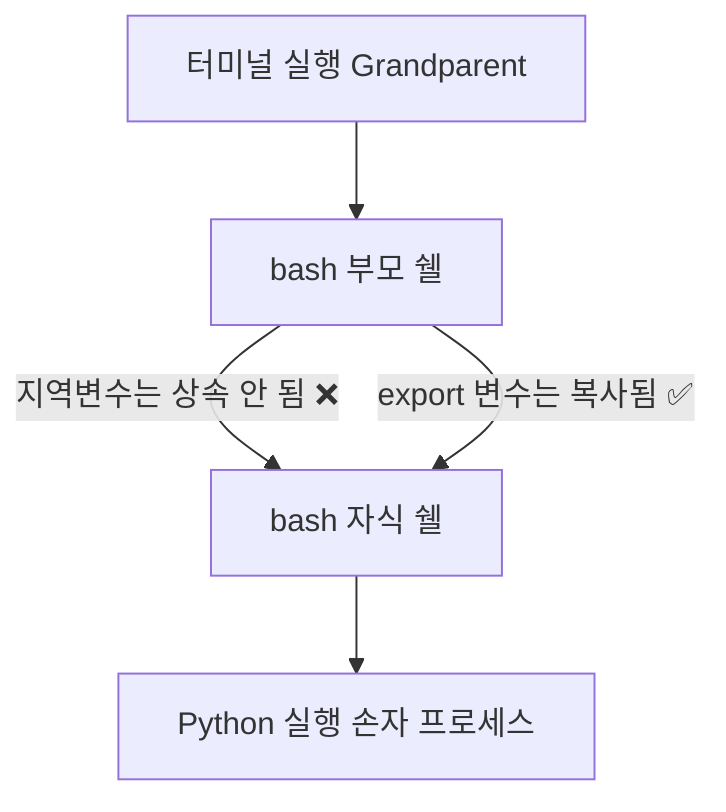

---
aliases:
  - 환경변수
  - Environment Variables
  - env
  - export
  - printenv
tags:
  - environment
  - env
  - Linux
related:
  - "[[Path_Variable]]"
  - "[[Shell_Config]]"
  - "[[00_Linux_HomePage(기존)]]"
  - "[[Linux_Docker_Setup]]"
  - "[[Linux_Fundamental_Rules]]"
---
## 개념 한 줄 요약

리눅스 시스템에서 프로세스가 실행되는 **'주변 환경'을 정의하는 Key-Value(키-값) 쌍의 전역 변수**다.
쉽게 말해, 프로그램들이 공통적으로 참고할 수 있는 **"공지사항 게시판"**과 같다.

---
## 왜 필요한가? (Why)

**문제점:**
- 코드 안에 비밀번호나 DB 주소를 직접 적는 **'하드코딩(Hard-coding)'** 은 최악의 보안 습관이다.
- 개발 서버(Dev)와 운영 서버(Prod)의 설정이 다를 때마다 코드를 수정하는 건 비효율적이다.

**해결책:**
- 코드는 건드리지 않고, **환경 변수라는 '외부 설정값'만 바꿔끼우면** 하나의 코드로 여러 환경에서 안전하게 동작시킬 수 있다.
- **보안성**과 **유연성**을 동시에 잡는 표준 방식이다.

---
##  실무 적용 사례 (Practical Context)

데이터 엔지니어는 환경 변수 없이는 일할 수 없다.

1.  **비밀 정보 관리:** AWS Access Key, DB 비밀번호 등은 절대 코드에 적지 않고 환경 변수(`AWS_ACCESS_KEY_ID`)로 주입한다.
2.  **경로 설정:** 하둡이나 스파크가 어디 설치되어 있는지 알려줄 때 (`JAVA_HOME`, `SPARK_HOME`).
3.  **Airflow 설정:** "DB는 저쪽을 바라보고, 로그는 이쪽에 쌓아라" 같은 설정을 할 때 (`AIRFLOW__CORE__SQL_ALCHEMY_CONN`).

---
## Code Core Points (핵심 문법)

1.  **선언(설정):** `export` 명령어를 사용하여 **대문자**로 만드는 것이 관례다.
2.  **참조(사용):** 변수 이름 앞에 **`$`** 기호를 붙여서 값을 꺼낸다.
3.  **조회:** `env` 또는 `printenv`로 전체 목록을 본다.

---
##  상세 코드 분석 (Detailed Analysis)

### ① 변수 만들기 (Syntax) ⭐️ 띄어쓰기 & 따옴표

리눅스 문법은 아주 깐깐하다. 
두 가지 규칙을 반드시 지켜야 한다.

```bash
# 규칙 1. 등호(=) 앞뒤에 공백 절대 금지 🚫
# 이유: 공백이 있으면 리눅스는 변수 설정이 아니라 '명령어 실행'이라고 착각한다.
export DB_PORT = 5432    # (X) -> "command not found" 에러 발생
export DB_PORT=5432      # (O) 딱 붙여 써야 한다.

# 규칙 2. 값에는 가급적 따옴표("") 붙이기 (방어적 습관) 🛡️
# 띄어쓰기가 없는 숫자나 단어는 따옴표를 생략해도 된다.
export TIMEOUT=30        # (O) 동작함

# 하지만 띄어쓰기가 포함된 문자열은 따옴표가 없으면 에러가 난다.
export CITY=New York     # (X) 'York'를 명령어로 인식해서 에러!
export CITY="New York"   # (O) 하나의 덩어리로 인식함

# [결론]
# 언제는 붙이고 언제는 안 붙일지 고민하지 말고,
# 그냥 "숫자든 문자든 무조건 따옴표를 붙인다"고 습관을 들이는 게 가장 안전하다.
export DB_PORT="5432"
```

### ② 변수 사용하기 ($ 기호)

```bash
# 변수 이름만 부르면 그냥 글자로 인식한다.
echo DB_PORT
# 출력: DB_PORT

# 앞에 $를 붙여야 "그 안에 든 값"을 가져온다.
echo $DB_PORT
# 출력: 5432
```

### ③ Export의 진짜 의미 (Scope)

왜 그냥 `A=1` 하지 않고 `export A=1`을 할까?

```bash
# 1. 지역 변수 선언 (export 없음)
MY_LOCAL="only"

# 2. 자식 프로세스(새로운 쉘) 실행
bash

# 3. 확인해보면?
echo $MY_LOCAL
# 출력: (빈칸) -> 자식은 부모의 지역 변수를 물려받지 못함!

# 4. 환경 변수 선언 (export 있음)
export MY_GLOBAL="all"
bash
echo $MY_GLOBAL
# 출력: all -> 자식 프로세스(Python, Docker 등)에게도 상속됨!
```

---
### [심화] 쉘 안의 쉘 (Inception)

#### 터미널에서 `bash`를 또 입력한다는 건, 화면을 새로고침하는 게 아니라 **"현재 쉘 안에 새로운 쉘(자식)을 낳는 것"** 이다. 
(마치 마트료시카 인형이나 영화 '인셉션'처럼!)



- **지역 변수:** 부모 쉘(`MY_LOCAL`)에만 존재하고, 자식이 태어날 때 물려주지 않는다.
- **환경 변수 (`export`):** 자식 쉘(`bash`)이나 프로그램(`python`)이 실행될 때, 부모의 환경 변수를 **복제(Copy)** 해서 들고 들어간다.
- **결론:** 그래서 내가 설정한 비밀번호나 경로를 파이썬 프로그램이 알아먹게 하려면, 반드시 **`export`** 를 해서 "상속 가능한 상태"로 만들어야 하는 것이다.

### 🧪 직접 확인해보기: `exit`의 비밀 

"터미널에서 `exit`를 쳤는데 왜 창이 안 꺼지지?" 라는 경험을 해본 적이 있다면, 
당신은 방금 **자식 쉘에서 부모 쉘로 복귀(Return)** 한 것이다.

- **`bash` 입력:** 현재 쉘 안에서 자식 쉘이 실행됨 (Inception Level 2 진입 ⬇️)
- **`exit` 입력:** 자식 쉘이 죽고, 나를 불렀던 부모 쉘로 돌아옴 (Level 1 복귀 ⬆️)
- **`exit` 또 입력:** 더 이상 돌아갈 부모가 없을 때 비로소 터미널 창이 꺼짐.

> **주의할 점:** 자식 쉘에서 만든 변수(`export` 포함)는 `exit` 하는 순간 **모두 증발**한다. 
> 부모는 자식이 밖에서 뭘 벌어왔는지 전혀 모른다. (변수 역수입 불가 🙅‍♂️)

---
## 초보자가 자주 하는 실수 (Misconceptions)

### ① "띄어쓰기 때문에 망했어요."

- `VAR = VAL` (X)
- 리눅스 쉘(Bash)은 공백을 **명령어의 끝**으로 인식한다. 
- 무조건 **`VAR=VAL`** 처럼 붙여 써야 한다.

### ② "터미널 껐더니 다 사라졌어요." (휘발성)

- 터미널 창에서 입력한 `export`는 **임시 설정**이다.
- 영구적으로 저장하려면  **[[Shell_Config]]** (`.bashrc` 또는 `.zshrc`) 파일 안에 적어두고 `source` 해야 한다.

### ③ "$는 언제 붙여요?"

- 값을 **넣을 때(설정)** 는 안 붙인다. (`MY_VAR=hello`)
- 값을 **꺼낼 때(사용)** 만 붙인다. (`echo $MY_VAR`)