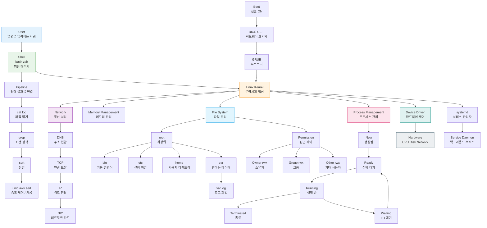

```mermaid
flowchart TB
    %% ===== 사용자 영역 =====
    User[User<br/>명령을 입력하는 사람]
    Shell[Shell<br/>bash zsh<br/>명령 해석기]

    User --> Shell

    %% ===== 쉘 파이프라인 =====
    Pipe[Pipeline<br/>명령 결과를 연결]
    Cmd1[cat log<br/>파일 읽기]
    Cmd2[grep<br/>조건 검색]
    Cmd3[sort<br/>정렬]
    Cmd4[uniq awk sed<br/>중복 제거 / 가공]

    Shell --> Pipe
    Pipe --> Cmd1 --> Cmd2 --> Cmd3 --> Cmd4

    %% ===== 커널 =====
    Kernel[Linux Kernel<br/>운영체제 핵심]

    Shell --> Kernel

    %% ===== 커널 서브시스템 =====
    Proc[Process Management<br/>프로세스 관리]
    Mem[Memory Management<br/>메모리 관리]
    FS[File System<br/>파일 관리]
    Net[Network<br/>통신 처리]
    Driver[Device Driver<br/>하드웨어 제어]

    Kernel --> Proc
    Kernel --> Mem
    Kernel --> FS
    Kernel --> Net
    Kernel --> Driver

    %% ===== 프로세스 상태 =====
    New[New<br/>생성됨]
    Ready[Ready<br/>실행 대기]
    Running[Running<br/>실행 중]
    Waiting[Waiting<br/>I O 대기]
    Terminated[Terminated<br/>종료]

    Proc --> New --> Ready --> Running
    Running --> Waiting --> Ready
    Running --> Terminated

    %% ===== 파일 시스템 구조 =====
    Root[root<br/>최상위]
    bin[bin<br/>기본 명령어]
    etc[etc<br/>설정 파일]
    home[home<br/>사용자 디렉토리]
    var[var<br/>변하는 데이터]
    log[var log<br/>로그 파일]

    FS --> Root
    Root --> bin
    Root --> etc
    Root --> home
    Root --> var
    var --> log

    %% ===== 파일 권한 =====
    Perm[Permission<br/>접근 제어]
    Owner[Owner rwx<br/>소유자]
    Group[Group rwx<br/>그룹]
    Other[Other rwx<br/>기타 사용자]

    FS --> Perm
    Perm --> Owner
    Perm --> Group
    Perm --> Other

    %% ===== 네트워크 흐름 =====
    DNS[DNS<br/>주소 변환]
    TCP[TCP<br/>연결 보장]
    IP[IP<br/>경로 전달]
    NIC[NIC<br/>네트워크 카드]

    Net --> DNS --> TCP --> IP --> NIC

    %% ===== 하드웨어 =====
    HW[Hardware<br/>CPU Disk Network]

    Driver --> HW

    %% ===== 부팅 과정 =====
    Boot[Boot<br/>전원 ON]
    BIOS[BIOS UEFI<br/>하드웨어 초기화]
    GRUB[GRUB<br/>부트로더]
    systemd[systemd<br/>서비스 관리자]
    Service[Service Daemon<br/>백그라운드 서비스]

    Boot --> BIOS --> GRUB --> Kernel
    Kernel --> systemd --> Service

    %% ===== 스타일 =====
    style User fill:#E3F2FD,stroke:#1E88E5
    style Shell fill:#E8F5E9,stroke:#43A047
    style Kernel fill:#FFF3E0,stroke:#FB8C00
    style Proc fill:#FCE4EC,stroke:#D81B60
    style FS fill:#E1F5FE,stroke:#039BE5
    style Net fill:#F3E5F5,stroke:#8E24AA
    style Driver fill:#E0F2F1,stroke:#00897B
    style HW fill:#ECEFF1,stroke:#546E7A
```

