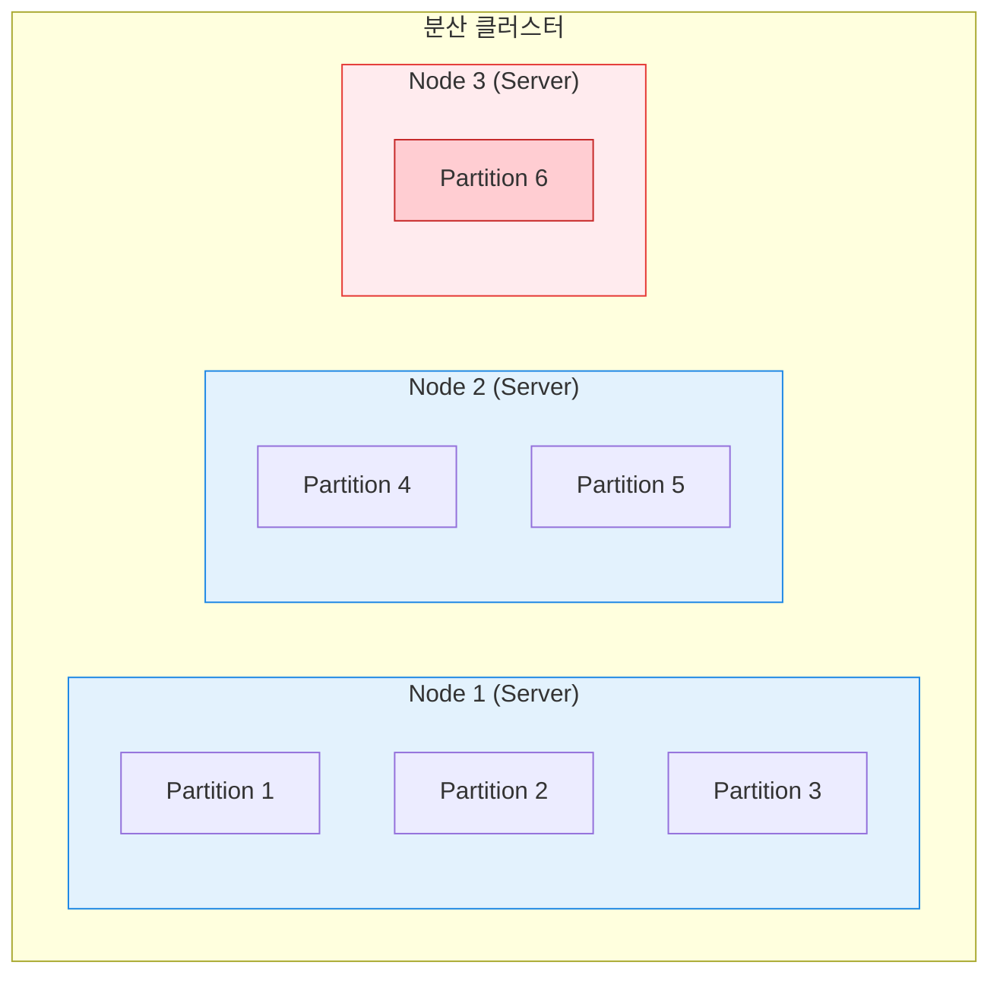

---
aliases:
  - 노드
  - 파티션
  - Node
  - Partition
  - 분산처리
  - Sharding
tags:
  - CS
  - Spark
related:
  - "[[Spark_Architecture]]"
  - "[[RDD_Concept]]"
  - "[[CAP_Theorem]]"
---
## 개념 한 줄 요약

**"Node는 '일하는 사람(서버)'이고, Partition은 그 사람이 처리해야 할 '일감 뭉치(데이터 조각)'이다."**

* **Node (노드):** 물리적인 **컴퓨터(Server)** 한 대. (하드웨어/OS 관점)
* **Partition (파티션):** 논리적으로 쪼개진 **데이터 덩어리**. (데이터 관점)

---

## 완벽한 비유: 피자 가게 

데이터 처리를 **"피자 만들기"** 라고 생각해 봅시다.

| 구분 | **Node (노드)** | **Partition (파티션)** |
| :--- | :--- | :--- |
| **비유** | **요리사 (또는 조리대)** | **피자 반죽 덩어리** |
| **성격** | **자원 (CPU, RAM)** | **대상 (Data)** |
| **관계** | 요리사 한 명이... | 반죽 여러 개를 처리할 수 있음. |
| **망가짐** | 요리사가 아프면(Server Down) | 그 요리사가 들고 있던 반죽(Data)도 못 쓰게 됨. |

---

##  N:M 관계 (가장 중요한 포인트) 

초보자가 가장 많이 하는 착각이 "노드 하나에 파티션 하나가 들어간다"고 생각하는 것입니다.
**절대 아닙니다!**

* **1 Node : N Partitions** (보통 노드 하나가 파티션 여러 개를 가짐)
* **이유:**
    * 노드(요리사)는 손이 빠릅니다. 
    * 반죽(파티션) 하나만 주고 "이거 다 하면 퇴근해"라고 하면 너무 빨리 끝납니다.
    * 그래서 보통 **CPU 코어 개수보다 파티션 개수를 2~3배 많게** 설정합니다. (끊임없이 일을 시키기 위해!)

---

## 데이터 엔지니어링에서의 적용 (Spark & DB)

### ① 데이터 쏠림 (Data Skew) 

* **상황:** A 요리사(Node 1)에게는 반죽 100개를 주고, B 요리사(Node 2)에게는 반죽 1개만 줌.
* **결과:** B는 놀고 있는데 A 혼자 야근하느라 전체 퇴근 시간(Job Execution Time)이 늦어짐.
* **해결:** 파티션을 다시 잘게 쪼개서(Repartition) 골고루 나눠줘야 함.

### ② 셔플 (Shuffle) 

* **상황:** "페퍼로니 피자 만들 사람?" 하고 외침.
* **행동:** 각 요리사(Node)들이 자기가 가진 반죽(Partition) 중에 페퍼로니가 섞인 부분을 떼어서, 페퍼로니 담당 요리사에게 던져줌.
* **비용:** 반죽이 공중을 날아다님(네트워크 통신). 엄청나게 비싸고 느린 작업.

---

## 5. 요약 도식화

> (Node 3는 파티션을 1개만 가지고 있어서 놀고 있는 상황 = 비효율!)

>"스파크 돌리다가 '왜 이렇게 느리지?' 싶으면 90%는 **파티션** 문제야. 
>**노드(Node)** 는 돈 주면 늘릴 수 있지만, **파티션(Partition)** 관리는 네 실력에 달렸어. 
>데이터를 너무 잘게 쪼개면 관리하느라 시간 낭비고, 너무 크게 쪼개면 메모리가 터져(OOM). 
>이 '적절한 크기'를 찾는 게 엔지니어의 감이야!"